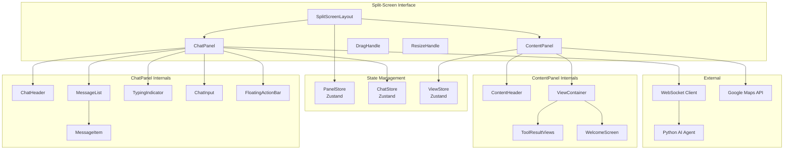
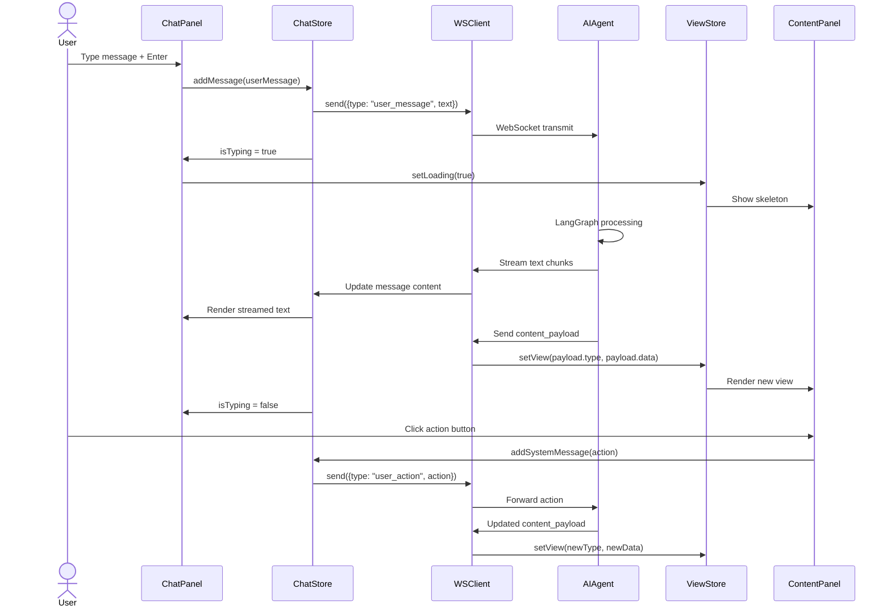

# Design Document: DerLg AI Split-Screen Interface

## Overview

### Purpose

This document specifies the technical architecture, component design, data flow, and wireframe specifications for the DerLg AI Split-Screen Interface. This is a conversational AI panel system where a draggable, resizable chat interface occupies the left portion of the screen by default, while a dynamic content display area on the right renders rich interactive components (maps, trip cards, hotel comparisons, payment QR codes) based on AI agent tool calls.

The split-screen interface replaces the legacy full-screen chat drawer with a persistent dual-panel layout that keeps trip content visible while the user converses with the AI agent.

### Scope

This design covers:
- Split-screen layout architecture with draggable, resizable panels
- Panel mode state machine (`split` | `chat_focus` | `content_focus`)
- ChatPanel component with message history, input, and floating window support
- ContentPanel rendering system with 15 view types
- ContentPayload message protocol between AI agent and frontend
- WebSocket message flow and action handling
- State management for panel configuration, chat history, and view state
- Responsive behavior across desktop, tablet, and mobile
- Accessibility implementation for keyboard navigation and screen readers
- Performance optimizations (virtualization, lazy loading, caching)

### Out of Scope
- AI agent backend implementation (see `../agentic-llm-chatbot/`)
- NestJS backend API design (see `../backend-nestjs-supabase/`)
- Core app navigation and pages (see `../frontend-nextjs-implementation/`)
- Payment processing logic (handled by backend)
- Map tile server infrastructure

### Technology Stack

- **Framework**: Next.js 14 (App Router), React 18+
- **Language**: TypeScript (strict mode)
- **Styling**: Tailwind CSS with custom design tokens
- **State Management**: Zustand (panel state, chat state), React Query (server state)
- **WebSocket**: Native WebSocket API with custom reconnection logic
- **Maps**: Google Maps JavaScript API (primary), Leaflet + OpenStreetMap (fallback)
- **Animation**: Framer Motion for panel transitions and view changes
- **Virtualization**: `@tanstack/react-virtual` for message list
- **Drag/Resize**: Custom implementation with Pointer Events API
- **i18n**: next-intl (inherits from parent app)

---

## Architecture

### High-Level Component Architecture



### State Management Architecture

Three dedicated Zustand stores manage split-screen state. Each store persists a subset of its state to `localStorage`.

**PanelStore — Panel Configuration**

```typescript
interface PanelState {
  // Panel mode
  mode: 'split' | 'chat_focus' | 'content_focus';

  // Split mode dimensions (percentages, 0–100)
  chatWidthPercent: number;      // default: 35
  contentWidthPercent: number;   // default: 65

  // Floating window state
  isFloating: boolean;
  floatingPosition: { x: number; y: number } | null;
  floatingSize: { width: number; height: number };

  // Viewport tracking
  viewportWidth: number;
  viewportHeight: number;
  breakpoint: 'mobile' | 'tablet' | 'desktop';

  // Actions
  setMode: (mode: PanelState['mode']) => void;
  setChatWidth: (percent: number) => void;
  toggleFloating: () => void;
  setFloatingPosition: (pos: { x: number; y: number }) => void;
  setFloatingSize: (size: { width: number; height: number }) => void;
  updateViewport: () => void;
  resetToDefaults: () => void;
}
```

Persisted keys: `mode`, `chatWidthPercent`, `isFloating`, `floatingPosition`, `floatingSize`.

**ChatStore — Conversation State**

```typescript
interface ChatState {
  // Messages
  messages: ChatMessage[];
  messageCount: number;

  // Connection
  connectionStatus: 'connected' | 'connecting' | 'disconnected' | 'error';
  sessionId: string | null;

  // Input
  inputText: string;
  isTyping: boolean;
  inputDisabled: boolean;

  // UI
  scrollToBottom: boolean;
  showScrollButton: boolean;

  // Actions
  addMessage: (message: ChatMessage) => void;
  updateMessage: (id: string, updates: Partial<ChatMessage>) => void;
  setInputText: (text: string) => void;
  sendMessage: (text: string) => Promise<void>;
  setConnectionStatus: (status: ChatState['connectionStatus']) => void;
  clearHistory: () => void;
}
```

Persisted keys: `messages` (last 50 only), `sessionId`.

**ViewStore — Content Panel View State**

```typescript
interface ViewState {
  // Current and history
  currentView: ContentViewType | null;
  viewHistory: ViewHistoryEntry[];
  viewData: Record<string, unknown> | null;

  // Loading
  isLoading: boolean;
  loadingViewType: ContentViewType | null;

  // Comparison tray
  comparisonItems: ComparisonItem[];

  // Actions
  setView: (view: ContentViewType, data?: Record<string, unknown>) => void;
  goBack: () => void;
  setLoading: (isLoading: boolean, viewType?: ContentViewType) => void;
  addComparisonItem: (item: ComparisonItem) => void;
  removeComparisonItem: (id: string) => void;
  clearComparison: () => void;
}
```

Persisted keys: `viewHistory` (last 10), `comparisonItems`.

### WebSocket Message Flow



### ContentPayload Protocol

The ContentPayload is the contract between AI agent and frontend. It is delivered as the `content_payload` field in every agent WebSocket message.

```typescript
// Root message from AI agent
interface AgentMessage {
  type: 'agent_message';
  session_id: string;
  text: string;                    // Summary shown in chat
  content_payload?: ContentPayload; // What to render in ContentPanel
  state: AgentState;               // DISCOVERY | SUGGESTION | ...
  timestamp: string;               // ISO 8601
}

// Content payload discriminated union
interface ContentPayload {
  type: ContentViewType;
  data: ViewTypeDataMap[ContentViewType];
  actions: ContentAction[];
  metadata?: {
    title?: string;
    subtitle?: string;
    backable?: boolean;
    shareable?: boolean;
  };
}

type ContentViewType =
  | 'welcome'
  | 'map'
  | 'trip_list'
  | 'trip_detail'
  | 'hotel_list'
  | 'hotel_detail'
  | 'transport_list'
  | 'trip_comparison'
  | 'booking_summary'
  | 'payment_qr'
  | 'payment_status'
  | 'booking_confirmation'
  | 'itinerary'
  | 'budget_estimate'
  | 'weather_forecast';

type AgentState =
  | 'DISCOVERY'
  | 'SUGGESTION'
  | 'EXPLORATION'
  | 'CUSTOMIZATION'
  | 'BOOKING'
  | 'PAYMENT'
  | 'POST_BOOKING';

// Action definition
interface ContentAction {
  type: string;                    // e.g. "select_trip", "pay_now"
  label: string;                   // Button label (i18n key)
  payload: Record<string, unknown>; // Action-specific data
  style?: 'primary' | 'secondary' | 'danger';
  icon?: string;                   // Lucide icon name
}
```

**View-Specific Data Schemas**

```typescript
interface ViewTypeDataMap {
  welcome: {
    featured_trips: TripCard[];
    quick_actions: QuickAction[];
    recent_activity: ActivityItem[];
  };

  map: {
    center: { lat: number; lng: number };
    zoom: number;
    markers: MapMarker[];
    routes?: MapRoute[];
    fit_bounds?: boolean;
  };

  trip_list: {
    trips: TripCard[];
    total_count: number;
    pagination: { page: number; per_page: number; total_pages: number };
    filters?: TripFilterState;
  };

  trip_detail: {
    trip: TripDetail;
    itinerary: DayItinerary[];
    reviews: Review[];
    related_trips: TripCard[];
  };

  hotel_list: {
    hotels: HotelCard[];
    total_count: number;
    pagination: { page: number; per_page: number; total_pages: number };
    filters?: HotelFilterState;
  };

  hotel_detail: {
    hotel: HotelDetail;
    rooms: RoomType[];
    amenities: string[];
    nearby_attractions: NearbyPlace[];
  };

  transport_list: {
    options: TransportOption[];
    route: { from: string; to: string; distance_km: number };
  };

  trip_comparison: {
    trips: TripDetail[];
    highlights: string[][];
  };

  booking_summary: {
    booking: BookingDetail;
    price_breakdown: PriceBreakdown;
    reserved_until: string;          // ISO 8601
    countdown_seconds: number;
  };

  payment_qr: {
    qr_code_url: string;
    amount: number;
    currency: string;
    payment_methods: PaymentMethod[];
    expiry_seconds: number;
    refresh_interval: number;
  };

  payment_status: {
    status: 'pending' | 'processing' | 'completed' | 'failed';
    booking_id: string;
    amount: number;
    updated_at: string;
    retryable: boolean;
  };

  booking_confirmation: {
    booking_ref: string;             // DLG-YYYY-NNNN
    check_in_qr: string;
    itinerary_summary: ItinerarySummary;
    downloads: { label: string; url: string; type: string }[];
  };

  itinerary: {
    days: DaySchedule[];
    trip_name: string;
    start_date: string;
    end_date: string;
  };

  budget_estimate: {
    categories: BudgetCategory[];
    total_low: number;
    total_high: number;
    currency: string;
  };

  weather_forecast: {
    location: string;
    dates: WeatherDay[];
  };
}
```

---

## Component Design

### 1. SplitScreenLayout

The root layout component that orchestrates panel rendering, mode transitions, and responsive behavior.

```typescript
// components/split-screen/SplitScreenLayout.tsx
'use client';

interface SplitScreenLayoutProps {
  children?: React.ReactNode;      // Optional content to render in ContentPanel
  defaultMode?: PanelMode;
}

export function SplitScreenLayout({
  children,
  defaultMode = 'split',
}: SplitScreenLayoutProps) {
  const { mode, breakpoint, isFloating } = usePanelStore();

  // Responsive breakpoint detection
  useEffect(() => {
    const update = () => {
      const w = window.innerWidth;
      const bp = w < 768 ? 'mobile' : w < 1024 ? 'tablet' : 'desktop';
      usePanelStore.getState().updateViewport();
    };
    window.addEventListener('resize', update);
    update();
    return () => window.removeEventListener('resize', update);
  }, []);

  if (breakpoint === 'mobile') {
    return <MobileLayout>{children}</MobileLayout>;
  }

  if (isFloating) {
    return <FloatingLayout>{children}</FloatingLayout>;
  }

  return (
    <div className="flex h-screen w-screen overflow-hidden">
      <SplitPanels mode={mode}>{children}</SplitPanels>
    </div>
  );
}
```

**Layout Algorithm**

```
split mode:
  ChatPanel  = chatWidthPercent% of viewport (default 35%, min 320px)
  ContentPanel = remaining width
  ResizeHandle visible between panels

chat_focus mode:
  ChatPanel  = 85% of viewport
  ContentPanel = 15% (icon strip only)
  No resize handle

content_focus mode:
  ChatPanel  = collapsed to 64px floating bubble (bottom-left)
  ContentPanel = 100% of viewport
  Click bubble → restore split mode

floating mode:
  ChatPanel = absolute positioned window
  ContentPanel = 100% of viewport
  Window has drag handle, resize handles, dock button
```

### 2. ChatPanel

The conversational interface. Supports three rendering modes: docked (split), floating window, and collapsed bubble.

```typescript
// components/split-screen/ChatPanel.tsx
'use client';

interface ChatPanelProps {
  variant: 'docked' | 'floating' | 'bubble' | 'mobile-sheet';
}

export function ChatPanel({ variant }: ChatPanelProps) {
  const { messages, connectionStatus, isTyping } = useChatStore();
  const { mode, isFloating } = usePanelStore();

  if (variant === 'bubble') {
    return <ChatBubble onClick={() => setMode('split')} />;
  }

  return (
    <div className={cn(
      "flex flex-col bg-white dark:bg-gray-900",
      variant === 'docked' && "h-full border-r border-gray-200",
      variant === 'floating' && "absolute rounded-2xl shadow-2xl border border-gray-200",
      variant === 'mobile-sheet' && "rounded-t-2xl shadow-[0_-4px_20px_rgba(0,0,0,0.1)]"
    )}>
      <ChatHeader
        variant={variant}
        onDragStart={handleDragStart}
        onDock={handleDock}
        onMaximize={() => setMode('chat_focus')}
        connectionStatus={connectionStatus}
      />

      <MessageList
        messages={messages}
        isTyping={isTyping}
        virtualize={messages.length > 20}
      />

      {isTyping && <TypingIndicator />}

      <ChatInput
        disabled={connectionStatus !== 'connected'}
        onSend={handleSend}
        onFileAttach={handleFileAttach}
      />
    </div>
  );
}
```

**MessageList with Virtualization**

```typescript
// components/split-screen/MessageList.tsx
'use client';

import { useVirtualizer } from '@tanstack/react-virtual';

interface MessageListProps {
  messages: ChatMessage[];
  isTyping: boolean;
  virtualize: boolean;
}

export function MessageList({ messages, isTyping, virtualize }: MessageListProps) {
  const parentRef = useRef<HTMLDivElement>(null);
  const virtualizer = useVirtualizer({
    count: messages.length,
    getScrollElement: () => parentRef.current,
    estimateSize: () => 80,
    overscan: 5,
  });

  // Auto-scroll to bottom on new messages
  useEffect(() => {
    if (shouldAutoScroll) {
      virtualizer.scrollToIndex(messages.length - 1, { align: 'end' });
    }
  }, [messages.length]);

  return (
    <div ref={parentRef} className="flex-1 overflow-y-auto">
      <div style={{ height: virtualizer.getTotalSize() }}>
        {virtualizer.getVirtualItems().map((virtualItem) => (
          <MessageItem
            key={messages[virtualItem.index].id}
            message={messages[virtualItem.index]}
            style={{
              position: 'absolute',
              top: 0,
              left: 0,
              width: '100%',
              transform: `translateY(${virtualItem.start}px)`,
            }}
          />
        ))}
      </div>
    </div>
  );
}
```

### 3. ContentPanel

The right-side display area that renders rich content based on the current view type.

```typescript
// components/split-screen/ContentPanel.tsx
'use client';

interface ContentPanelProps {
  children?: React.ReactNode;
}

export function ContentPanel({ children }: ContentPanelProps) {
  const { currentView, viewData, isLoading, viewHistory } = useViewStore();
  const { mode } = usePanelStore();

  // In chat_focus mode, show icon strip
  if (mode === 'chat_focus') {
    return <ContentIconStrip activeView={currentView} />;
  }

  return (
    <div className="flex flex-col h-full bg-gray-50 dark:bg-gray-950 overflow-hidden">
      <ContentHeader
        title={getViewTitle(currentView)}
        icon={getViewIcon(currentView)}
        showBack={viewHistory.length > 1}
        showShare={isShareable(currentView)}
        onBack={() => useViewStore.getState().goBack()}
        onShare={() => handleShare()}
        onFullscreen={() => setMode('content_focus')}
      />

      <div className="flex-1 overflow-y-auto relative">
        <AnimatePresence mode="wait">
          {isLoading ? (
            <ContentSkeleton key="skeleton" viewType={currentView} />
          ) : (
            <motion.div
              key={currentView || 'empty'}
              initial={{ opacity: 0 }}
              animate={{ opacity: 1 }}
              exit={{ opacity: 0 }}
              transition={{ duration: 0.15 }}
            >
              {currentView ? (
                <ViewRenderer view={currentView} data={viewData} />
              ) : (
                <WelcomeScreen />
              )}
            </motion.div>
          )}
        </AnimatePresence>
      </div>
    </div>
  );
}
```

### 4. ViewRenderer

Switch component that maps view types to their rendering components.

```typescript
// components/split-screen/ViewRenderer.tsx
'use client';

const viewComponents: Record<ContentViewType, ComponentType<ViewProps>> = {
  welcome: WelcomeView,
  map: MapView,
  trip_list: TripListView,
  trip_detail: TripDetailView,
  hotel_list: HotelListView,
  hotel_detail: HotelDetailView,
  transport_list: TransportListView,
  trip_comparison: TripComparisonView,
  booking_summary: BookingSummaryView,
  payment_qr: PaymentQRView,
  payment_status: PaymentStatusView,
  booking_confirmation: BookingConfirmationView,
  itinerary: ItineraryView,
  budget_estimate: BudgetEstimateView,
  weather_forecast: WeatherForecastView,
};

interface ViewRendererProps {
  view: ContentViewType;
  data: Record<string, unknown> | null;
}

export function ViewRenderer({ view, data }: ViewRendererProps) {
  const Component = viewComponents[view];

  if (!Component) {
    return <ErrorFallback view={view} message={`Unknown view type: ${view}`} />;
  }

  // Schema validation before render
  const validation = validateViewData(view, data);
  if (!validation.valid) {
    console.error('ContentPayload validation failed:', validation.errors);
    return <ErrorFallback view={view} message="Invalid data format" retryable />;
  }

  return <Component data={data} />;
}
```

### 5. Drag and Resize System

**DragHandle — Panel Repositioning**

```typescript
// components/split-screen/DragHandle.tsx
'use client';

interface DragHandleProps {
  onDragStart: () => void;
  onDragMove: (delta: { x: number; y: number }) => void;
  onDragEnd: () => void;
}

export function DragHandle({ onDragStart, onDragMove, onDragEnd }: DragHandleProps) {
  const handlePointerDown = (e: React.PointerEvent) => {
    e.preventDefault();
    const startX = e.clientX;
    const startY = e.clientY;

    const handleMove = (moveEvent: PointerEvent) => {
      onDragMove({
        x: moveEvent.clientX - startX,
        y: moveEvent.clientY - startY,
      });
    };

    const handleUp = () => {
      onDragEnd();
      window.removeEventListener('pointermove', handleMove);
      window.removeEventListener('pointerup', handleUp);
    };

    window.addEventListener('pointermove', handleMove);
    window.addEventListener('pointerup', handleUp);
    onDragStart();
  };

  return (
    <div
      role="button"
      aria-label="Drag to move panel"
      tabIndex={0}
      onPointerDown={handlePointerDown}
      onKeyDown={handleKeyboardMove}
      className="cursor-move p-2 hover:bg-gray-100 rounded"
    >
      <GripVertical className="w-5 h-5 text-gray-400" />
    </div>
  );
}
```

**ResizeHandle — Panel Resizing**

```typescript
// components/split-screen/ResizeHandle.tsx
'use client';

interface ResizeHandleProps {
  direction: 'horizontal' | 'vertical' | 'corner';
  onResize: (delta: { width?: number; height?: number }) => void;
  onResizeEnd: () => void;
}

export function ResizeHandle({ direction, onResize, onResizeEnd }: ResizeHandleProps) {
  const handlePointerDown = (e: React.PointerEvent) => {
    e.preventDefault();
    const startX = e.clientX;
    const startY = e.clientY;

    const handleMove = (moveEvent: PointerEvent) => {
      const delta: { width?: number; height?: number } = {};
      if (direction === 'horizontal' || direction === 'corner') {
        delta.width = moveEvent.clientX - startX;
      }
      if (direction === 'vertical' || direction === 'corner') {
        delta.height = moveEvent.clientY - startY;
      }
      onResize(delta);
    };

    const handleUp = () => {
      onResizeEnd();
      window.removeEventListener('pointermove', handleMove);
      window.removeEventListener('pointerup', handleUp);
    };

    window.addEventListener('pointermove', handleMove);
    window.addEventListener('pointerup', handleUp);
  };

  return (
    <div
      role="separator"
      aria-label="Resize panel"
      aria-orientation={direction === 'horizontal' ? 'vertical' : 'horizontal'}
      tabIndex={0}
      onPointerDown={handlePointerDown}
      onKeyDown={handleKeyboardResize}
      className={cn(
        "absolute bg-transparent hover:bg-blue-500/20 transition-colors",
        direction === 'horizontal' && "right-0 top-0 bottom-0 w-2 cursor-col-resize",
        direction === 'vertical' && "bottom-0 left-0 right-0 h-2 cursor-row-resize",
        direction === 'corner' && "bottom-0 right-0 w-4 h-4 cursor-nwse-resize"
      )}
    />
  );
}
```

### 6. MapView

Interactive map rendering with Google Maps JavaScript API.

```typescript
// components/split-screen/views/MapView.tsx
'use client';

interface MapViewProps {
  data: ViewTypeDataMap['map'];
}

export function MapView({ data }: MapViewProps) {
  const mapRef = useRef<HTMLDivElement>(null);
  const googleMapRef = useRef<google.maps.Map | null>(null);
  const markersRef = useRef<google.maps.Marker[]>([]);

  useEffect(() => {
    if (!mapRef.current || !window.google) return;

    const map = new google.maps.Map(mapRef.current, {
      center: data.center,
      zoom: data.zoom,
      mapTypeControl: true,
      streetViewControl: true,
      fullscreenControl: false, // We have custom fullscreen
    });

    googleMapRef.current = map;

    // Add markers
    data.markers.forEach((markerData) => {
      const marker = new google.maps.Marker({
        position: markerData.position,
        map,
        title: markerData.title,
        icon: getMarkerIcon(markerData.category),
      });

      marker.addListener('click', () => {
        // Show info card and sync to chat
        showInfoCard(markerData);
        syncToChat('location_selected', markerData);
      });

      markersRef.current.push(marker);
    });

    // Draw routes
    data.routes?.forEach((route) => {
      new google.maps.Polyline({
        path: route.path,
        map,
        strokeColor: '#2563eb',
        strokeWeight: 3,
      });
    });

    // Fit bounds if requested
    if (data.fit_bounds && data.markers.length > 0) {
      const bounds = new google.maps.LatLngBounds();
      data.markers.forEach((m) => bounds.extend(m.position));
      map.fitBounds(bounds);
    }

    return () => {
      markersRef.current.forEach((m) => m.setMap(null));
      markersRef.current = [];
    };
  }, [data]);

  return (
    <div className="h-full w-full relative">
      <div ref={mapRef} className="h-full w-full" />
      <MapControls
        onZoomIn={() => googleMapRef.current?.setZoom((googleMapRef.current.getZoom() || 10) + 1)}
        onZoomOut={() => googleMapRef.current?.setZoom((googleMapRef.current.getZoom() || 10) - 1)}
        onLayerChange={(layer) => googleMapRef.current?.setMapTypeId(layer)}
      />
    </div>
  );
}
```

---

## Data Flow

### Panel Mode Transition Flow

```
User clicks mode toggle button
  → PanelStore.setMode(newMode)
    → Update mode state
    → Persist to localStorage
    → Trigger layout recalculation
      → SplitScreenLayout re-renders with new dimensions
        → Animate width/height changes (300ms cubic-bezier)
          → ChatPanel and ContentPanel receive new sizes
```

### Chat-to-Content Synchronization

```
User sends chat message
  → ChatStore.sendMessage(text)
    → Add user message to history
    → Send via WebSocket
    → Set isTyping = true
    → ViewStore.setLoading(true)
      → ContentPanel shows skeleton

AI agent responds with content_payload
  → WebSocket receives agent_message
    → ChatStore.addMessage(agentMessage)
      → Append to message history
      → Set isTyping = false
    → IF content_payload exists:
      → ViewStore.setView(type, data)
        → Push to viewHistory
        → ContentPanel renders new view
      → ChatStore marks message as "has_content"

User clicks action in ContentPanel
  → ContentAction handler
    → IF action should notify chat:
      → ChatStore.addSystemMessage(action summary)
    → Send user_action via WebSocket
    → ViewStore.setLoading(true)
      → Wait for agent response
```

### Floating Window Flow

```
User drags ChatPanel header
  → onDragStart: remember current position
  → IF not already floating:
    → PanelStore.toggleFloating()
      → Set isFloating = true
      → Calculate initial position (current location)
      → ContentPanel expands to 100% width
  → onDragMove: update floatingPosition
  → onDragEnd: persist position to localStorage

User clicks "Dock" button
  → PanelStore.toggleFloating()
    → Set isFloating = false
    → Restore split layout
    → ContentPanel returns to split width
```

---

## Responsive Layout Algorithms

### Desktop (>1024px)

```
Layout: Split-screen with resizable panels
ChatPanel: 35% default, draggable, resizable (320px–60%)
ContentPanel: Remaining width
Floating: Supported (absolute positioned window)
```

### Tablet (768px–1024px)

```
Layout: Split-screen with fixed ratio
ChatPanel: Fixed 40% width, NOT resizable
ContentPanel: Fixed 60% width
Floating: Disabled (always docked)
Mode toggles: Enabled
```

### Mobile (<768px)

```
Layout: ContentPanel full-screen + ChatPanel bottom sheet
ChatPanel: Bottom sheet with 3 states:
  - collapsed: 80px height (latest message preview + input)
  - half: 50% viewport height (last 3 messages)
  - full: 90% viewport height (full history)
ContentPanel: Full viewport, swipeable views
Floating: N/A (converted to bottom sheet)
```

```typescript
// Mobile bottom sheet state machine
interface MobileSheetState {
  snapPoint: 'collapsed' | 'half' | 'full';
  height: number;  // calculated from snapPoint
}

const snapPoints = {
  collapsed: 80,   // px
  half: 0.5,       // 50% of viewport
  full: 0.9,       // 90% of viewport
};

// Drag to snap
function calculateSnapPoint(currentHeight: number, viewportHeight: number): MobileSheetState['snapPoint'] {
  const ratios = [
    { point: 'collapsed', value: snapPoints.collapsed },
    { point: 'half', value: viewportHeight * snapPoints.half },
    { point: 'full', value: viewportHeight * snapPoints.full },
  ];

  // Find nearest snap point
  const nearest = ratios.reduce((prev, curr) =>
    Math.abs(curr.value - currentHeight) < Math.abs(prev.value - currentHeight) ? curr : prev
  );

  return nearest.point as MobileSheetState['snapPoint'];
}
```

---

## Accessibility Implementation

### Keyboard Navigation

| Element | Focus | Key | Action |
|---------|-------|-----|--------|
| ResizeHandle | Tab | ArrowLeft/Right | Adjust panel width by 20px |
| ResizeHandle | Tab | Enter | Reset to default width |
| DragHandle | Tab | ArrowKeys | Move panel by 20px |
| DragHandle | Tab | Enter | Drop panel at current position |
| ChatInput | Auto | Enter | Send message |
| ChatInput | Auto | Shift+Enter | New line |
| ModeToggle | Tab | Enter/Space | Toggle panel mode |
| ActionButton | Tab | Enter/Space | Trigger action |
| Message | Tab | Enter | Restore associated content view |

### Screen Reader Announcements

```typescript
// components/split-screen/Announcer.tsx
'use client';

export function LiveRegionAnnouncer() {
  const { lastMessage } = useChatStore();
  const { currentView } = useViewStore();

  return (
    <>
      {/* New messages - polite (won't interrupt) */}
      <div aria-live="polite" aria-atomic="true" className="sr-only">
        {lastMessage?.role === 'assistant' && lastMessage.text}
      </div>

      {/* View changes - assertive (will interrupt) */}
      <div aria-live="assertive" aria-atomic="true" className="sr-only">
        {currentView && `Showing ${getViewTitle(currentView)}`}
      </div>
    </>
  );
}
```

### Reduced Motion

```typescript
// hooks/useReducedMotion.ts
export function useReducedMotion(): boolean {
  const [reduced, setReduced] = useState(false);

  useEffect(() => {
    const mq = window.matchMedia('(prefers-reduced-motion: reduce)');
    setReduced(mq.matches);
    const handler = (e: MediaQueryListEvent) => setReduced(e.matches);
    mq.addEventListener('change', handler);
    return () => mq.removeEventListener('change', handler);
  }, []);

  return reduced;
}

// Usage in animations
const transition = reducedMotion
  ? { duration: 0 }
  : { duration: 0.3, ease: [0.4, 0, 0.2, 1] };
```

---

## Performance Optimizations

### 1. Message List Virtualization

Messages are virtualized when count exceeds 20. Only visible messages (+5 overscan) are rendered.

### 2. Content Panel Lazy Loading

```typescript
// Lazy load heavy view components
const MapView = dynamic(() => import('./views/MapView'), {
  loading: () => <MapSkeleton />,
  ssr: false, // Maps need window object
});

const TripDetailView = dynamic(() => import('./views/TripDetailView'), {
  loading: () => <TripDetailSkeleton />,
});
```

### 3. Image Loading Strategy

```typescript
// components/ImageWithPlaceholder.tsx
export function LazyImage({ src, alt, blurHash }: LazyImageProps) {
  return (
    <div className="relative overflow-hidden">
      {blurHash && (
        <BlurhashCanvas
          hash={blurHash}
          className="absolute inset-0 w-full h-full"
        />
      )}
       e.currentTarget.classList.add('opacity-100')}
      />
    </div>
  );
}
```

### 4. Debounced Persistence

```typescript
// Panel size persistence (500ms debounce)
const debouncedSave = useMemo(
  () => debounce((width: number) => {
    localStorage.setItem('derlg_chat_width', String(width));
  }, 500),
  []
);
```

### 5. WebSocket Reconnection

```typescript
// Exponential backoff for reconnection
function getReconnectDelay(attempt: number): number {
  const base = 1000;
  const max = 30000;
  const jitter = Math.random() * 1000;
  return Math.min(base * Math.pow(2, attempt), max) + jitter;
}
```

---

## Error Handling Strategy

### Error Boundaries

```typescript
// components/split-screen/ContentErrorBoundary.tsx
'use client';

export class ContentErrorBoundary extends React.Component<
  { children: React.ReactNode; viewType: string },
  { hasError: boolean; error: Error | null }
> {
  static getDerivedStateFromError(error: Error) {
    return { hasError: true, error };
  }

  componentDidCatch(error: Error, errorInfo: React.ErrorInfo) {
    Sentry.captureException(error, {
      tags: { view_type: this.props.viewType },
      extra: errorInfo,
    });
  }

  render() {
    if (this.state.hasError) {
      return (
        <ErrorFallback
          message={`Failed to load ${this.props.viewType}`}
          error={this.state.error}
          onRetry={() => this.setState({ hasError: false, error: null })}
        />
      );
    }
    return this.props.children;
  }
}
```

### Error States by Component

| Component | Error State | Recovery |
|-----------|-------------|----------|
| WebSocket | Disconnected banner | Auto-reconnect with backoff + manual retry button |
| MapView | Static map image fallback | Retry loading Google Maps script |
| Image | Placeholder with error icon | Retry on intersection observer trigger |
| PaymentStatus | Manual refresh button | Poll with exponential backoff |
| ContentPanel | Error fallback with retry | Reset view to previous working state |
| ChatPanel | Offline mode with queue | Send queued messages on reconnect |

---

## Analytics Events

```typescript
// analytics/splitScreenEvents.ts

export const SplitScreenEvents = {
  // Panel interactions
  PANEL_MODE_CHANGE: 'panel_mode_change',
  PANEL_RESIZE: 'panel_resize',
  PANEL_DRAG: 'panel_drag',
  PANEL_FLOAT_TOGGLE: 'panel_float_toggle',

  // View interactions
  VIEW_CHANGE: 'view_change',
  VIEW_TIME_SPENT: 'view_time_spent',
  VIEW_BACK: 'view_back',
  VIEW_SHARE: 'view_share',

  // Content actions
  ACTION_CLICK: 'action_click',
  TRIP_SELECT: 'trip_select',
  TRIP_COMPARE_ADD: 'trip_compare_add',
  HOTEL_SELECT: 'hotel_select',
  TRANSPORT_SELECT: 'transport_select',
  BOOKING_INITIATE: 'booking_initiate',
  PAYMENT_START: 'payment_start',
  PAYMENT_COMPLETE: 'payment_complete',

  // Map interactions
  MAP_ZOOM: 'map_zoom',
  MAP_PAN: 'map_pan',
  MAP_MARKER_CLICK: 'map_marker_click',

  // Chat metrics
  MESSAGE_SENT: 'message_sent',
  MESSAGE_RECEIVED: 'message_received',
  RESPONSE_TIME: 'response_time',

  // Funnel
  FUNNEL_STAGE: 'funnel_stage',

  // Errors
  ERROR_OCCURRED: 'error_occurred',
  ERROR_RECOVERED: 'error_recovered',
} as const;

// Event payload interfaces
interface PanelModeChangeEvent {
  event: typeof SplitScreenEvents.PANEL_MODE_CHANGE;
  from: PanelMode;
  to: PanelMode;
  viewport_width: number;
}

interface ViewChangeEvent {
  event: typeof SplitScreenEvents.VIEW_CHANGE;
  view_type: ContentViewType;
  from_view: ContentViewType | null;
  time_on_previous_view_ms: number;
}

interface ActionClickEvent {
  event: typeof SplitScreenEvents.ACTION_CLICK;
  action_type: string;
  view_type: ContentViewType;
  context: Record<string, unknown>;
}
```

---

## Wireframe Specifications

### Split Mode (Default)

```
+----------------------------------------------------------+
|  ChatPanel (35%)          |  ContentPanel (65%)           |
|  +---------------------+  |  +-------------------------+  |
|  | Header              |  |  | Header (title + actions)|  |
|  | [Drag] [Dock] [Max] |  |  | [Back] [Share] [Full]   |  |
|  +---------------------+  |  +-------------------------+  |
|  |                     |  |  |                         |  |
|  | Message List        |  |  |                         |  |
|  | [User] Hello!       |  |  | Rich Content Area       |  |
|  | [AI] Hi there!      |  |  | (Map, Cards, Forms)     |  |
|  |                     |  |  |                         |  |
|  |                     |  |  |                         |  |
|  +---------------------+  |  |                         |  |
|  | [Type a message...] |  |  |                         |  |
|  +---------------------+  |  +-------------------------+  |
|            |RH|           |                               |
+----------------------------------------------------------+
```

### Chat Focus Mode

```
+----------------------------------------------------------+
|  ChatPanel (85%)                              | Content   |
|  +-----------------------------------------+  | (15%)     |
|  | Header                                  |  | [icon]    |
|  +-----------------------------------------+  | [icon]    |
|  |                                         |  | [icon]    |
|  | Full message history                    |  |           |
|  | with more breathing room                |  | Icon strip|
|  |                                         |  | only      |
|  |                                         |  |           |
|  +-----------------------------------------+  |           |
|  | [Type a message...]                     |  |           |
|  +-----------------------------------------+  |           |
+----------------------------------------------------------+
```

### Content Focus Mode

```
+----------------------------------------------------------+
|  [Bubble]  ContentPanel (100%)                           |
|  +--+     +-------------------------------------------+  |
|  |AI|     | Header                                    |  |
|  +--+     | [Back] [Share] [Restore Chat]             |  |
|           +-------------------------------------------+  |
|           |                                           |  |
|           | Full-screen content                       |  |
|           | (Immersive map, detailed itinerary)       |  |
|           |                                           |  |
|           |                                           |  |
|           +-------------------------------------------+  |
+----------------------------------------------------------+
```

### Floating Mode

```
+----------------------------------------------------------+
|                                                          |
|   ContentPanel (100% width)                              |
|  +----------------------------------------------------+  |
|  |                                                    |  |
|  |                                                    |  |
|  |    +------------------------------+                |  |
|  |    | ChatPanel (floating)         |                |  |
|  |    | +------------------------+   |                |  |
|  |    | | Header [Drag] [Dock]   |   |                |  |
|  |    | +------------------------+   |                |  |
|  |    | | Messages...            |   |                |  |
|  |    | |                        |   |                |  |
|  |    | +------------------------+   |                |  |
|  |    | | [Type...]              |   |                |  |
|  |    | +------------------------+   |                |  |
|  |    +------------------------------+                |  |
|  |                                                    |  |
|  +----------------------------------------------------+  |
+----------------------------------------------------------+
```

---

## Document Relationships

| Document | Purpose |
|----------|---------|
| `design.md` | **This document** — architecture, components, data flow, wireframes |
| `requirements.md` | Functional requirements with acceptance criteria |
| `../agentic-llm-chatbot/design.md` | AI agent backend architecture (when created) |
| `../agentic-llm-chatbot/requirements.md` | AI agent tool definitions, WebSocket protocol |
| `../frontend-nextjs-implementation/design.md` | Core app architecture, auth, API client, navigation |
| `../../docs/product/prd.md` | Product requirements (F10–F16: AI Travel Concierge) |

---

*This document is a living document. Update it whenever architecture decisions, component APIs, or data flow patterns change.*
