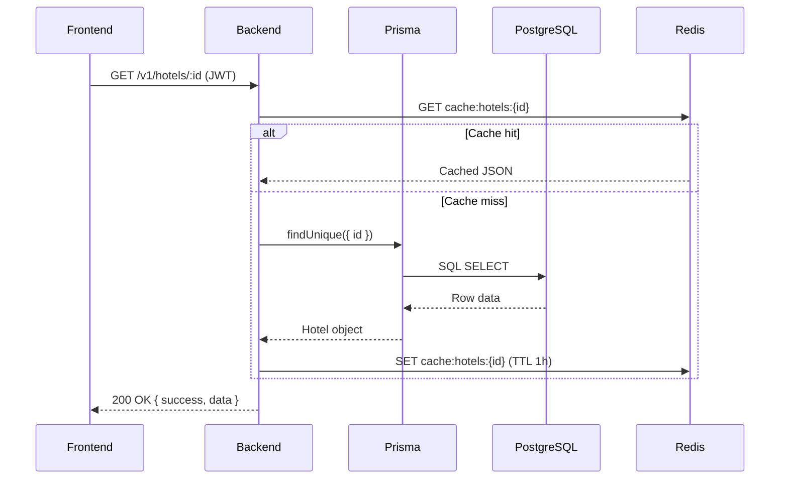
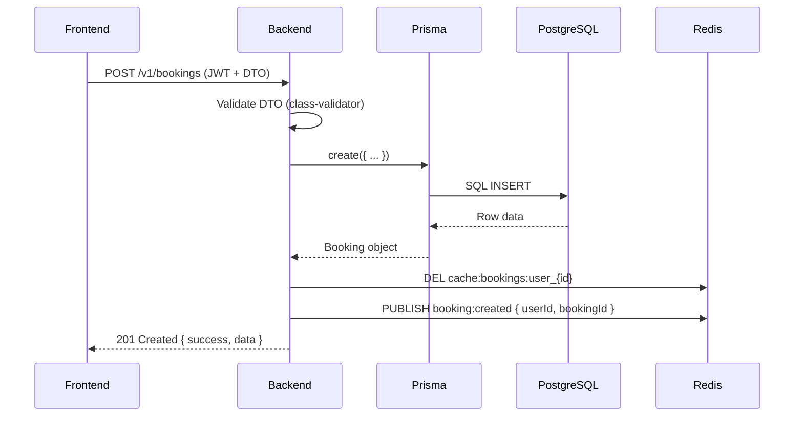
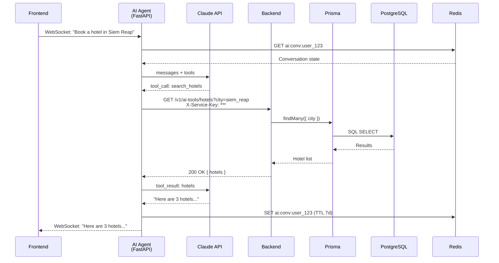

# Data Architecture

> **Scope:** Where data lives, how it moves, who owns it, and how it is cached.

---

## Primary Database — PostgreSQL (Supabase)

| Attribute | Detail |
|-----------|--------|
| **Role** | Source of truth for all business data |
| **Production** | Supabase managed PostgreSQL |
| **Development** | Docker `postgres:15-alpine` |
| **ORM** | Prisma |
| **Schema file** | `backend/prisma/schema.prisma` |

### Hosting Strategy

- **Production:** Supabase provides managed PostgreSQL with automatic backups, connection pooling, and Row-Level Security (RLS).
- **Development:** A local Docker container spun up via `docker-compose.yml`.
- **Connection pooling:** PgBouncer or Supabase pooler is used in production to handle burst traffic from the NestJS backend.

### ORM & Migration Strategy

- **Prisma** is the only allowed way to access PostgreSQL.
- Schema changes follow this workflow:
  1. Edit `schema.prisma`
  2. Run `npx prisma migrate dev` (local) or `npx prisma migrate deploy` (CI)
  3. Generate client: `npx prisma generate`
- Prisma Studio (`npx prisma studio`) is the recommended local database GUI.

### Row-Level Security (RLS)

- RLS is **enabled on all tables** in Supabase production.
- Backend bypasses RLS using the `service_role` key; all authorization logic lives in NestJS guards and services.
- Direct client access to Supabase (if ever needed) will use anon/key-authenticated policies.

---

## Cache & Sessions — Redis

| Attribute | Detail |
|-----------|--------|
| **Role** | Session store, rate-limiting counter, pub/sub bus, AI conversation state |
| **Production** | Upstash (managed Redis with TLS) |
| **Development** | Docker `redis:7-alpine` |
| **Client** | `ioredis` or `redis` (NestJS) |

### Key Patterns & TTL Policies

| Key Prefix | Purpose | TTL | Example |
|------------|---------|-----|---------|
| `sess:` | User session metadata | 7 days | `sess:user_123` |
| `refresh:` | JWT refresh token whitelist | 7 days | `refresh:abc123` |
| `ratelimit:` | Per-IP request counter | 5 minutes | `ratelimit:192.168.1.1` |
| `ai:conv:` | AI conversation state (LangGraph) | 7 days | `ai:conv:user_456` |
| `cache:` | General API response cache | 1 hour | `cache:hotels:siem_reap` |

### Pub / Sub Channels

| Channel | Publisher | Subscriber | Purpose |
|---------|-----------|------------|---------|
| `payment:status:{bookingId}` | Backend (Stripe webhook handler) | Frontend (SSE subscriber) | Real-time payment status updates |
| `emergency:broadcast` | Backend (emergency module) | All connected clients | Emergency alert push |

---

## File Storage — Supabase Storage

| Attribute | Detail |
|-----------|--------|
| **Role** | Avatars, ID verifications, hotel images, receipt PDFs |
| **Production** | Supabase Storage bucket |
| **Development** | Supabase local CLI or cloud project |

### Buckets & Access Patterns

| Bucket | Access | Content | URL Type |
|--------|--------|---------|----------|
| `public-images` | Public | Hotel photos, place images, festival banners | Public URL (no expiry) |
| `user-uploads` | Private | Avatar images, student ID scans | Signed URL (1-hour expiry) |
| `receipts` | Private | Booking receipt PDFs | Signed URL (24-hour expiry) |

### Upload Flow

1. Frontend requests a **signed upload URL** from the backend.
2. Backend generates the signed URL via Supabase Storage API.
3. Frontend uploads the file directly to Supabase Storage (bypassing backend bandwidth).
4. Backend stores the returned public/signed file path in PostgreSQL.

---

## Data Flow Diagrams

### Read Flow

### Write Flow

### AI Flow

---

## Data Ownership Rules

| Data Type | Owner | Storage | Backup |
|-----------|-------|---------|--------|
| User accounts & profiles | Backend | PostgreSQL | Supabase automated backups |
| Bookings, payments, loyalty | Backend | PostgreSQL | Supabase automated backups |
| AI conversation history | AI Agent | Redis (7d TTL) + PostgreSQL (archived) | Redis AOF + nightly PG archive |
| Session tokens | Backend | Redis | None (ephemeral) |
| Uploaded files | Supabase Storage | S3-backed buckets | Supabase bucket replication |
| Cached API responses | Backend | Redis | None (rebuildable) |

---

*For authentication and authorization, see [`security.md`](./security.md). For payment data flows, see [`payments.md`](./payments.md).*
