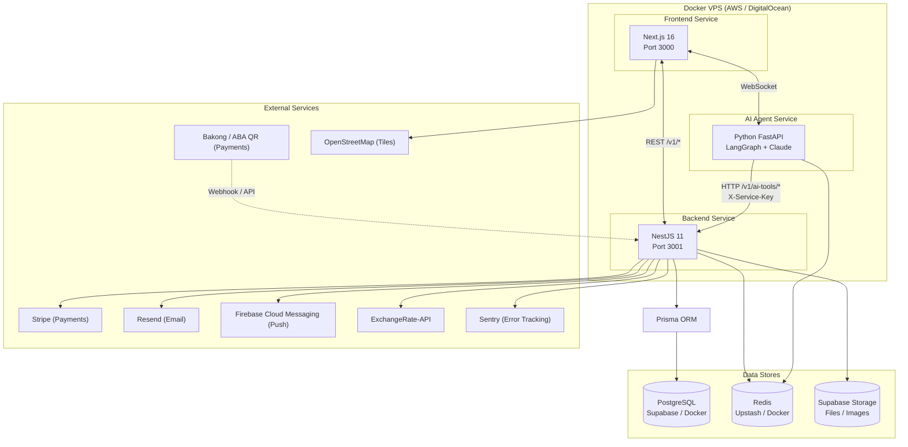

# DerLg — System Architecture

> **Version:** 1.0  
> **Last updated:** 2026-05-10  
> **Scope:** Full-stack architecture for DerLg.com — frontend, backend, AI agent, data stores, and external integrations.

---

## Product Context

DerLg is a Cambodia travel booking platform with an AI-powered travel concierge. It helps international tourists (especially Chinese-speaking visitors and students) discover, plan, and book complete trips through both traditional UI flows and natural-language conversational AI.

### Core Value Proposition

Mobile-first PWA that combines traditional booking with conversational AI to help travelers discover, plan, and book complete Cambodia trips through natural language chat.

### Target Users

| Segment | Needs |
|---------|-------|
| International tourists | Trip discovery, hotel/transport booking, emergency assistance |
| Chinese tourists (primary market) | Multi-language support (ZH), local payment methods (Bakong/ABA QR) |
| Students | Verified discounts on transportation and hotels |
| Safety-conscious travelers | Offline maps, emergency alerts, real-time notifications |

### Business Model

Commission-based on bookings (transportation, hotels, tour guides) with premium features for loyalty members.

---

## High-Level Architecture

### Service Quick Reference

| Service | Technology | Port | Responsibility |
|---------|-----------|------|----------------|
| Frontend | Next.js 16, React 19, TypeScript | 3000 | UI rendering, PWA shell, client state, offline caching |
| Backend | NestJS 11, TypeScript, Prisma | 3001 | Business logic, auth, bookings, payments, notifications |
| AI Agent | Python 3.11, FastAPI, LangGraph | 8000 | Conversational assistant, trip recommendations, booking via tools |

---

## Key Design Principles

1. **Mobile-first PWA**  
   The primary interface is mobile web. Service workers enable offline access to maps and cached content.

2. **AI-assisted booking ("Vibe Booking")**  
   Users can describe a trip in natural language; the AI agent translates intent into structured bookings.

3. **Multi-language support (EN / ZH / KM)**  
   All user-facing content is localized via `next-intl`. The AI agent detects and responds in the user's language.

4. **Offline-capable where possible**  
   Map tiles, static content, and recent booking data are cached locally. Critical read paths work without connectivity.

5. **Security by default**  
   No service trusts another implicitly. The AI agent has no database access; it calls backend APIs with a service key. JWTs are short-lived; refresh tokens are `httpOnly` cookies.

---

## Reading Guide

This architecture is split into focused documents. Read them in order, or jump to the topic you need:

| Document | What you'll learn |
|----------|-----------------|
| **[`services.md`](./services.md)** | What each service owns, how they communicate, and which third-party APIs we depend on. |
| **[`data.md`](./data.md)** | Where data lives, how it moves, ORM strategy, and caching policies. |
| **[`security.md`](./security.md)** | Authentication flows, authorization model, roles, and security baseline. |
| **[`payments.md`](./payments.md)** | Money flow: Stripe, Bakong/ABA QR, booking holds, webhooks, refunds, and idempotency. |
| **[`realtime-and-ai.md`](./realtime-and-ai.md)** | WebSocket chat, AI agent capabilities, tool calling, and real-time notifications. |
| **[`operations.md`](./operations.md)** | Docker deployment, local development setup, observability, and links to deeper specs. |

---

## Technology Stack at a Glance

| Layer | Technology |
|-------|-----------|
| Frontend framework | Next.js 16 (App Router) |
| Frontend language | TypeScript 5 |
| UI & styling | Tailwind CSS v4, shadcn/ui |
| State management | Zustand (client), React Query (server) |
| Maps | Leaflet.js + OpenStreetMap |
| i18n | next-intl (EN / ZH / KM) |
| Backend framework | NestJS 11 |
| Backend language | TypeScript 5.7 |
| ORM | Prisma |
| Database | PostgreSQL 15 (Supabase production, Docker dev) |
| Cache / Sessions | Redis 7 (Upstash production, Docker dev) |
| AI framework | LangGraph (Python) |
| LLM | Claude 4 Sonnet (Anthropic API) |
| Payments | Stripe (cards), Bakong / ABA QR (Cambodia local) |
| Email | Resend |
| Push | Firebase Cloud Messaging (FCM) |
| Error tracking | Sentry |

---

*For implementation details, see `.kiro/specs/`. For per-feature API contracts, see `docs/modules/*/README.md`.*
