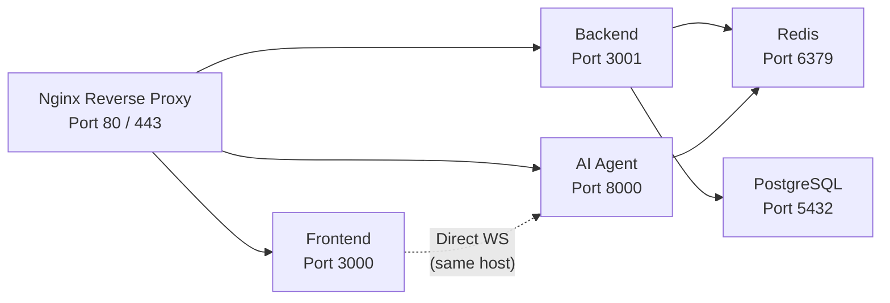

# Deployment, Development & Operations

> **Scope:** Where everything runs in production, how a new developer spins up the entire stack, how we monitor health, and where to find deeper documentation.

---

## Deployment & Hosting

All DerLg services run as **Docker containers on a single VPS** (AWS EC2 or DigitalOcean Droplet). This simplifies networking, reduces cost at early scale, and keeps the AI agent WebSocket path direct.

### Hosting Strategy

| Service | Platform | Notes |
|---------|----------|-------|
| **Frontend** | Docker container on VPS | Next.js standalone output; Nginx reverse proxy serves static assets |
| **Backend** | Docker container on VPS | NestJS app behind Nginx; health check at `/health` |
| **AI Agent** | Docker container on VPS | FastAPI + Uvicorn; no GPU required (Claude is API-based) |
| **PostgreSQL** | Supabase managed (production) / Docker (dev) | Connection pooling via Supabase pooler or PgBouncer |
| **Redis** | Upstash (production) / Docker (dev) | TLS required in production |
| **File Storage** | Supabase Storage | S3-backed buckets; public and private access policies |
| **CDN** | CloudFront or Cloudflare (optional) | Static assets, OpenStreetMap tile proxy, image optimization |

### Docker Network Layout



### Nginx Routing

| Public Path | Internal Target | Purpose |
|-------------|-----------------|---------|
| `/` | `frontend:3000` | Next.js app (SSR + static) |
| `/v1/*` | `backend:3001` | REST API |
| `/v1/ai-tools/*` | `backend:3001` | AI tool endpoints (service-key protected) |
| `/ws/chat` | `ai-agent:8000` | WebSocket chat (direct proxy) |
| `/webhooks/stripe` | `backend:3001` | Stripe webhook endpoint |
| `/webhooks/bakong` | `backend:3001` | Bakong webhook endpoint |

### Health Checks

The backend exposes a single health endpoint used by Docker, Nginx, and load balancers:

```
GET /health
```

**Response:**

```json
{
  "status": "ok",
  "timestamp": "2026-05-10T09:15:00.000Z",
  "services": {
    "database": "ok",
    "redis": "ok"
  }
}
```

- If PostgreSQL or Redis is unreachable, the endpoint returns `503 Service Unavailable`.
- Docker `HEALTHCHECK` uses this endpoint to auto-restart unhealthy containers.

### Environment Variables (Production)

#### Frontend

| Variable | Example | Purpose |
|----------|---------|---------|
| `NEXT_PUBLIC_API_URL` | `https://api.derlg.com` | Backend base URL |
| `NEXT_PUBLIC_WS_URL` | `wss://api.derlg.com/ws/chat` | AI agent WebSocket URL |
| `NEXT_PUBLIC_STRIPE_KEY` | `pk_live_...` | Stripe publishable key |

#### Backend

| Variable | Example | Purpose |
|----------|---------|---------|
| `DATABASE_URL` | `postgresql://...` | Prisma connection string |
| `DIRECT_URL` | `postgresql://...` | Direct Supabase connection (for migrations) |
| `SUPABASE_SERVICE_ROLE_KEY` | `eyJ...` | Supabase admin access |
| `JWT_ACCESS_SECRET` | `random_256bit` | Access token signing |
| `JWT_REFRESH_SECRET` | `random_256bit` | Refresh token signing |
| `STRIPE_SECRET_KEY` | `sk_live_...` | Stripe API |
| `STRIPE_WEBHOOK_SECRET` | `whsec_...` | Stripe webhook verification |
| `AI_SERVICE_KEY` | `hex_256bit` | Service-to-service auth for AI agent |
| `REDIS_URL` | `rediss://...` | Upstash or Redis connection |
| `RESEND_API_KEY` | `re_...` | Email service |
| `SENTRY_DSN` | `https://...` | Error tracking |

#### AI Agent

| Variable | Example | Purpose |
|----------|---------|---------|
| `ANTHROPIC_API_KEY` | `sk-ant-...` | Claude LLM access |
| `BACKEND_URL` | `http://backend:3001` | Internal backend URL |
| `AI_SERVICE_KEY` | `hex_256bit` | Must match backend `AI_SERVICE_KEY` |
| `REDIS_URL` | `rediss://...` | Session storage |

---

## Development Environment

### Docker Compose

A single `docker-compose.yml` at the repo root spins up the entire stack:

```yaml
services:
  postgres:
    image: postgres:15-alpine
    ports: ["5432:5432"]
    environment:
      POSTGRES_DB: derlg
      POSTGRES_USER: postgres
      POSTGRES_PASSWORD: postgres

  redis:
    image: redis:7-alpine
    ports: ["6379:6379"]

  backend:
    build: ./backend
    ports: ["3001:3001"]
    volumes: ["./backend:/app"]
    command: npm run start:dev
    depends_on: [postgres, redis]

  frontend:
    build: ./frontend
    ports: ["3000:3000"]
    volumes: ["./frontend:/app"]
    command: npm run dev
    depends_on: [backend]

  ai-agent:
    build: ./vibe-booking
    ports: ["8000:8000"]
    volumes: ["./vibe-booking:/app"]
    command: uvicorn main:app --reload --host 0.0.0.0 --port 8000
    depends_on: [backend, redis]
```

### First-Time Setup

1. **Clone the repo**
   ```bash
   git clone <repo-url>
   cd derlg
   ```

2. **Copy environment files**
   ```bash
   cp frontend/.env.example frontend/.env.local
   cp backend/.env.example backend/.env
   cp vibe-booking/.env.example vibe-booking/.env
   ```

3. **Generate secrets**
   ```bash
   # JWT secrets
   openssl rand -hex 32
   # AI service key
   openssl rand -hex 32
   ```

4. **Start infrastructure**
   ```bash
   docker-compose up -d postgres redis
   ```

5. **Run Prisma migrations**
   ```bash
   cd backend
   npx prisma migrate dev
   npx prisma db seed
   ```

6. **Start all services**
   ```bash
   docker-compose up
   ```

### Hot Reload

- **Frontend:** Next.js dev server watches `frontend/`.
- **Backend:** `nest start --watch` restarts on `.ts` changes.
- **AI Agent:** Uvicorn `--reload` restarts on `.py` changes.
- **Database:** Schema changes require `npx prisma migrate dev`.

### Local Tooling

| Tool | Purpose | Command |
|------|---------|---------|
| **Prisma Studio** | Database GUI | `npx prisma studio` |
| **Redis CLI** | Cache inspection | `docker-compose exec redis redis-cli` |
| **pgAdmin** | PostgreSQL GUI (optional) | Connect to `localhost:5432` |

---

## CI / CD

### Build Pipeline

| Service | Trigger | Steps |
|---------|---------|-------|
| **Frontend** | Push to `main` | `npm ci` → `npm run lint` → `npm run build` → Docker build → Deploy |
| **Backend** | Push to `main` | `npm ci` → `npm run lint` → `npm run test` → `npm run build` → Docker build → Deploy |
| **AI Agent** | Push to `main` | `pip install` → `pytest` → Docker build → Deploy |

### Database Migrations

- **Local:** `npx prisma migrate dev` (interactive, generates migration files).
- **CI / Production:** `npx prisma migrate deploy` (applies pending migrations, no generation).
- Migrations run in the backend container startup script before the app starts.

### Deployment Triggers

- **Automatic:** Push to `main` branch triggers GitHub Actions → builds images → pushes to Docker Hub → SSH to VPS → `docker-compose pull && docker-compose up -d`.
- **Manual:** One-click rollback to previous image tag via GitHub Actions workflow dispatch.

---

## Observability & Operations

### Health Monitoring

| Check | Endpoint | Frequency | Alert If |
|-------|----------|-----------|----------|
| Backend alive | `GET /health` | Every 30s | `status != ok` for 2 consecutive checks |
| Database connectivity | Included in `/health` | Every 30s | `database != ok` |
| Redis connectivity | Included in `/health` | Every 30s | `redis != ok` |
| Frontend build | CI pipeline | On every push | Build fails |

### Error Tracking — Sentry

- **Frontend:** Sentry React SDK captures component errors and API failures.
- **Backend:** Sentry NestJS SDK captures unhandled exceptions and Prisma query errors.
- **AI Agent:** Sentry Python SDK captures LangGraph node exceptions and Claude API failures.
- All errors are tagged with `environment` (local / staging / production) and `release` (Git commit SHA).

### Logging

- **Backend:** Structured JSON logs via NestJS `Logger`.
  ```json
  { "level": "error", "message": "PaymentIntent failed", "bookingId": "...", "stripeError": "...", "timestamp": "..." }
  ```
- **AI Agent:** Structured JSON logs via Python `structlog`.
- **Frontend:** Error logs sent to Sentry; console logs stripped in production builds.

### Metrics

| Metric | Source | Storage |
|--------|--------|---------|
| API latency (p50, p95, p99) | Backend middleware | Sentry performance + optional Prometheus |
| Error rate (per endpoint) | Backend exception filter | Sentry |
| Booking success rate | Backend payment handler | Custom dashboard (future) |
| WebSocket connections | AI Agent | In-memory counter + log |
| Stripe webhook latency | Backend webhook handler | Sentry performance |

### Alerting

| Severity | Condition | Channel | Response |
|----------|-----------|---------|----------|
| **Critical** | Payment webhook failures for > 5 minutes | Email + SMS to on-call | Investigate Stripe dashboard; check Nginx logs |
| **Critical** | Database connectivity loss for > 1 minute | Email + SMS to on-call | Check Supabase status; verify connection pool |
| **Warning** | API error rate > 5% for 5 minutes | Slack #alerts | Check Sentry for spike cause |
| **Warning** | API p95 latency > 2s for 10 minutes | Slack #alerts | Check slow query log; consider scaling |
| **Info** | Deployment completed | Slack #deploys | Verify `/health` on production |

---

## Documentation Cross-References

This architecture describes the system at a high level. For deeper detail, refer to the documents below.

### Per-Feature Architecture

| Feature | Location |
|---------|----------|
| Vibe Booking | `docs/modules/vibe-booking/README.md` |
| Emergency | `docs/modules/emergency/README.md` |
| Explore Places | `docs/modules/explore-places/README.md` |
| Festivals | `docs/modules/festivals/README.md` |
| Hotel Booking | `docs/modules/hotel-booking/README.md` |
| Loyalty | `docs/modules/loyalty/README.md` |
| Multi-language | `docs/modules/multilanguage/README.md` |
| My Trip | `docs/modules/my-trip/README.md` |
| Offline Maps | `docs/modules/offline-maps/README.md` |
| Payments | `docs/modules/payments/README.md` |
| Profile | `docs/modules/profile/README.md` |
| Student Discount | `docs/modules/student-discount/README.md` |
| Tour Guide | `docs/modules/tour-guide/README.md` |
| Transportation | `docs/modules/transportation/README.md` |
| Trip Discovery | `docs/modules/trip-discovery/README.md` |

### API Specifications

- Feature API contracts: `docs/modules/*/README.md` (backend endpoint definitions)
- Kiro backend spec: `.kiro/specs/backend-nestjs-supabase/requirements.md`
- Kiro frontend spec: `.kiro/specs/frontend-nextjs-implementation/requirements.md`

### Roadmaps

- **Backend roadmap:** `docs/platform/roadmaps/roadmap-backend.md`
- **Frontend roadmap:** `docs/platform/roadmaps/roadmap-frontend.md`
- **Architecture roadmap:** `docs/platform/roadmaps/architecture-roadmap.md`

### Kiro Implementation Specs

| Workstream | Location |
|------------|----------|
| Backend + Supabase | `.kiro/specs/backend-nestjs-supabase/` |
| Frontend Next.js | `.kiro/specs/frontend-nextjs-implementation/` |
| Agentic LLM Chatbot | `.kiro/specs/agentic-llm-chatbot/` |
| System Admin Panel | `.kiro/specs/system-admin-panel/` |
| QA & Testing | `.kiro/specs/qa-testing-comprehensive/` |
| Chatbot Bug Fixes | `.kiro/specs/chatbot-bug-testing-fixes/` |

---

*For the system overview, start with [`index.md`](./index.md).*
