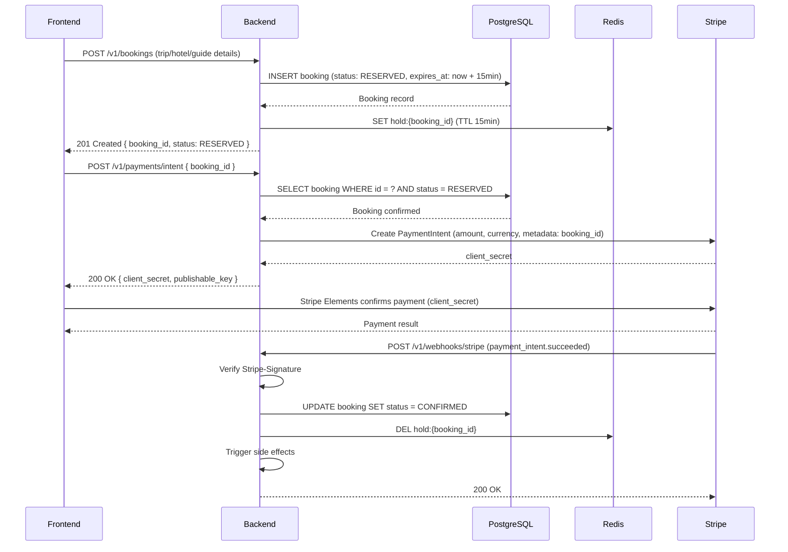
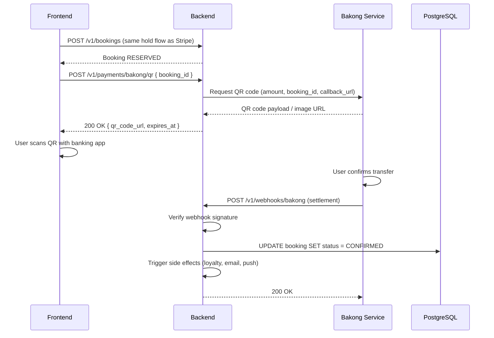

# Payment Architecture

> **Scope:** How money moves through the system, how bookings are held and confirmed, how failures are handled, and how we prevent duplicate charges.

---

## Payment Methods

DerLg supports two parallel payment pipelines:

| Method | Provider | Target Market | Integration |
|--------|----------|---------------|-------------|
| **Credit / Debit Cards** | Stripe (Payment Intents + Stripe Elements) | International tourists | Direct backend integration |
| **QR Code Transfer** | Bakong / ABA QR | Cambodia-local tourists | Separate microservice; webhooks to backend |

---

## Stripe — Card Payment Flow

### Booking Hold & Confirmation



### Step-by-Step Explanation

1. **Booking Hold (15 minutes)**
   - User completes the booking form.
   - Backend creates a booking record with `status = RESERVED`.
   - A Redis key `hold:{booking_id}` is set with a 15-minute TTL.
   - Inventory (hotel rooms, transport seats) is tentatively allocated.

2. **Payment Intent Creation**
   - Frontend requests a payment intent for the held booking.
   - Backend validates the booking is still `RESERVED` and not expired.
   - Backend calls Stripe to create a `PaymentIntent`.
   - `client_secret` and Stripe `publishable_key` are returned to the frontend.

3. **Client-Side Payment**
   - Frontend uses **Stripe Elements** to collect card details securely.
   - Stripe handles PCI compliance; card numbers never touch DerLg servers.
   - Stripe returns a payment result (success or failure) directly to the frontend.

4. **Webhook Confirmation & Side Effects**
   - Stripe sends `payment_intent.succeeded` (or `payment_intent.payment_failed`) to the backend webhook endpoint.
   - Backend verifies the `Stripe-Signature` header.
   - On success:
     - Booking status updated to `CONFIRMED`.
     - Redis hold key deleted.
     - Loyalty points awarded.
     - Receipt email sent via Resend.
     - Push notification sent via FCM.
   - On failure:
     - Booking status updated to `PAYMENT_FAILED`.
     - User notified via email/push with retry link.

---

## Bakong / ABA QR — Local Payment Flow

Bakong operates as a **separate payment service** outside the main backend.



### Bakong-Specific Notes

- The Bakong service generates a unique QR code per booking.
- QR codes expire when the booking hold expires (15 minutes).
- Settlement is asynchronous; the user may scan the QR and confirm the transfer after a short delay.
- Webhook verification uses a Bakong-specific signing secret.
- Refund logic for Bakong is handled manually via admin dashboard (no automated refund API).

---

## Failure Handling

### Hold Expiration

| Trigger | Mechanism | Outcome |
|---------|-----------|---------|
| 15-minute TTL expires | Redis key `hold:{booking_id}` expires + cron job backup | Booking status → `EXPIRED`, inventory released, user notified |

- **Primary:** Redis TTL on `hold:{booking_id}`.
- **Backup:** A cron job or scheduled NestJS task runs every minute to find `RESERVED` bookings past `expires_at` and cancels them.

### Failed Payment — Retry Policy

| Failure Type | User Action | System Action |
|--------------|-------------|---------------|
| Card declined (insufficient funds) | Retry with same or different card | Hold extended by 5 minutes (max 1 extension) |
| 3D Secure failure | Retry authentication | Same hold, new PaymentIntent created |
| Expired card | Update card details | New PaymentIntent, hold extended once |
| Fraud block | Contact bank | Booking auto-canceled after hold expiry |

### Refund Tiers

| Cancellation Window | Refund % | Processing |
|---------------------|----------|------------|
| > 7 days before trip | 100% | Automatic Stripe refund; Bakong manual refund |
| 1 – 7 days before trip | 50% | Automatic Stripe refund; Bakong manual refund |
| < 24 hours before trip | 0% | No refund; credit issued as loyalty points |

- Refunds are initiated by the backend calling Stripe's `Refund` API.
- Bakong refunds require admin manual processing; the backend tracks refund status in the `payments` table.

---

## Idempotency

### Webhook Idempotency

- Stripe webhooks include a unique `id` in the event payload.
- Backend records processed event IDs in Redis (`webhook:stripe:{event_id}`) with a 24-hour TTL.
- Duplicate events are acknowledged with `200 OK` but no business logic is re-executed.

```
POST /v1/webhooks/stripe
  → Check Redis: EXISTS webhook:stripe:evt_123
  → If exists: return 200 OK immediately
  → If new: process, SET webhook:stripe:evt_123, return 200 OK
```

### Duplicate Payment Prevention

- Each `PaymentIntent` is created with `metadata: { booking_id }`.
- Before creating a new PaymentIntent, the backend checks for existing intents on the same booking.
- A booking can have at most one active PaymentIntent at a time.
- If a user double-clicks "Pay," the second request returns the existing `client_secret` instead of creating a duplicate.

### API Idempotency Key

- Frontend may send an `Idempotency-Key` header (`uuid`) on payment-related POSTs.
- Backend caches the response for 24 hours keyed by `idempotency:{key}`.
- Retries with the same key return the cached response without side effects.

---

## Payment Data Model (Summary)

| Entity | Key Fields | Purpose |
|--------|-----------|---------|
| `bookings` | `id`, `status` (RESERVED / CONFIRMED / PAYMENT_FAILED / EXPIRED / CANCELED), `expires_at`, `total_amount` | Master booking record |
| `payments` | `id`, `booking_id`, `provider` (stripe / bakong), `provider_payment_id`, `amount`, `currency`, `status`, `refunded_amount` | Record of each payment attempt |
| `payment_intents` (Stripe) | `id`, `booking_id`, `stripe_payment_intent_id`, `client_secret`, `status` | Tracks Stripe-specific intent lifecycle |

---

*For authentication and security controls around payments, see [`security.md`](./security.md). For real-time payment status updates, see [`realtime-and-ai.md`](./realtime-and-ai.md).*
