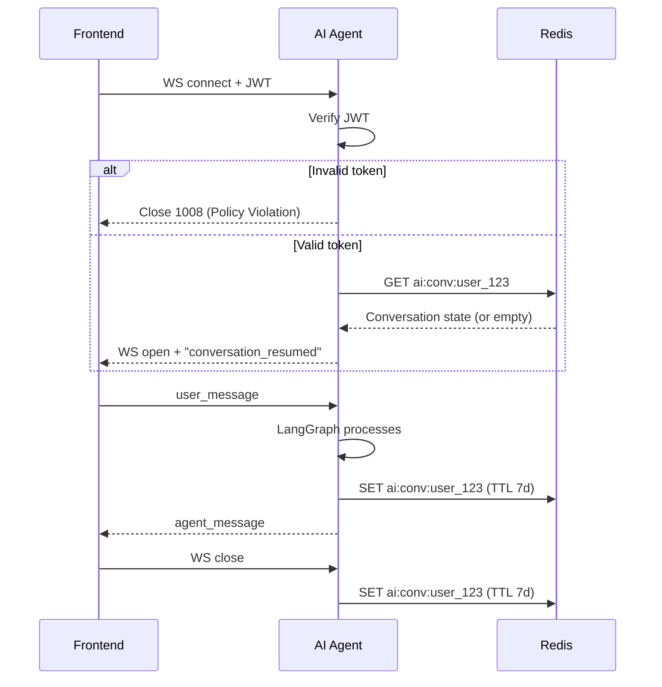
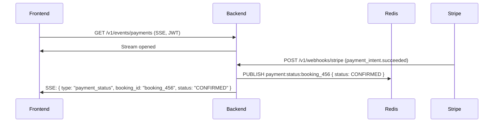
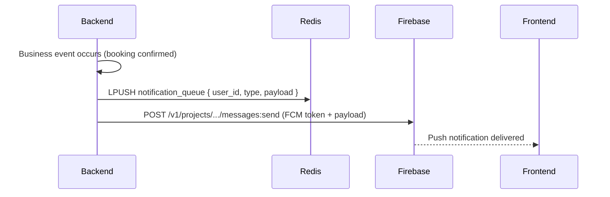
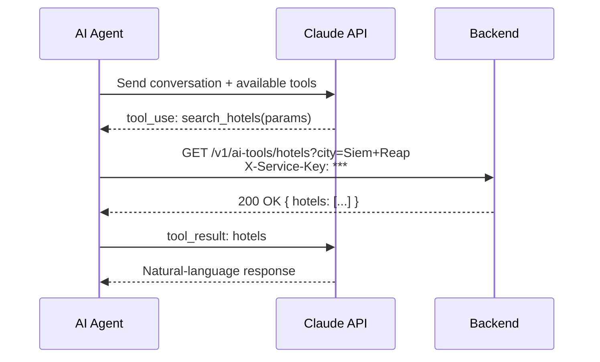
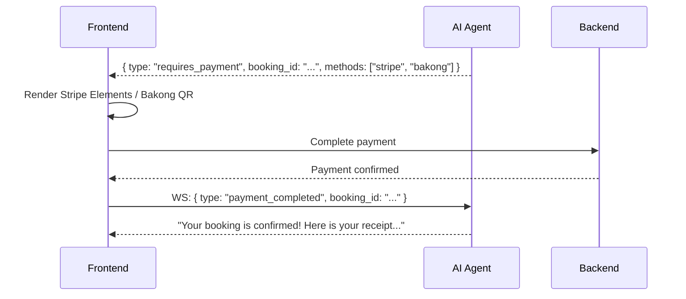

# Real-Time Communication & AI Integration

> **Scope:** How live data moves between users and services, and how the AI agent participates in user journeys.

---

## AI Chat

### Protocol & Path

| Attribute | Detail |
|-----------|--------|
| **Protocol** | WebSocket |
| **Connection** | Frontend → AI Agent (FastAPI) directly |
| **Path** | `wss://api.derlg.com/ws/chat` (or `ws://localhost:8000/ws/chat` in dev) |
| **Auth** | Bearer JWT passed in the connection handshake query param or header |
| **Transport** | JSON messages with a type discriminator |

Because all services run inside the same Docker network on a single VPS, the frontend opens a **direct WebSocket** to the FastAPI AI agent. There is no backend proxy for chat traffic.

### Message Format

```json
// Client → Server
{
  "type": "user_message",
  "conversation_id": "conv_abc123",
  "content": "I need a hotel in Siem Reap for 2 nights"
}

// Server → Client
{
  "type": "agent_message",
  "conversation_id": "conv_abc123",
  "content": "Here are 3 hotels in Siem Reap...",
  "suggestions": [
    { "type": "hotel", "id": "hotel_1", "name": "..." }
  ]
}

// Server → Client (tool execution)
{
  "type": "tool_call",
  "tool": "search_hotels",
  "params": { "city": "Siem Reap", "nights": 2 }
}
```

### Connection Lifecycle



### Message History Persistence

| Layer | Storage | TTL / Retention |
|-------|---------|-----------------|
| **Active session** | Redis (`ai:conv:{user_id}`) | 7 days |
| **Long-term archive** | PostgreSQL (`conversations`, `messages` tables) | Permanent |

- While the conversation is active, the full message history lives in Redis for fast retrieval by LangGraph.
- When the WebSocket closes, the conversation state is flushed to PostgreSQL for long-term storage and analytics.
- If a user reconnects after the Redis TTL expires, the agent starts a fresh conversation but can summarize archived history from PostgreSQL.

---

## Payment Status Updates

### Mechanism: Server-Sent Events (SSE)

The frontend subscribes to an SSE stream on the backend to receive real-time payment status updates.



### Why SSE over WebSocket for Payments?

| Concern | Decision |
|---------|----------|
| Directionality | Payment updates are **server → client only**; SSE is simpler than a full-duplex WebSocket. |
| Reconnection | SSE has built-in automatic reconnection with `Last-Event-ID`. |
| Infrastructure | Reuses the existing HTTP stack (no separate WebSocket manager needed on the backend). |

### Fallback

If SSE is unavailable (e.g., corporate proxies block it), the frontend falls back to short-polling the booking status endpoint every 5 seconds while a payment is in progress.

---

## Push Notifications

### Provider: Firebase Cloud Messaging (FCM)

| Attribute | Detail |
|-----------|--------|
| **Protocol** | HTTPS (server → FCM) + FCM SDK (client) |
| **Token management** | Frontend requests FCM token on login; backend stores `fcm_token` in the `users` table |
| **Topics** | `booking_updates`, `trip_reminders`, `emergency_alerts` |

### Trigger Events

| Event | Recipient | Channel |
|-------|-----------|---------|
| Booking confirmed | Booking owner | Push + Email |
| Payment failed | Booking owner | Push + Email |
| Trip reminder (24h before) | Traveler | Push |
| Emergency alert | All users in affected region | Push (topic broadcast) |
| Loyalty tier upgrade | User | Push + Email |
| Student verification approved | User | Push + Email |

### Delivery Flow



---

## AI Agent Capabilities

The AI agent is a **fourth participant** in most user journeys. It does not replace the frontend or backend; it augments them with natural-language interaction.

### Core Capabilities

| Capability | Description | Backend Tools Used |
|------------|-------------|-------------------|
| **Conversational trip planning** | Users describe a trip; the agent suggests destinations, durations, and activities. | `search_trips`, `search_places` |
| **Search and recommendation** | Finds hotels, trips, and guides matching user preferences (budget, dates, location). | `search_hotels`, `search_guides`, `check_availability` |
| **Booking assistance** | Creates booking holds, suggests alternative dates if sold out, explains pricing. | `create_booking_hold`, `check_availability` |
| **Emergency guidance** | Provides safety advice, nearest hospital/police info, and triggers SOS if needed. | `get_emergency_contacts`, `send_sos_alert` |

### Capability Boundaries

The AI agent **CAN**:
- Search and read data via backend tool endpoints.
- Create **booking holds** (`RESERVED` status) for the user to confirm.
- Suggest payment methods and guide the user to the checkout screen.
- Answer questions about Cambodia travel, culture, and safety.

The AI agent **CANNOT**:
- Access the database directly (all reads go through `/v1/ai-tools/*`).
- Execute payments or create Stripe charges.
- Modify confirmed bookings without user explicit confirmation.
- Access admin-only data or other users' private information.

---

## Tool Calling

### Backend Tool Endpoints

The backend exposes a dedicated namespace for the AI agent:

```
/v1/ai-tools/*
```

All requests must include:

```
X-Service-Key: <AI_SERVICE_KEY>
```

### Available Tools

| Tool | Method | Path | Purpose |
|------|--------|------|---------|
| `search_hotels` | GET | `/v1/ai-tools/hotels` | Find hotels by city, date, price range |
| `search_trips` | GET | `/v1/ai-tools/trips` | Find trip packages |
| `search_guides` | GET | `/v1/ai-tools/guides` | Find tour guides by location and language |
| `check_availability` | GET | `/v1/ai-tools/availability` | Check inventory for a specific item and date |
| `create_booking_hold` | POST | `/v1/ai-tools/booking-holds` | Create a `RESERVED` booking (15-min hold) |
| `get_weather` | GET | `/v1/ai-tools/weather` | Current weather for a location (if OpenWeatherMap enabled) |
| `get_emergency_contacts` | GET | `/v1/ai-tools/emergency-contacts` | Nearby emergency services |
| `send_sos_alert` | POST | `/v1/ai-tools/sos` | Trigger an emergency alert for the user |
| `get_user_loyalty` | GET | `/v1/ai-tools/loyalty` | Read the user's current points and tier |

### Tool Call Flow



---

## AI State Machine

### Orchestration: LangGraph

The AI agent uses **LangGraph** to manage conversation state and tool execution. The graph is deterministic: the LLM decides which node to transition to, but the backend controls the available tools and validates all inputs.

### State Structure

```python
class ConversationState:
    messages: list[Message]          # Full conversation history
    user_id: str                     # DerLg user ID
    intent: str | None               # Detected intent (plan, book, ask, emergency)
    pending_tool_calls: list[dict]   # Tools the LLM wants to execute
    last_action: str | None          # Last successful tool or response
    context: dict                    # Arbitrary session context (dates, budget, etc.)
```

### Session Persistence

- **Active sessions** are stored in Redis (`ai:conv:{user_id}`) with a 7-day TTL.
- **Archival** happens on WebSocket disconnect: the final state is serialized and stored in PostgreSQL.
- **Reconnection:** If the user reconnects within 7 days, the Redis state is restored. If not, a new session starts; archived history can be loaded from PostgreSQL as a summary.

### Human-in-the-Loop for Payment

The AI agent **never executes payments**. When a conversation reaches the payment stage:

1. The agent creates a booking hold (if the user agrees).
2. The agent sends a structured message to the frontend with `type: "requires_payment"`.
3. The frontend renders the native payment UI (Stripe Elements or Bakong QR).
4. After payment, the frontend sends a `payment_completed` event back to the agent via WebSocket.
5. The agent resumes the conversation with confirmation details.



---

*For the service boundaries that define these communication paths, see [`services.md`](./services.md). For payment-specific flows, see [`payments.md`](./payments.md).*
