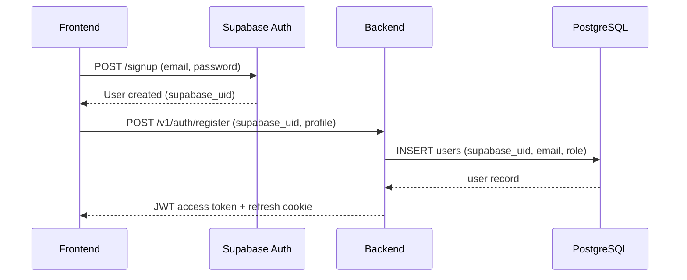
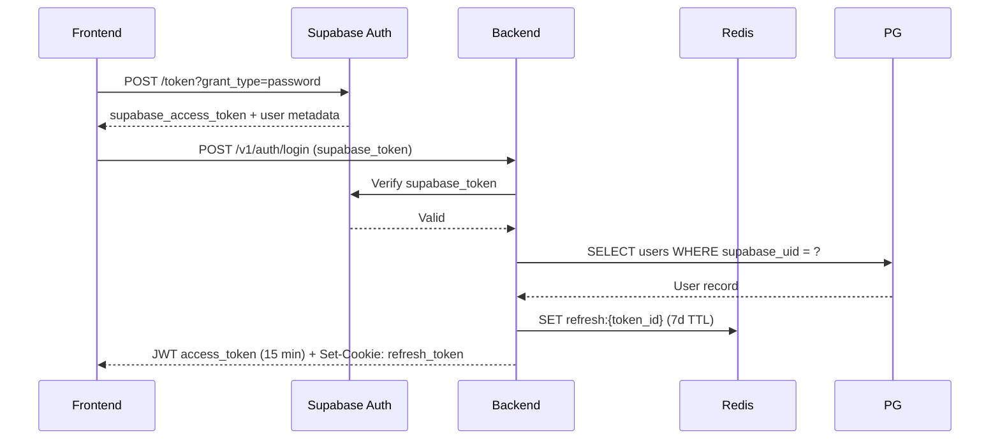
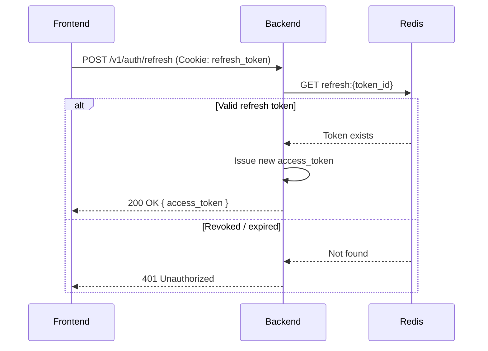
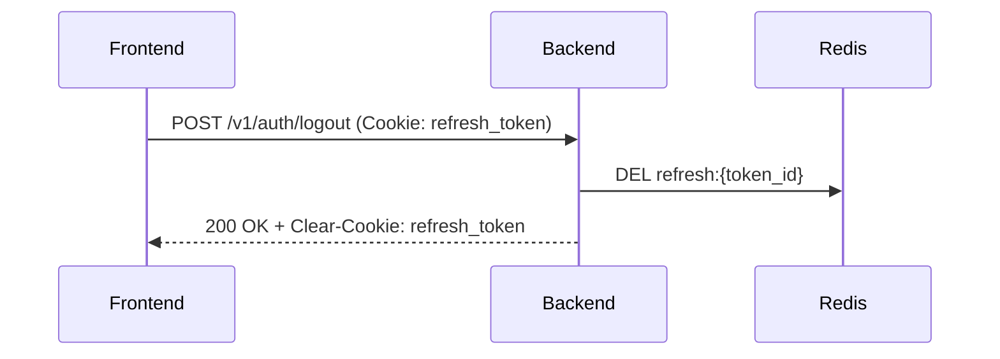

# Authentication & Security Architecture

> **Scope:** How users and services prove identity, what they are allowed to do, and the security baseline that protects the entire system.

---

## Auth Strategy Overview

DerLg uses a **hybrid auth model**:

| Layer | Mechanism | Handles |
|-------|-----------|---------|
| **Identity provider** | Supabase Auth | Email/password registration, Google OAuth, password resets |
| **Session / API auth** | Backend-issued JWT | Access tokens for API calls, refresh tokens in `httpOnly` cookies |
| **Service-to-service** | `X-Service-Key` header | AI agent → backend internal endpoints |

---

## Identity Flow

### Registration

### Login

### Token Refresh

### Logout

---

## Token Specifications

### Access Token

| Attribute | Value |
|-----------|-------|
| **Issuer** | Backend (NestJS) |
| **Audience** | DerLg API (`/v1/*`) |
| **Expiry** | 15 minutes |
| **Storage** | Frontend memory (Zustand auth store) |
| **Transport** | `Authorization: Bearer <token>` header |
| **Payload** | `sub` (user id), `role`, `email`, `iat`, `exp` |

### Refresh Token

| Attribute | Value |
|-----------|-------|
| **Issuer** | Backend (NestJS) |
| **Expiry** | 7 days |
| **Storage** | `httpOnly`, `Secure`, `SameSite=Strict` cookie |
| **Transport** | Automatic via browser cookie |
| **Revocation** | Stored in Redis; deleted on logout or security event |

### AI Agent Service Key

| Attribute | Value |
|-----------|-------|
| **Name** | `X-Service-Key` |
| **Value** | Random 256-bit hex string (`AI_SERVICE_KEY` env var) |
| **Scope** | `/v1/ai-tools/*` endpoints only |
| **Rotation** | Manual rotation via env var redeploy |

---

## Authorization Model

### Role-Based Access Control (RBAC)

| Role | Description | Key Permissions |
|------|-------------|-----------------|
| `user` | Standard registered tourist | Book trips, view own bookings, chat with AI, earn loyalty points |
| `guide` | Registered tour guide | Manage availability, accept bookings, view assigned trips |
| `admin` | Platform administrator | Full read/write across all modules, user management, refund approval |
| `student` | Verified student user | All `user` permissions + discounted pricing on eligible bookings |

### Role Assignment

- `user` is the default role on registration.
- `student` is granted after successful ID verification (upload + manual or automated review).
- `guide` requires a separate application and admin approval.
- `admin` is assigned manually in the database (no self-service promotion).

### Permission Enforcement

- **Backend:** Guards (`RolesGuard`) check the `role` claim in the JWT against a `@Roles()` decorator on controllers/handlers.
- **Database:** Row-Level Security (RLS) policies in Supabase enforce ownership at the database level as a safety net.
- **Frontend:** UI gates hide admin/guide features based on the user role returned at login. This is cosmetic; the backend is the source of truth.

### AI Agent Permissions

The AI agent is not a "user" and does not hold a JWT. It uses the service key.

| Endpoint Pattern | AI Agent Access | Notes |
|------------------|-----------------|-------|
| `/v1/ai-tools/*` | **Allowed** | Explicitly built for the agent |
| `/v1/bookings` (POST) | **Denied** | Agent cannot create bookings directly; it guides the user through the frontend |
| `/v1/payments/*` | **Denied** | Agent never touches payment flows |
| `/v1/admin/*` | **Denied** | No admin access |
| `/v1/users/*` | **Read-only** | Can read public profile data for personalization |

---

## Security Baseline

### Rate Limiting

| Endpoint Category | Limit | Window | Backend |
|-------------------|-------|--------|---------|
| Auth (login, register, refresh) | 5 requests | 5 minutes | Redis-backed sliding window |
| Password reset | 3 requests | 15 minutes | Redis-backed sliding window |
| General API | 100 requests | 1 minute | Redis-backed per IP + per user |
| AI chat (WebSocket) | 50 messages | 1 minute | In-memory rate limiter per connection |

### CORS

- **Production:** Whitelist exact origins only (`https://derlg.com`, `https://www.derlg.com`).
- **Development:** `http://localhost:3000` allowed.
- **Credentials:** Cookies are sent cross-origin only to whitelisted domains.

### Input Validation

- All request bodies are validated via `class-validator` DTOs.
- Strict `ValidationPipe` with `whitelist: true` strips unexpected fields.
- File uploads are validated for type (image/*, application/pdf) and size (max 5 MB).

### Secret Management

| Rule | Implementation |
|------|----------------|
| No hardcoded secrets | All keys live in environment variables |
| `.env` files are gitignored | Committed templates use `.env.example` |
| JWT secrets | Random 256-bit strings generated at setup |
| Service keys | Separate key per service (AI agent, Stripe webhooks, etc.) |
| Database credentials | Connection string in env var; SSL required in production |

### Stripe Webhook Security

- Stripe webhook endpoints verify the `Stripe-Signature` header using the endpoint secret.
- Replayed or tampered webhooks are rejected with `400 Bad Request`.
- Webhook handlers are idempotent (see [`payments.md`](./payments.md)).

### Supabase Row-Level Security (RLS)

- RLS is enabled on all tables in production.
- Backend uses the `service_role` key and bypasses RLS intentionally.
- Any future direct client access (e.g., mobile app) will use anon/key policies that enforce row ownership.

---

## Threat Model Quick Reference

| Threat | Mitigation |
|--------|------------|
| JWT theft | Short expiry (15 min), refresh tokens in `httpOnly` cookies, Redis revocation on logout |
| Replay attacks | Stripe webhook signature verification, idempotency keys on payment endpoints |
| Brute force | Redis-backed rate limiting on auth endpoints |
| SQL injection | Prisma ORM (parameterized queries only) |
| Mass assignment | `whitelist: true` in ValidationPipe |
| XSS | `httpOnly` cookies prevent JS access to refresh tokens; Content Security Policy (CSP) headers |
| AI agent overreach | Service key restricted to `/v1/ai-tools/*`; no payment or admin endpoints exposed |

---

*For payment-specific security, see [`payments.md`](./payments.md). For the overall system overview, see [`index.md`](./index.md).*
