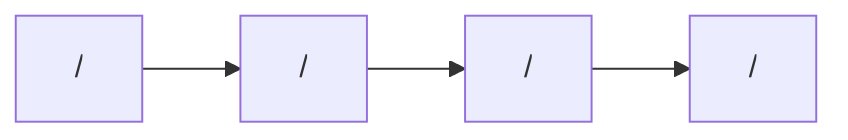

# Frontend design: <Feature Name>

> **Forward-looking design doc.** What the frontend for this feature **will** look like. Replaces nothing in the codebase yet.
> Once the feature ships, the equivalent reference doc at [`reference/features/<feature>.md`](./reference/features/) takes over as the source of truth and this design doc is archived.

| Field | Value |
|---|---|
| **Status** | Drafting \| Approved \| Implementing \| Shipped |
| **Owner** | <name or team> |
| **Last reviewed** | YYYY-MM-DD |
| **Phase** | <e.g. Phase 5 — Feature Modules> (see [roadmap](../../roadmaps/frontend-roadmap.md)) |
| **Product PRD** | [`docs/product/prd.md#<anchor>`](../../../product/prd.md) |
| **Feature registry** | [`docs/product/feature-decisions.md#<anchor>`](../../../product/feature-decisions.md) |
| **Backend module** | [`docs/modules/<feature>/`](../../../modules/<feature>/) *(if it exists)* |
| **Related ADRs** | ADR-XXXX, ADR-YYYY |

---

## 1. Goal

One sentence. The user job-to-be-done that this feature solves on the frontend.

> Example: *Let a traveler discover, compare, and book a Cambodia trip package end-to-end on mobile, in their preferred language.*

---

## 2. User flow

Numbered steps, entry → completion. Mention the route at each step.

1. User lands on `/[locale]/...`
2. ...
3. ...
4. Success state at `/[locale]/...`

Optional Mermaid diagram if the flow branches:

---

## 3. Pages

Every route this feature owns. One row per page.

| # | Path | Auth | Layout shell | Purpose |
|---|---|---|---|---|
| 1 | `/[locale]/<feature>` | Yes/No | `(main)` / `(auth)` / standalone | Landing |
| 2 | `/[locale]/<feature>/[id]` | Yes/No | `(main)` | Detail |
| 3 | `/[locale]/<feature>/new` | Yes | `(main)` | Create flow |

---

## 4. Per-page detail

Repeat one block per page. Keep each block lean — link out for cross-cutting concerns.

### 4.1 `/[locale]/<feature>` (Landing)

**Purpose:** what the user comes here to do.

**Data shown** (every visible piece of information):
- ...
- ...

**User actions** (every interaction):
- Tap card → navigate to detail.
- Filter by category → updates `searchParams`.
- ...

**Components used:**
- Existing in `shared/`: `<Button>`, `<Card>`, `<EmptyState>`.
- New in `features/<feature>/components/`: `<FeatureList>`, `<FeatureCard>`, `<FeatureFilterBar>`.

**States:**

| State | UI | Source |
|---|---|---|
| Loading | Skeleton list | `loading.tsx` |
| Empty | `<EmptyState>` with CTA | `t('<feature>.empty.*')` |
| Error | Inline error + retry | React Query `error` |

**Backend calls:** `GET /v1/<feature>?...`

**i18n keys:** `<feature>.list.*`

---

### 4.2 `/[locale]/<feature>/[id]` (Detail)

(Same structure as 4.1.)

---

## 5. Data model

What this feature consumes. Reference Zod schema names; don't restate the shape unless it's truly new.

| Schema | Shape (high-level) | Source |
|---|---|---|
| `<Feature>Schema` | `id`, `name`, `priceUsd`, `imageUrl`, ... | `features/<feature>/schemas/<feature>.ts` |
| `<Feature>DetailSchema` | extends above + `description`, `gallery[]`, ... | same file |

**Backend endpoints called:**

| Method | Path | Use |
|---|---|---|
| GET | `/v1/<feature>` | List with filters |
| GET | `/v1/<feature>/:id` | Detail |
| POST | `/v1/<feature>` | Create |

---

## 6. Client state

Per [ADR-0002](../adr/0002-state-management-split.md):

**React Query hooks** (server state):

| Hook | Query key | `staleTime` | Invalidates |
|---|---|---|---|
| `use<Feature>List(filters)` | `['<feature>', 'list', filters]` | 30s | — |
| `use<Feature>(id)` | `['<feature>', id]` | 60s | — |
| `useCreate<Feature>()` | — | — | `['<feature>']` |

**Zustand stores** (client UI state, if any):

| Store | What it holds | Persisted |
|---|---|---|
| `use<Feature>UiStore` | filter draft, last-viewed id | No |

**Forms** (RHF + Zod):

| Form | Schema | Where |
|---|---|---|
| Create<Feature>Form | `Create<Feature>Schema` | `features/<feature>/components/Create<Feature>Form.tsx` |

---

## 7. External integrations

Anything beyond the NestJS backend. Mark N/A if none.

- **WebSocket:** N/A *(or: connects to AI agent at `<url>` for ...)*
- **Stripe:** N/A *(or: Stripe Elements for card form on `/checkout`)*
- **Maps:** N/A *(or: Leaflet on detail page for trip route)*
- **Push (FCM):** N/A
- **Storage (uploads):** N/A

---

## 8. Edge cases & error states

| Case | UI behavior | Notes |
|---|---|---|
| Offline | Show cached list + offline banner | PWA strategy in [`reference/pwa.md`](../reference/) |
| 401 (session expired) | Auto-refresh once, then redirect to `/login` | Handled in shared API client per [ADR-0003](../adr/0003-auth-and-session-model.md) |
| 4xx (validation) | Inline field error + toast | Message from `errors.<feature>.*` |
| 5xx / network | Toast + manual retry CTA | |
| Permission denied | Empty state with explanation | |
| Feature flag off | Route returns 404 | |

---

## 9. Acceptance criteria (frontend)

The feature is "done" when:

- [ ] Every page in §3 renders with real data from the backend.
- [ ] Every state in §4 (loading / empty / error) is reachable and looks correct.
- [ ] Every flow in §2 completes end-to-end without console errors.
- [ ] All copy is i18n-keyed across `en`, `zh`, `km`.
- [ ] At least one E2E test covers the happy path.
- [ ] All §3 routes pass keyboard navigation and meet WCAG AA contrast.
- [ ] Mobile (375 px) and tablet (768 px) layouts render correctly.
- [ ] All §3 routes meet the Core Web Vitals budget in `governance.md`.

---

## 10. Open questions

Track unresolved design decisions here. Each becomes either an ADR, a roadmap entry, or is resolved in a follow-up PR before this design is marked **Approved**.

- [ ] ...
- [ ] ...

---

## 11. Out of scope

Things this design intentionally does **not** cover. Useful for reviewers.

- Admin-side management of `<feature>` (separate dashboard, post-MVP).
- ...

---

## 12. Related

- Product PRD section: [`docs/product/prd.md#<anchor>`](../../../product/prd.md)
- Feature registry entry: [`docs/product/feature-decisions.md#<anchor>`](../../../product/feature-decisions.md)
- Backend module: [`docs/modules/<feature>/`](../../../modules/<feature>/)
- Future reference doc: [`../reference/features/<feature>.md`](../reference/features/) *(authored once shipped)*
- Roadmap phase: [`docs/platform/roadmaps/frontend-roadmap.md`](../../roadmaps/frontend-roadmap.md)

---

## Authoring notes (delete before merging)

- **Status lifecycle:** `Drafting` → `Approved` (ready to implement) → `Implementing` → `Shipped`. Once `Shipped`, the equivalent doc in `reference/features/<feature>.md` becomes the source of truth; this design doc is moved to `archive/` (or kept in place with a banner pointing to the reference doc).
- **No code in this doc.** Pseudo-code and shape examples only. Concrete code samples belong in the eventual reference doc.
- **No future tense in `reference/features/`** — by contrast, this template is *all* future tense. Keep that distinction.
- **One feature per doc**, regardless of how many pages it has. Multi-page features fit in one design doc. Don't fragment.
- **Cite, don't restate.** When mentioning state management, auth, i18n, design system — link to the ADR / cross-cutting reference and move on.
- Keep tables small. If you find yourself filling 30 rows of "components", you're describing too much detail for a design doc — that's reference territory.
