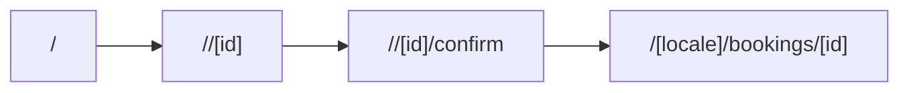
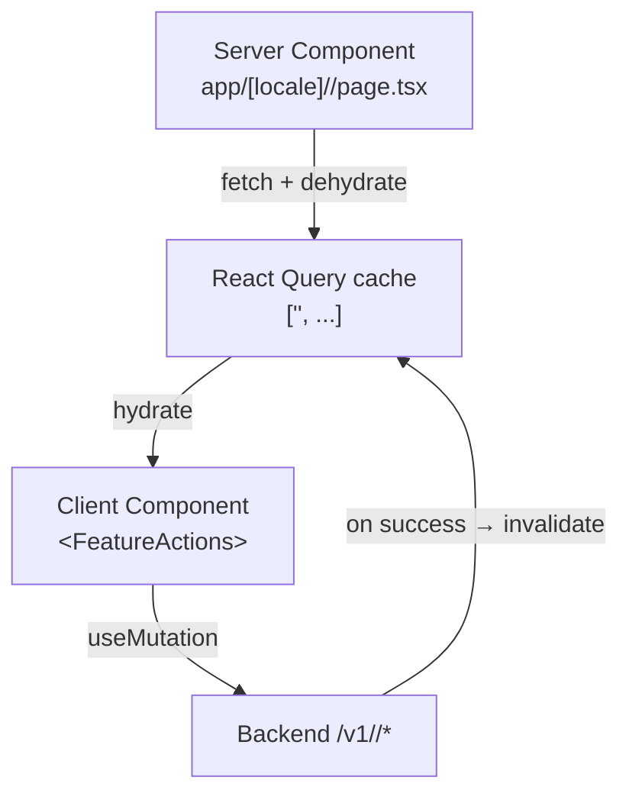

# Frontend reference: <Feature Name>

> One-paragraph summary. **What is this feature on the frontend?** Not the product pitch — the implementation. Example:
> "The Auth feature owns the email/password and Google OAuth sign-in flows, the password reset experience, and the in-memory access token. It does not own session storage (see [`auth-and-session.md`](../auth-and-session.md))."

| Field | Value |
|-------|-------|
| **Owner** | Frontend platform team |
| **Status** | Draft \| Active \| Deprecated |
| **Last reviewed** | YYYY-MM-DD |
| **Product spec** | [`docs/modules/<feature>/architecture.md`](../../../../modules/<feature>/architecture.md) |
| **Backend reference** | [`docs/platform/backend/...`](...) *(when it exists)* |
| **Related ADRs** | ADR-XXXX, ADR-YYYY |
| **Related code** | `frontend/app/[locale]/<...>/`, `frontend/components/<feature>/`, `frontend/stores/<feature>.store.ts` |

---

## TL;DR

Three to five bullets. The minimum a reader needs to know if they read nothing else.

- This feature lives at `app/[locale]/<...>` and uses the `(<group>)` route group.
- State lives in `frontend/stores/<feature>.store.ts` (Zustand) for client UI state and `frontend/hooks/use-<feature>.ts` (React Query) for server state.
- The user-facing flow is: <step 1> → <step 2> → <step 3>.
- It depends on cross-cutting reference: [`state-and-data.md`](../state-and-data.md), [`auth-and-session.md`](../auth-and-session.md), [`design-system.md`](../design-system.md), [`i18n-and-locale.md`](../i18n-and-locale.md).
- Open question: <thing the team hasn't decided yet>.

---

## Routes

Enumerate every route this feature owns.

| Path | Route group | Auth required | SEO | Notes |
|------|-------------|---------------|-----|-------|
| `/[locale]/<feature>` | `(app)` | Yes | `noindex` | Main landing |
| `/[locale]/<feature>/[id]` | `(app)` | Yes | `noindex` | Detail |
| `/[locale]/<feature>/new` | `(app)` | Yes | `noindex` | Create flow |

If a route is part of a flow, include a Mermaid diagram below. Keep it small.



---

## Components

What lives in `frontend/components/<feature>/`, and what is reused from `components/shared/` or `components/ui/`.

| Component | Type | Used by | Notes |
|-----------|------|---------|-------|
| `<FeatureCard>` | Server | `app/[locale]/<feature>/page.tsx` | Renders list item |
| `<FeatureForm>` | Client | `app/[locale]/<feature>/new/page.tsx` | RHF + Zod, see Validation below |
| `<FeatureActions>` | Client | `<FeatureDetail>` | Mutation island |

If the feature relies on a shared primitive that has feature-specific configuration (e.g., a custom `<BottomSheet>` variant), document the variant here.

---

## State

### Zustand stores ([ADR-0002](../../adr/0002-state-management-split.md))

| Store | File | Persisted? | What it owns |
|-------|------|------------|--------------|
| `use<Feature>Store` | `stores/<feature>.store.ts` | Yes / No | …client-only state… |

Document the **shape** when it's not obvious from the file:

```typescript
interface FeatureState {
  // …
}
```

### React Query hooks ([ADR-0002](../../adr/0002-state-management-split.md))

| Hook | File | Query key | Stale time | Invalidates |
|------|------|-----------|------------|-------------|
| `use<Feature>List` | `hooks/use-<feature>.ts` | `['<feature>', 'list', filters]` | 30 s | — |
| `use<Feature>` | same | `['<feature>', id]` | 30 s | — |
| `useCreate<Feature>` | same | — | — | `['<feature>']` |
| `useUpdate<Feature>` | same | — | — | `['<feature>', id]` |

---

## Data flow

A diagram describing which Server Components fetch initial data, which Client Components mutate, and where hydration boundaries sit. Use Mermaid `flowchart`.



If a piece of data flows over the WebSocket (Vibe Booking only), document it here too. Cite [`realtime-and-vibe-booking.md`](../realtime-and-vibe-booking.md) rather than restating the protocol.

---

## i18n namespaces ([ADR-0004](../../adr/0004-i18n-routing-strategy.md))

Which keys in `messages/{en,zh,km}.json` belong to this feature.

```jsonc
// messages/en.json (excerpt)
{
  "<feature>": {
    "title": "…",
    "form": {
      "submit": "…",
      "errors": {
        "required": "…"
      }
    }
  }
}
```

| Namespace | Used in | Notes |
|-----------|---------|-------|
| `<feature>` | All feature components | Top-level keys go here |
| `errors.<feature>` | API error toasts | Centralized error messages |

Rules:
- All three locale files MUST contain the same key set.
- AI-generated content is never interpolated into i18n strings — it's rendered through the AI content renderer.

---

## Validation schemas

Zod schemas live in `frontend/schemas/<feature>.ts`. Reference them here, don't restate them.

```typescript
// schemas/<feature>.ts
export const Create<Feature>Schema = z.object({ /* … */ })
export type Create<Feature> = z.infer<typeof Create<Feature>Schema>
```

Forms use React Hook Form + `@hookform/resolvers/zod` per the [`Forms`](../../governance.md#code) DoD rule.

---

## Error states

What the user sees on each failure mode.

| Scenario | UI surface | Source of message |
|----------|-----------|-------------------|
| Validation error | Inline, under the input | Zod schema |
| 4xx from backend | Toast (top-right desktop, top-center mobile) | `errors.<feature>.*` i18n key resolved from `error.code` |
| 5xx / network | Toast + retry CTA | `errors.network` i18n key |
| Session expired | Redirect to `/login` (handled by api-client) | n/a |

If the feature has an empty state (no data yet), describe it here too:

| Scenario | Component | Copy |
|----------|-----------|------|
| Empty list | `<EmptyState>` (shared) | `<feature>.empty.title`, `<feature>.empty.cta` |

---

## Performance considerations ([ADR-0001](../../adr/0001-app-router-server-components-default.md))

- **Initial fetch:** which Server Component prefetches what; what is hydrated.
- **Code splitting:** dynamic imports for heavy children (charts, maps, Stripe Elements). Cite the file paths.
- **Image policy:** which images use `next/image`; explicit dimensions; sizes attribute.
- **Suspense boundaries:** where `loading.tsx` lives for this feature.

A feature doc that has nothing performance-relevant to say should still keep this section with one line: *"No feature-specific performance considerations beyond the platform defaults in [`performance.md`](../performance.md)."*

---

## Accessibility

- **Keyboard flow:** which key advances which step; any focus traps.
- **Screen-reader landmarks:** which `<section aria-label>` exist; what live regions are used.
- **Color/contrast:** any feature-specific palette decisions.
- **Touch targets:** any element that must be ≥ 44 px on mobile.

Cite the platform baseline in [`design-system.md`](../design-system.md); only note feature-specific overrides here.

---

## Testing ([ADR-0005](../../adr/0005-testing-stack.md))

| Tier | What's covered | Where |
|------|----------------|-------|
| Unit | Schema parsing, store transitions, utility helpers | `schemas/<feature>.test.ts`, `stores/<feature>.store.test.ts` |
| Component | Form validation, list rendering, error states | `components/<feature>/*.test.tsx` |
| E2E | The user-visible happy path + one failure path | `e2e/<feature>.spec.ts` |

MSW handlers for this feature live in `mocks/handlers.ts` under the `<feature>` namespace; cite the relevant ones.

---

## Open questions

Decisions still pending. Each should either become an ADR, a roadmap entry, or be resolved in a follow-up PR.

- …
- …

---

## Related

- **Product spec:** [`docs/modules/<feature>/`](../../../../modules/<feature>/) — requirements, API contract, cross-cutting architecture.
- **Cross-cutting reference docs cited:** [`state-and-data.md`](../state-and-data.md), [`auth-and-session.md`](../auth-and-session.md), [`design-system.md`](../design-system.md), [`i18n-and-locale.md`](../i18n-and-locale.md), [`testing.md`](../testing.md).
- **ADRs:** ADR-XXXX, ADR-YYYY.
- **Guides:** `../../guides/<...>` (when authored).
- **Explanation:** `../../explanation/<...>` (when authored).

---

## Authoring notes (delete this section before merging)

- Replace every `<feature>` placeholder.
- Delete sections that are genuinely not applicable (rare — most features touch most layers).
- A doc with only stub content is fine for a feature still in scaffolding; bump `Status: Draft` and `Last reviewed`. Convert to `Active` once the feature ships.
- Update `Last reviewed` whenever the doc or its underlying code changes.
- Cite cross-cutting reference docs liberally; never restate their content.
- Keep diagrams small. If the feature is too complex for one diagram, split into "routes" + "data flow" + "state transitions" rather than one mega-diagram.
