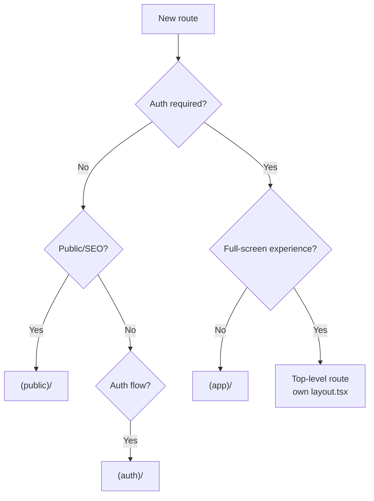

# Frontend Architecture

> How the DerLg frontend is structured: route groups, rendering strategy (Server vs Client Components), data fetching boundaries, and the rationale behind the folder layout. If you're adding a feature, this is the doc that tells you *where* the code goes.

| Field | Value |
|-------|-------|
| **Owner** | Frontend platform team |
| **Status** | Active |
| **Last reviewed** | 2026-05-22 |
| **Related ADRs** | [ADR-0001](./adr/0001-app-router-server-components-default.md), [ADR-0007](./adr/0007-feature-sliced-architecture-with-strict-boundaries.md) |
| **Related code** | [`frontend/app/`](../../../frontend/app/), [`frontend/features/`](../../../frontend/features/), [`frontend/shared/`](../../../frontend/shared/), [`frontend/middleware.ts`](../../../frontend/middleware.ts) |
| **Steering** | [`.kiro/steering/structure.md`](../../../.kiro/steering/structure.md) |

---

## TL;DR

- App Router with three route groups: `(public)`, `(auth)`, `(app)`. Route group choice = decision about layout, navigation, and auth guard.
- **Server Components by default.** `'use client'` is allowed only when one of five triggers applies (state, effects, browser APIs, event handlers, or third-party client-only libraries).
- **Server reads, Client mutates.** Initial data fetched in Server Components; React Query hooks own client-driven reads and writes after hydration.
- **Feature-sliced layout.** `app/` holds routes. `features/<x>/` is self-contained per feature. `shared/` is the only cross-feature surface. ESLint forbids feature-to-feature imports — see [ADR-0007](./adr/0007-feature-sliced-architecture-with-strict-boundaries.md).
- The `vibe-booking/` route is the one exception to the layout pattern — it's a full-screen split-pane experience with its own layout file.

---

## Route layout

```
frontend/app/
├── layout.tsx                  # Root layout: fonts, providers, metadata, error boundary
├── globals.css                 # Tailwind v4 entry + CSS variables
├── page.tsx                    # Marketing landing (SSR, public)
├── error.tsx                   # Root error boundary
├── not-found.tsx               # Root 404
│
├── (public)/                   # Marketing + content pages, no auth required
│   ├── layout.tsx              # Public chrome (header + footer, no bottom nav)
│   ├── about/page.tsx
│   └── trips/[slug]/page.tsx   # Public trip detail (SEO-indexable)
│
├── (auth)/                     # Login, register, password reset
│   ├── layout.tsx              # Minimal layout (logo + form, no chrome)
│   ├── login/page.tsx
│   ├── register/page.tsx
│   ├── forgot-password/page.tsx
│   └── reset-password/page.tsx
│
├── (app)/                      # Authenticated app shell with bottom nav
│   ├── layout.tsx              # Top bar + bottom tab navigation
│   ├── page.tsx                # Home (feed)
│   ├── explore/page.tsx
│   ├── bookings/
│   │   ├── page.tsx            # My Trips list
│   │   └── [id]/page.tsx       # Booking detail
│   ├── chat/page.tsx           # Vibe Booking entry (mobile)
│   └── profile/page.tsx
│
├── vibe-booking/               # Desktop split-screen Vibe Booking (its own shell)
│   ├── layout.tsx              # Split-pane layout, no bottom nav
│   └── page.tsx
│
└── api/                        # Next.js Route Handlers
    ├── auth/refresh/route.ts   # Proxies httpOnly cookie refresh to backend
    └── health/route.ts
```

### Why three route groups

Route groups in Next.js (`(name)`) don't appear in URLs; they exist purely to share **layouts** and **middleware behavior**:

| Group | Layout | Auth required? | Bottom nav? | SEO-indexable? |
|-------|--------|----------------|-------------|----------------|
| `(public)` | Marketing chrome | No | No | Yes |
| `(auth)` | Minimal | No (must redirect *away* if already authenticated) | No | `noindex` |
| `(app)` | App shell | Yes | Yes | Mostly `noindex` (booking detail is private) |
| `vibe-booking` (no group) | Custom split-pane | Yes | No | `noindex` |

This boundary matters because the **middleware** (`middleware.ts`) reads the URL to decide whether to inject locale prefixes and run auth guards. Mixing public and authenticated routes inside the same group breaks that contract.

### Adding a new route — decision tree



---

## Rendering strategy

### Default: Server Components

Every file in `app/` is a Server Component until proven otherwise. Server Components:
- Run only on the server; their JS is **not** shipped to the browser.
- Can `await` data directly. No `useEffect` ceremony.
- Cannot use `useState`, `useEffect`, refs, browser APIs, or import client-only libraries (Zustand, Leaflet).

```tsx
// app/(app)/page.tsx — Server Component
import { getFeaturedTrips } from '@/lib/api/trips'
import { TripGrid } from '@/components/home/TripGrid'

export default async function HomePage() {
  const trips = await getFeaturedTrips() // runs on server
  return <TripGrid trips={trips} />
}
```

### Opt-in: Client Components

A file becomes a Client Component when it starts with `'use client'`. The five legitimate triggers:

1. **State** — `useState`, `useReducer`
2. **Effects** — `useEffect`, `useLayoutEffect`
3. **Refs** to DOM nodes
4. **Event handlers** — `onClick`, `onChange`, etc.
5. **Client-only libraries** — Zustand, Leaflet, Stripe Elements, Framer Motion (some), WebSocket

Every Client Component **MUST** declare why at the top:

```tsx
'use client'
// Reason: WebSocket connection + Zustand chat store consumer.

import { useChatStore } from '@/stores/chat.store'
// ...
```

### Composition pattern

The right pattern is **server shells around client islands**:

```tsx
// Server Component (parent)
export default async function BookingDetailPage({ params }) {
  const booking = await getBooking(params.id)            // fetch on server
  return (
    <article>
      <BookingHeader booking={booking} />                {/* server */}
      <BookingActions bookingId={booking.id} />          {/* client island */}
    </article>
  )
}
```

```tsx
// components/bookings/BookingActions.tsx
'use client'
// Reason: button click handlers + cancellation mutation.

export function BookingActions({ bookingId }: { bookingId: string }) {
  const { mutate } = useCancelBooking()
  return <Button onClick={() => mutate(bookingId)}>Cancel</Button>
}
```

Anti-pattern: marking the page itself `'use client'` to get one button working. Push the `'use client'` boundary down to the smallest interactive piece.

---

## Data fetching boundaries

| Source | Where it runs | When to use |
|--------|---------------|-------------|
| **Server Component `fetch`** | Server, build/request time | Initial page data, SEO content, anything that should appear in the first HTML |
| **Server Component → React Query `prefetchQuery`** | Server | When a child Client Component will reuse the data via `useQuery` (hydrate dehydrated state) |
| **React Query `useQuery`** | Client | Data that changes after page load (lists, polling, dependent queries) |
| **React Query `useMutation`** | Client | All writes from the user |
| **Route Handler (`app/api/*`)** | Server | Edge cases: token refresh, webhook proxies, things that must use httpOnly cookies |
| **Server Action** | Server | Forms where Server Components can submit directly. **Allowed** but currently we default to React Query mutations for consistency with the WebSocket-heavy stack. Revisit per ADR. |

Rules:
1. **MUST NOT** call `fetch` directly inside a Client Component for backend data. Wrap it in a React Query hook in `hooks/`.
2. **MUST** include a deterministic `queryKey`: `['bookings', userId, status]`, never `['bookings', new Date()]`.
3. **MUST** revalidate cache on mutations (`queryClient.invalidateQueries`).
4. **SHOULD** prefetch on the server when the page first renders an authenticated, data-heavy view.

See [`state-and-data.md`](./state-and-data.md) for the complete contract.

---

## Folder layout — feature-sliced with a strict boundary

Per [ADR-0007](./adr/0007-feature-sliced-architecture-with-strict-boundaries.md):

```
frontend/
├── app/                        # ROUTES ONLY — page.tsx, layout.tsx, error.tsx, loading.tsx, route.ts
├── features/                   # One folder per feature; self-contained
│   ├── vibe-booking/
│   │   ├── components/         # Internal — not importable from outside the feature
│   │   ├── hooks/              # Internal
│   │   ├── stores/             # Internal Zustand stores (per ADR-0002)
│   │   ├── schemas/            # Internal Zod schemas
│   │   ├── lib/                # Internal utilities
│   │   ├── server/             # Optional: Server Component data helpers
│   │   ├── actions/            # Optional: Server Actions (we default to React Query mutations — ADR-0002)
│   │   ├── types.ts            # Feature-local types
│   │   ├── index.ts            # PUBLIC API — only this is importable from app/ or other code
│   │   └── README.md
│   ├── auth/
│   ├── bookings/
│   └── …
│
├── shared/                     # Cross-feature; importable from anywhere
│   ├── components/
│   │   ├── ui/                 # shadcn/ui primitives (Button, Input, Dialog, BottomSheet)
│   │   └── layout/             # BottomNav, TopBar, Skeleton, EmptyState
│   ├── hooks/                  # Cross-feature hooks
│   ├── lib/                    # api-client, env, currency, formatters
│   ├── stores/                 # auth.store, locale.store (truly cross-feature only)
│   ├── schemas/                # Shared Zod schemas (envelope, error)
│   ├── types/                  # Domain types used by 2+ features
│   └── README.md
│
├── messages/                   # i18n bundles (en/zh/km.json) — by ADR-0004
├── i18n/                       # next-intl config — by ADR-0004
├── middleware.ts               # By ADR-0003 + ADR-0004
└── eslint.config.mjs, tsconfig.json, next.config.ts, …
```

### The strict boundary

Enforced by `eslint-plugin-boundaries` in `eslint.config.mjs`. The rule is short:

| From | May import from |
|------|----------------|
| **`app/`** | `app/`, `features/<x>` (via the feature's `index.ts` only), `shared/`, `i18n/`, `messages/` |
| **`features/<x>/`** | itself (relative paths), `shared/`, `i18n/`, `messages/`. **Never** another feature. |
| **`shared/`** | `shared/` only. |
| **`i18n/`, `messages/`** | themselves; `i18n/` may also read `shared/`. |

> **Cross-feature reuse has exactly one mechanism: promote to `shared/`.** When two features need the same primitive, the primitive moves into `shared/`. There is no "feature-to-feature public API".

### Public API per feature

The only file in `features/<x>/` that may be imported from outside the feature is `index.ts`. Everything else is internal:

```ts
// features/vibe-booking/index.ts
export { default as SplitScreenLayout } from './components/SplitScreenLayout'
export { useVibeBookingStore } from './stores/vibe-booking.store'
export { ContentPayloadSchema, type ContentPayload } from './schemas/content-payload'
```

`app/vibe-booking/page.tsx` imports from `@/features/vibe-booking` — never `@/features/vibe-booking/components/SplitScreenLayout`. The lint rule (`boundaries/entry-point`) enforces this.

### Inside a feature

- Use **relative paths** (`./components/Foo`, `../stores/foo.store`). Relative imports survive feature renames.
- Anything goes; the boundary rule does not apply within a feature.
- Subfolders are: `components/`, `hooks/`, `stores/`, `schemas/`, `lib/`, optionally `server/` (Server-Component data helpers) and `actions/` (Server Actions if/when adopted), plus a top-level `types.ts` and `index.ts`.
- Tests are co-located: `Foo.test.tsx` next to `Foo.tsx`. Boundary rules ignore test files.

### Where to put a new file

| Question | Answer |
|----------|--------|
| Is it a route? | `app/...` (and nothing else there) |
| Is it a UI primitive (Button, Input, Dialog)? | `shared/components/ui/` |
| Is it a layout chrome used across features (BottomNav, TopBar, EmptyState)? | `shared/components/layout/` |
| Is it used by exactly one feature? | `features/<feature>/...` |
| Is it used by 2+ features? | `shared/...` |
| Is it pure logic (no React)? | `shared/lib/` if cross-feature, `features/<x>/lib/` if not |
| Is it a Zustand store used by one feature? | `features/<feature>/stores/<feature>.store.ts` |
| Is it a Zustand store used by multiple features (auth, locale)? | `shared/stores/<domain>.store.ts` |
| Is it a Zod schema for AI content / forms used by one feature? | `features/<feature>/schemas/...` |
| Is it a Zod schema for the API envelope or shared errors? | `shared/schemas/...` |
| Is it a domain type used by one feature? | `features/<feature>/types.ts` |
| Is it a domain type used by 2+ features? | `shared/types/<domain>.ts` |

### Naming

Per [`.kiro/steering/conventions.md`](../../../.kiro/steering/conventions.md):

| Kind | Convention | Example |
|------|-----------|---------|
| Component file | `PascalCase.tsx` | `TripCard.tsx` |
| Hook file | `use-kebab-case.ts` | `use-booking-hold.ts` |
| Store file | `<domain>.store.ts` | `auth.store.ts` |
| Utility file | `kebab-case.ts` | `api-client.ts` |
| Feature folder | `kebab-case/` matching the slug under `docs/modules/` | `vibe-booking/` |
| Route segment folder | `kebab-case` | `forgot-password/` |
| Test file | Co-located, `*.test.tsx` | `TripCard.test.tsx` |

### Path aliases (`tsconfig.json`)

```jsonc
{
  "compilerOptions": {
    "paths": {
      "@/*": ["./*"],
      "@/features/*": ["./features/*"],
      "@/shared/*": ["./shared/*"]
    }
  }
}
```

The `@/*` alias is the legacy fallback. New imports prefer the explicit `@/features/*` and `@/shared/*` aliases. ESLint additionally **forbids** imports from the old top-level paths (`@/components/*`, `@/hooks/*`, `@/stores/*`, `@/schemas/*`, `@/lib/*`, `@/types/*`) so that recreating the flat layout is impossible.

---

## Layouts and providers

### Root layout responsibilities (`app/layout.tsx`)

The root layout is the only place that should:
1. Load fonts via `next/font/google` (Geist + locale-specific fallbacks).
2. Set the HTML lang attribute (locale-aware via `next-intl`).
3. Wrap the app in providers: `QueryClientProvider`, `ThemeProvider` (if any), `IntlProvider`, `ToastProvider`.
4. Inject the global error boundary (`error.tsx`) and 404 (`not-found.tsx`).
5. Define default metadata via `export const metadata`.

```tsx
// app/layout.tsx — sketch
import { GeistSans, GeistMono } from 'geist/font'
import { Providers } from './providers'

export const metadata = {
  title: { default: 'DerLg', template: '%s — DerLg' },
  description: '…',
}

export default async function RootLayout({ children, params: { locale } }) {
  return (
    <html lang={locale} className={`${GeistSans.variable} ${GeistMono.variable}`}>
      <body>
        <Providers locale={locale}>{children}</Providers>
      </body>
    </html>
  )
}
```

### Providers Client Component (`app/providers.tsx`)

Client-only because React Query needs a stable `QueryClient` instance:

```tsx
'use client'
// Reason: QueryClientProvider, IntlProvider, and ToastProvider all require client state.
```

Keep this file thin. Anything stateful that needs to live across all routes goes here; everything else stays in feature components.

### Group-specific layouts

- `(public)/layout.tsx` — public header + footer.
- `(auth)/layout.tsx` — minimal centered card.
- `(app)/layout.tsx` — top bar (contextual) + persistent bottom nav. Renders bottom nav as a Server Component shell with a Client Component active-tab indicator.
- `vibe-booking/layout.tsx` — split-pane layout, no bottom nav.

---

## Middleware (`middleware.ts`)

Single middleware file is the only place that runs on every request before the route. It does two things:

1. **Locale routing** via `next-intl` middleware. Adds `/en`, `/zh`, `/km` prefixes when missing, redirects based on `Accept-Language` for first-time visitors.
2. **Auth guards** for `(app)` routes: if the user has no access token cookie, redirect to `/login?returnUrl=...`.

```typescript
// middleware.ts — sketch
import createIntlMiddleware from 'next-intl/middleware'
import { NextRequest, NextResponse } from 'next/server'

const intlMiddleware = createIntlMiddleware({
  locales: ['en', 'zh', 'km'],
  defaultLocale: 'en',
})

const PROTECTED = /^\/(en|zh|km)?\/(app|bookings|profile|chat|vibe-booking)/

export function middleware(req: NextRequest) {
  if (PROTECTED.test(req.nextUrl.pathname) && !hasSession(req)) {
    return NextResponse.redirect(new URL('/login', req.url))
  }
  return intlMiddleware(req)
}

export const config = {
  matcher: ['/((?!api|_next|.*\\..*).*)'],
}
```

Rules:
1. **MUST NOT** import client-only libraries in middleware. Edge runtime is restricted.
2. **MUST NOT** read the request body. Middleware runs early and bodies should be parsed in route handlers.
3. **SHOULD** keep auth check fast — only existence of session cookie, not its validity. Validity is checked in API calls and refreshed via interceptors.

See [`auth-and-session.md`](./auth-and-session.md) for the full session model.

---

## Error and loading UI

| File | Purpose |
|------|---------|
| `error.tsx` (any segment) | Client Component error boundary; catches render errors below the segment. |
| `global-error.tsx` (root) | Catches errors in `app/layout.tsx` itself. Required for production. |
| `not-found.tsx` | Renders for 404s called via `notFound()`. |
| `loading.tsx` | Suspense fallback while server data resolves. Use skeletons, not spinners. |

Rules:
1. Every `(group)` MUST have its own `error.tsx` with a "Try again" button.
2. `loading.tsx` MUST render the page skeleton, not a centered spinner — the page should feel laid out from the first paint.
3. Errors MUST be reported to Sentry via `captureException` in the error boundary's `useEffect`. See [`observability.md`](./observability.md).

---

## Anti-patterns

- ❌ **Marking the whole page `'use client'`** to enable one button. Push the directive down to the smallest island.
- ❌ **Importing Zustand into a Server Component.** The build fails — but if you bypass it via dynamic import, you'll silently ship server state to the client.
- ❌ **Importing across features.** `import { Foo } from '@/features/bookings/components/Foo'` from inside `features/vibe-booking/` is a lint error. Promote `Foo` to `shared/` if both features need it.
- ❌ **Deep imports of another feature's internals.** `import x from '@/features/vibe-booking/components/ChatPanel'` from `app/` is a lint error — use the public `@/features/vibe-booking` index.
- ❌ **Putting non-route code in `app/`.** `app/` is page files, layouts, loading/error boundaries, and route handlers only.
- ❌ **Recreating top-level `components/`, `hooks/`, `stores/`, `schemas/`, `lib/`, `types/`.** Those folders are gone; lint forbids `@/components/*` etc.
- ❌ **Adding a fourth route group.** If you think you need one, write an ADR first.
- ❌ **Doing auth checks in `layout.tsx`.** Auth lives in `middleware.ts`. Layouts can render different chrome based on session, but they don't gate access.
- ❌ **Calling backend APIs from `app/api/*` for things the client can call directly.** Route handlers exist for httpOnly cookie operations and webhook proxies, not as a generic backend mirror.

---

## Acceptance criteria

- [ ] Every route in `app/` lives in `(public)`, `(auth)`, `(app)`, or has a documented exception.
- [ ] No file in `app/` starts with `'use client'` unless it's a leaf interactive component (typically in a feature, not in `app/`).
- [ ] Every `'use client'` file has a comment on the first line explaining why.
- [ ] No Client Component imports `shared/lib/api-client` directly — it goes through a `useQuery` / `useMutation` hook in a feature's `hooks/` folder.
- [ ] `middleware.ts` is the only place doing locale routing and auth guards.
- [ ] Each route group has `layout.tsx`, `error.tsx`, and `loading.tsx`.
- [ ] Every feature folder has an `index.ts` that exports the public API.
- [ ] No imports cross features (lint error from `eslint-plugin-boundaries`).
- [ ] No imports from the legacy top-level paths (`@/components/*`, `@/hooks/*`, `@/stores/*`, `@/schemas/*`, `@/lib/*`, `@/types/*`).

---

## Open questions

- Server Actions: do we adopt them for forms now that React 19 + Next.js 16 are stable, or keep all writes in React Query mutations? **Pending ADR.**
- Parallel routes (`@modal`) for booking detail modals on desktop while keeping the route URL stable: open exploration.
- Edge runtime for the public marketing routes (faster TTFB) vs Node runtime for everything (consistency): pending performance benchmarks.

---

## References

- [`foundation.md`](./foundation.md) — runtime contract
- [`reference/state-and-data.md`](./reference/state-and-data.md) — data fetching contract
- [`reference/auth-and-session.md`](./reference/auth-and-session.md) — session model
- [`reference/realtime-and-vibe-booking.md`](./reference/realtime-and-vibe-booking.md) — Vibe Booking layout exception
- [`adr/0001-app-router-server-components-default.md`](./adr/0001-app-router-server-components-default.md)
- [`adr/0007-feature-sliced-architecture-with-strict-boundaries.md`](./adr/0007-feature-sliced-architecture-with-strict-boundaries.md)
- [Next.js App Router docs](https://nextjs.org/docs/app)
- [`.kiro/steering/structure.md`](../../../.kiro/steering/structure.md)
