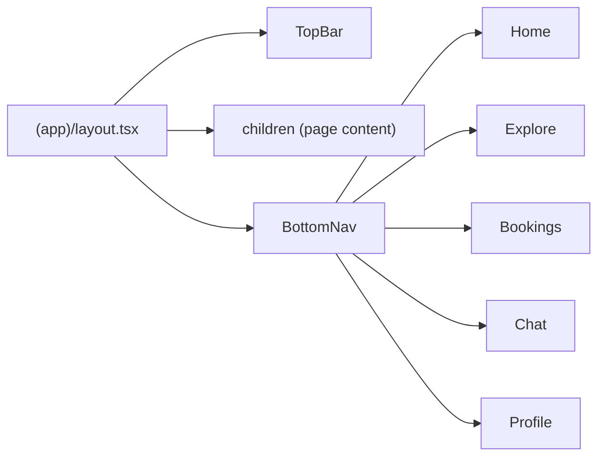

# Frontend design: App Shell

> **Forward-looking design doc.** What the frontend app shell **will** look like — the persistent frame (top bar + bottom tab navigation) that wraps every authenticated screen.
> Once the feature ships, the equivalent reference doc at [`reference/features/app-shell.md`](../../reference/features/app-shell.md) takes over as the source of truth and this design doc is archived.

| Field | Value |
|---|---|
| **Status** | Approved |
| **Owner** | You |
| **Last reviewed** | 2026-05-22 |
| **Phase** | Phase 4 — App Shell & Navigation |
| **Product PRD** | [`docs/product/prd.md`](../../../../product/prd.md) |
| **Feature registry** | [`docs/product/feature-decisions.md`](../../../../product/feature-decisions.md) |
| **Backend module** | N/A (frontend-only) |
| **Related ADRs** | [ADR-0001](../../adr/0001-app-router-server-components-default.md), [ADR-0003](../../adr/0003-auth-and-session-model.md), [ADR-0007](../../adr/0007-feature-sliced-architecture-with-strict-boundaries.md) |

---

## 1. Goal

Provide the persistent navigation frame (bottom tabs + contextual top bar) that wraps every authenticated screen, enabling one-tap switching between the five core sections and native-feeling stack navigation within each tab.

---

## 2. User flow

1. User authenticates → middleware allows access to `(app)` routes
2. `(app)/layout.tsx` renders: top bar + content area + bottom tab nav
3. User taps a tab → navigates to that section's root (e.g., `/[locale]/explore`)
4. User drills into a detail page → top bar shows back arrow + contextual title
5. User taps back → returns to previous page within the same tab
6. User taps the same tab again → scrolls to top / resets to section root

---

## 3. Pages

The app-shell itself is not a page — it's the **layout** that wraps all `(app)` pages. It owns:

| # | Path | Auth | Layout shell | Purpose |
|---|---|---|---|---|
| — | `/[locale]/(app)/layout.tsx` | Yes | Self (is the shell) | Persistent frame: TopBar + BottomNav |

Child pages rendered inside the shell (owned by other features):

| Tab | Root path | Feature owner |
|---|---|---|
| Home | `/[locale]/` | `trip-discovery` |
| Explore | `/[locale]/explore` | `explore-places` |
| Bookings | `/[locale]/bookings` | `my-trip` |
| Chat | `/[locale]/chat` | `vibe-booking` |
| Profile | `/[locale]/profile` | `profile` |

---

## 4. Per-page detail

### 4.1 `(app)/layout.tsx` (App Shell Layout)

**Purpose:** Render the persistent navigation chrome around all authenticated pages.

**Data shown:**
- **Top bar:** App logo (left), page title (center, contextual), action icons (right — e.g., notifications bell, search)
- **Bottom nav:** 5 tab icons with labels — Home, Explore, Bookings, Chat, Profile. Active tab highlighted. Unread badge on Chat tab when new messages exist.

**User actions:**
- Tap a bottom tab → navigate to that tab's root route
- Tap active tab → scroll content to top (if already on that tab's root)
- Tap back arrow in top bar → `router.back()`
- Swipe from left edge → back navigation (iOS gesture feel via CSS)

**Components used:**
- New in `shared/components/layout/`: `<TopBar>`, `<BottomNav>`, `<SafeAreaWrapper>`
- Existing in `shared/`: none yet (first layout components)

**States:**

| State | UI | Source |
|---|---|---|
| Default | TopBar + content + BottomNav visible | Layout mount |
| Scrolling down | TopBar hides (scroll-away), BottomNav stays | Scroll event |
| Scrolling up | TopBar reappears | Scroll event |
| Deep page (detail) | TopBar shows back arrow + contextual title | Route depth > 1 |
| Offline | Offline banner between TopBar and content | Network status |
| Chat unread | Red dot badge on Chat tab icon | Zustand `unreadCount` |

**Backend calls:** None (layout is purely client-side chrome).

**i18n keys:** `shell.nav.*` (`shell.nav.home`, `shell.nav.explore`, `shell.nav.bookings`, `shell.nav.chat`, `shell.nav.profile`)

---

## 5. Data model

The app-shell consumes no backend data directly. It reads client state only:

| Schema | Shape | Source |
|---|---|---|
| N/A | — | No backend schemas |

**Backend endpoints called:** None.

---

## 6. Client state

Per [ADR-0002](../../adr/0002-state-management-split.md):

**React Query hooks:** None (shell has no server data).

**Zustand stores** (client UI state):

| Store | What it holds | Persisted | Location |
|---|---|---|---|
| `useShellStore` | `activeTab`, `scrollPositions` (per tab), `isTopBarVisible` | No | `shared/stores/shell.store.ts` |

The shell store is cross-feature (every page reads `activeTab` for the BottomNav highlight), so it lives in `shared/stores/`.

**Forms:** None.

---

## 7. External integrations

- **WebSocket:** N/A (but the shell reads `unreadCount` from the vibe-booking store for the Chat badge — via `shared/stores/` or a cross-feature event)
- **Stripe:** N/A
- **Maps:** N/A
- **Push (FCM):** The shell will display a notification badge on the Chat tab when push notifications arrive. The push listener lives in `shared/lib/push.ts`; the shell reads the count.
- **Storage (uploads):** N/A

---

## 8. Edge cases & error states

| Case | UI behavior | Notes |
|---|---|---|
| Offline | Yellow banner "You're offline" between TopBar and content | Dismissible; reappears on next offline event |
| Session expired (401) | Redirect to `/[locale]/login?returnUrl=...` | Handled by api-client per ADR-0003, not by shell |
| Deep link to nested page | TopBar shows back arrow; BottomNav highlights correct tab | Parse pathname to determine active tab |
| Unknown route under (app) | `not-found.tsx` renders inside the shell | Shell stays; content shows 404 |
| Very long page title | Truncate with ellipsis in TopBar | `max-w` + `truncate` |
| Keyboard open (mobile) | BottomNav hides when virtual keyboard is visible | `visualViewport` resize event |
| Safe area (notch/home indicator) | Padding via `env(safe-area-inset-*)` | Applied in `<SafeAreaWrapper>` |
| Tab with no content yet (feature not built) | Empty state with "Coming soon" | Temporary until feature ships |

---

## 9. Acceptance criteria (frontend)

The feature is "done" when:

- [ ] `(app)/layout.tsx` renders TopBar + BottomNav around child pages.
- [ ] All 5 tabs navigate to their correct root routes.
- [ ] Active tab is visually highlighted based on current pathname.
- [ ] TopBar hides on scroll down, reappears on scroll up (mobile).
- [ ] TopBar shows back arrow + contextual title on nested pages (depth > 1).
- [ ] Safe area insets are respected (notch, home indicator).
- [ ] BottomNav hides when virtual keyboard is open.
- [ ] Tapping the active tab scrolls content to top.
- [ ] Offline banner appears/disappears based on network status.
- [ ] Chat tab shows unread badge when `unreadCount > 0`.
- [ ] All tab labels are i18n-keyed across `en`, `zh`, `km`.
- [ ] Mobile (375 px) and tablet (768 px) layouts render correctly.
- [ ] Shell components pass keyboard navigation and WCAG AA contrast.
- [ ] Shell renders as Server Component shell with Client Component interactive islands (TopBar scroll behavior, BottomNav active state).

---

## 10. Open questions

*None — the tab structure, layout placement, and component homes are all defined by the architecture doc and ADR-0007.*

---

## 11. Out of scope

- Content of each tab page (owned by their respective features: trip-discovery, explore-places, my-trip, vibe-booking, profile).
- Desktop sidebar navigation (post-MVP; mobile-first per product constraints).
- Animated tab transitions / shared element transitions (nice-to-have, not MVP).
- Pull-to-refresh behavior (owned by individual page features, not the shell).
- Search bar (contextual per feature; the shell provides the TopBar slot, features fill it).

---

## 12. Related

- Frontend architecture: [`docs/platform/frontend/architecture.md`](../../architecture.md)
- Roadmap Phase 4: [`docs/platform/roadmaps/frontend-roadmap.md`](../../../roadmaps/frontend-roadmap.md)
- ADR-0001 (RSC default): [`../../adr/0001-app-router-server-components-default.md`](../../adr/0001-app-router-server-components-default.md)
- ADR-0003 (auth guards in middleware): [`../../adr/0003-auth-and-session-model.md`](../../adr/0003-auth-and-session-model.md)
- ADR-0007 (shared/components/layout/ is the home for shell components): [`../../adr/0007-feature-sliced-architecture-with-strict-boundaries.md`](../../adr/0007-feature-sliced-architecture-with-strict-boundaries.md)
- Auth design (dependency): [`./auth.md`](./auth.md)
- Future reference doc: [`../../reference/features/app-shell.md`](../../reference/features/app-shell.md) *(authored once shipped)*
