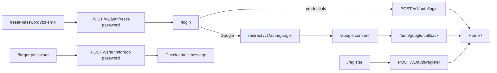

# Frontend design: Auth

> **Forward-looking design doc.** What the frontend for authentication **will** look like. Replaces nothing in the codebase yet.
> Once the feature ships, the equivalent reference doc at [`reference/features/auth.md`](../../reference/features/auth.md) takes over as the source of truth and this design doc is archived.

| Field | Value |
|---|---|
| **Status** | Drafting |
| **Owner** | You |
| **Last reviewed** | 2026-05-22 |
| **Phase** | Phase 3 — Authentication Flows |
| **Product PRD** | [`docs/product/prd.md`](../../../../product/prd.md) |
| **Feature registry** | [`docs/product/feature-decisions.md`](../../../../product/feature-decisions.md) |
| **Backend module** | [`docs/modules/auth/`](../../../../modules/auth/) |
| **Related ADRs** | [ADR-0003](../../adr/0003-auth-and-session-model.md), [ADR-0002](../../adr/0002-state-management-split.md), [ADR-0004](../../adr/0004-i18n-routing-strategy.md) |

---

## 1. Goal

Let a traveler create an account, sign in (email/password or Google), recover a forgotten password, and maintain a persistent session — all on mobile, in their preferred language.

---

## 2. User flow

### Registration

1. User lands on `/[locale]/register`
2. Fills email, password, optional name/phone
3. Submits → `POST /v1/auth/register`
4. On success → access token stored in memory, redirect to `/[locale]/` (home)

### Login

1. User lands on `/[locale]/login`
2. Fills email + password, or taps "Sign in with Google"
3. Email/password → `POST /v1/auth/login`
4. Google → redirect to backend `/v1/auth/google` → Google consent → callback → `/[locale]/auth/google/callback`
5. On success → access token stored in memory, redirect to `returnUrl` or `/[locale]/`

### Forgot password

1. User taps "Forgot password?" on login page → navigates to `/[locale]/forgot-password`
2. Enters email → `POST /v1/auth/forgot-password`
3. Sees confirmation message (regardless of email existence)

### Reset password

1. User clicks link in email → lands on `/[locale]/reset-password?token=<token>`
2. Enters new password + confirmation
3. Submits → `POST /v1/auth/reset-password`
4. On success → redirect to `/[locale]/login` with success toast

### Session rehydration (on hard reload)

1. App mounts → `providers.tsx` calls `POST /v1/auth/refresh` (cookie sent automatically)
2. If success → access token populated in memory, app renders normally
3. If fail → user remains unauthenticated, middleware redirects protected routes to `/[locale]/login`

---

## 3. Pages

| # | Path | Auth | Layout shell | Purpose |
|---|---|---|---|---|
| 1 | `/[locale]/login` | No (public) | `(auth)` | Email/password + Google sign-in |
| 2 | `/[locale]/register` | No (public) | `(auth)` | Account creation |
| 3 | `/[locale]/forgot-password` | No (public) | `(auth)` | Request password reset email |
| 4 | `/[locale]/reset-password` | No (public) | `(auth)` | Set new password via token |
| 5 | `/[locale]/auth/google/callback` | No (public) | None (transient) | Handle OAuth redirect, store token, redirect |

All auth pages will auto-redirect authenticated users (those with a valid session) to `/[locale]/` via middleware.

---

## 4. Per-page detail

### 4.1 `/[locale]/login` (Sign In)

**Purpose:** Authenticate an existing user via email/password or Google OAuth.

**Data shown:**
- App logo / branding
- Email input field
- Password input field (with show/hide toggle)
- "Forgot password?" link
- "Sign in" submit button
- Divider ("or")
- "Sign in with Google" button
- "Don't have an account? Register" link
- Language switcher (EN/ZH/KM)

**User actions:**
- Fill email + password → tap "Sign in" → submits login mutation
- Tap "Sign in with Google" → redirects to backend Google OAuth URL
- Tap "Forgot password?" → navigates to `/[locale]/forgot-password`
- Tap "Register" → navigates to `/[locale]/register`
- Switch language → changes locale prefix

**Components used:**
- Existing in `shared/`: `<Button>`, `<Input>`, `<PasswordInput>`, `<Divider>`, `<Logo>`
- New in `features/auth/components/`: `<LoginForm>`, `<GoogleSignInButton>`, `<AuthLayout>`

**States:**

| State | UI | Source |
|---|---|---|
| Idle | Form ready for input | Default |
| Submitting | Button shows spinner, inputs disabled | Mutation `isPending` |
| Error (invalid credentials) | Inline error above form: "Invalid email or password" | 401 from backend |
| Error (account suspended) | Inline error: "Account suspended. Contact support." | 403 from backend |
| Error (network) | Toast: "Connection failed. Try again." | Network error |
| Authenticated redirect | Brief loading → redirect to home | On success |

**Backend calls:** `POST /v1/auth/login`, `POST /v1/auth/google` (redirect)

**i18n keys:** `auth.login.*`

---

### 4.2 `/[locale]/register` (Sign Up)

**Purpose:** Create a new account.

**Data shown:**
- App logo / branding
- Email input
- Password input (with strength indicator)
- Name input (optional)
- Phone input (optional)
- "Create account" submit button
- Divider ("or")
- "Sign up with Google" button
- "Already have an account? Sign in" link
- Language switcher

**User actions:**
- Fill form → tap "Create account" → submits register mutation
- Tap "Sign up with Google" → same Google OAuth flow as login
- Tap "Sign in" → navigates to `/[locale]/login`

**Components used:**
- Existing in `shared/`: `<Button>`, `<Input>`, `<PasswordInput>`, `<Logo>`
- New in `features/auth/components/`: `<RegisterForm>`, `<PasswordStrengthIndicator>`

**States:**

| State | UI | Source |
|---|---|---|
| Idle | Form ready | Default |
| Submitting | Button spinner, inputs disabled | Mutation `isPending` |
| Error (email exists) | Inline field error on email: "Email already registered" | 409 from backend |
| Error (validation) | Inline field errors per field | Zod client-side |
| Error (network) | Toast | Network error |
| Success | Redirect to home | On success |

**Backend calls:** `POST /v1/auth/register`

**i18n keys:** `auth.register.*`

---

### 4.3 `/[locale]/forgot-password` (Request Reset)

**Purpose:** Request a password reset email.

**Data shown:**
- Back arrow → login
- Heading: "Reset your password"
- Description text
- Email input
- "Send reset link" button

**User actions:**
- Fill email → tap "Send reset link" → submits forgot-password mutation
- Tap back → navigates to `/[locale]/login`

**Components used:**
- Existing in `shared/`: `<Button>`, `<Input>`, `<Logo>`
- New in `features/auth/components/`: `<ForgotPasswordForm>`

**States:**

| State | UI | Source |
|---|---|---|
| Idle | Form ready | Default |
| Submitting | Button spinner | Mutation `isPending` |
| Success | Replace form with "Check your email" message + illustration | On 200 (always, to prevent enumeration) |
| Error (network) | Toast | Network error |

**Backend calls:** `POST /v1/auth/forgot-password`

**i18n keys:** `auth.forgotPassword.*`

---

### 4.4 `/[locale]/reset-password` (Set New Password)

**Purpose:** Set a new password using the token from the reset email.

**Data shown:**
- Heading: "Set new password"
- New password input (with strength indicator)
- Confirm password input
- "Reset password" button

**User actions:**
- Fill new password + confirmation → tap "Reset password"
- On success → redirect to `/[locale]/login` with success toast

**Components used:**
- Existing in `shared/`: `<Button>`, `<PasswordInput>`, `<Logo>`
- New in `features/auth/components/`: `<ResetPasswordForm>`, `<PasswordStrengthIndicator>` (reused from register)

**States:**

| State | UI | Source |
|---|---|---|
| Idle | Form ready | Default |
| Submitting | Button spinner | Mutation `isPending` |
| Error (invalid/expired token) | Inline error: "Reset link expired. Request a new one." + link to forgot-password | 400 from backend |
| Error (validation) | Inline field errors | Zod client-side |
| Success | Toast "Password updated" + redirect to login | On 200 |

**Backend calls:** `POST /v1/auth/reset-password`

**i18n keys:** `auth.resetPassword.*`

---

### 4.5 `/[locale]/auth/google/callback` (OAuth Return)

**Purpose:** Transient page that handles the Google OAuth redirect, extracts the access token from the response, stores it, and redirects.

**Data shown:**
- Full-screen loading spinner with "Signing you in…" text

**User actions:**
- None (automatic processing)

**Components used:**
- New in `features/auth/components/`: `<OAuthCallbackHandler>`

**States:**

| State | UI | Source |
|---|---|---|
| Processing | Spinner + "Signing you in…" | On mount |
| Error | Error message + "Try again" button → `/[locale]/login` | If callback fails |

**Backend calls:** `GET /v1/auth/google/callback?code=<code>` (the backend returns `{ accessToken, user }` and sets the refresh cookie)

**i18n keys:** `auth.oauth.*`

---

## 5. Data model

| Schema | Shape (high-level) | Source |
|---|---|---|
| `LoginSchema` | `email` (email), `password` (string, min 8) | `features/auth/schemas/auth.ts` |
| `RegisterSchema` | `email` (email), `password` (string, min 8), `name?` (string), `phone?` (string) | same file |
| `ForgotPasswordSchema` | `email` (email) | same file |
| `ResetPasswordSchema` | `token` (string), `newPassword` (string, min 8), `confirmPassword` (must match) | same file |
| `AuthUserSchema` | `id` (uuid), `email` (string), `name` (string | null), `role` (string) | same file |

**Backend endpoints called:**

| Method | Path | Use |
|---|---|---|
| POST | `/v1/auth/register` | Create account |
| POST | `/v1/auth/login` | Email/password sign-in |
| POST | `/v1/auth/refresh` | Get new access token (cookie-based) |
| POST | `/v1/auth/logout` | End current session |
| POST | `/v1/auth/logout-all` | End all sessions |
| POST | `/v1/auth/forgot-password` | Request reset email |
| POST | `/v1/auth/reset-password` | Set new password |
| POST | `/v1/auth/google` | Get Google OAuth URL |
| GET | `/v1/auth/google/callback?code=` | Handle OAuth return |

---

## 6. Client state

Per [ADR-0002](../../adr/0002-state-management-split.md) and [ADR-0003](../../adr/0003-auth-and-session-model.md):

**Zustand store** (`auth.store.ts`):

| Field | Type | Persisted | Notes |
|---|---|---|---|
| `accessToken` | `string \| null` | No (memory only) | Lost on reload; rehydrated via refresh |
| `user` | `AuthUser \| null` | Yes (localStorage) | `{ id, email, name, role }` |
| `isAuthenticated` | `boolean` (derived) | No | `!!accessToken` |

Actions: `setSession(accessToken, user)`, `clearSession()`.

**React Query mutations** (server state):

| Hook | Mutation key | On success | Invalidates |
|---|---|---|---|
| `useLogin()` | `['auth', 'login']` | `setSession` → redirect | — |
| `useRegister()` | `['auth', 'register']` | `setSession` → redirect | — |
| `useLogout()` | `['auth', 'logout']` | `clearSession` → redirect to `/login` | All queries |
| `useForgotPassword()` | `['auth', 'forgot-password']` | Show success UI | — |
| `useResetPassword()` | `['auth', 'reset-password']` | Toast → redirect to `/login` | — |

**Forms** (RHF + Zod):

| Form | Schema | Where |
|---|---|---|
| LoginForm | `LoginSchema` | `features/auth/components/LoginForm.tsx` |
| RegisterForm | `RegisterSchema` | `features/auth/components/RegisterForm.tsx` |
| ForgotPasswordForm | `ForgotPasswordSchema` | `features/auth/components/ForgotPasswordForm.tsx` |
| ResetPasswordForm | `ResetPasswordSchema` | `features/auth/components/ResetPasswordForm.tsx` |

---

## 7. External integrations

- **Google OAuth:** Redirect-based flow. Frontend redirects to backend `/v1/auth/google`, which returns the Google consent URL. After consent, Google redirects to backend callback, which redirects to frontend `/[locale]/auth/google/callback` with the session data.
- **WebSocket:** N/A for auth itself, but the access token contract established here is consumed by Vibe Booking's WebSocket connection.
- **Stripe:** N/A
- **Maps:** N/A
- **Push (FCM):** N/A
- **Storage (uploads):** N/A

---

## 8. Edge cases & error states

| Case | UI behavior | Notes |
|---|---|---|
| Offline | Toast "No internet connection" + disable submit | Forms require network |
| 401 on refresh (session expired) | Redirect to `/[locale]/login?returnUrl=...` | Per ADR-0003 |
| 409 on register (email exists) | Inline error on email field | Don't reveal if it's a Google-linked account |
| 403 on login (suspended) | Inline error with support contact | No retry possible |
| Rate limited (429) | Toast "Too many attempts. Try again in X minutes." | Backend rate: 5 req / 5 min |
| Reset token expired | Inline error + link to request new reset | |
| Google OAuth cancelled by user | Redirect back to login with no error | User chose to cancel |
| Google OAuth error | Error page on callback with "Try again" CTA | |
| Password mismatch (reset) | Inline field error on confirm field | Client-side Zod |
| Already authenticated user visits auth pages | Redirect to `/[locale]/` | Middleware handles |
| Deep link with `returnUrl` | After login, redirect to `returnUrl` instead of home | Validate `returnUrl` is same-origin |

---

## 9. Acceptance criteria (frontend)

The feature is "done" when:

- [ ] Every page in §3 renders with real data from the backend.
- [ ] Every state in §4 (idle, submitting, error, success) is reachable and looks correct.
- [ ] Login → home flow completes end-to-end without console errors.
- [ ] Register → home flow completes end-to-end.
- [ ] Forgot password → email sent confirmation displays.
- [ ] Reset password → login redirect with success toast.
- [ ] Google OAuth → home flow completes end-to-end.
- [ ] Hard reload rehydrates session from refresh cookie without flicker (skeleton shown during rehydration).
- [ ] Authenticated users are redirected away from auth pages.
- [ ] Unauthenticated users are redirected to login from protected routes (with `returnUrl`).
- [ ] `returnUrl` redirect works after login.
- [ ] All copy is i18n-keyed across `en`, `zh`, `km`.
- [ ] At least one E2E test covers login happy path and one covers register happy path.
- [ ] All auth pages pass keyboard navigation and meet WCAG AA contrast.
- [ ] Mobile (375 px) and tablet (768 px) layouts render correctly.
- [ ] Rate limit (429) error is handled gracefully.
- [ ] Logout clears all client state and redirects to login.

---

## 10. Open questions

*None — all decisions are locked in by ADR-0003 and the backend contract.*

---

## 11. Out of scope

- Email verification flow (not in MVP; backend doesn't require it yet).
- Phone number OTP login (post-MVP).
- Multi-factor authentication (post-MVP).
- Social login providers beyond Google (post-MVP).
- Admin login / admin-specific auth pages (separate dashboard, post-MVP).
- Account deletion / data export (covered by `profile` feature).
- "Remember me" checkbox (refresh token is always 7 days per backend contract).

---

## 12. Related

- Product PRD section: [`docs/product/prd.md`](../../../../product/prd.md)
- Feature registry entry: [`docs/product/feature-decisions.md`](../../../../product/feature-decisions.md)
- Backend module: [`docs/modules/auth/`](../../../../modules/auth/)
- Backend auth architecture: [`docs/modules/auth/architecture.md`](../../../../modules/auth/architecture.md)
- Backend auth requirements: [`docs/modules/auth/requirements.md`](../../../../modules/auth/requirements.md)
- Auth session ADR: [ADR-0003](../../adr/0003-auth-and-session-model.md)
- State management ADR: [ADR-0002](../../adr/0002-state-management-split.md)
- i18n routing ADR: [ADR-0004](../../adr/0004-i18n-routing-strategy.md)
- Future reference doc: [`../../reference/features/auth.md`](../../reference/features/auth.md) *(authored once shipped)*
- Roadmap phase: [`docs/platform/roadmaps/frontend-roadmap.md`](../../../roadmaps/frontend-roadmap.md)
