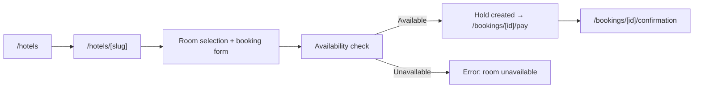

# Frontend design: Hotel Booking

> **Forward-looking design doc.** What the frontend for this feature **will** look like. Replaces nothing in the codebase yet.
> Once the feature ships, the equivalent reference doc at [`reference/features/hotel-booking.md`](./reference/features/) takes over as the source of truth and this design doc is archived.

| Field | Value |
|---|---|
| **Status** | Drafting |
| **Owner** | TBD |
| **Last reviewed** | 2026-05-22 |
| **Phase** | Phase 5 — Feature Modules |
| **Product PRD** | [`docs/product/prd.md#hotels`](../../../product/prd.md) |
| **Feature registry** | [`docs/product/feature-decisions.md#F31`](../../../product/feature-decisions.md) |
| **Backend module** | [`docs/modules/hotel-booking/`](../../../modules/hotel-booking/) |
| **Related ADRs** | — |
| **Dependencies** | auth, trip-discovery |

---

## 1. Goal

Let a traveler browse, filter, and book hotel accommodation in Cambodia — viewing rooms, availability, and pricing — then complete a reservation with a 15-minute hold, all on mobile in their preferred language.

---

## 2. User flow

1. User lands on `/[locale]/hotels` — sees curated hotel list with filters.
2. User applies filters (location, price range, dates, amenities) — list updates.
3. User taps a hotel card → navigates to `/[locale]/hotels/[slug]`.
4. User views gallery, amenities, map, reviews, and room options.
5. User selects a room and taps "Book" → booking form appears.
6. User fills check-in/check-out dates, guest count, special requests.
7. System validates availability → creates 15-minute hold.
8. User proceeds to payment → redirected to `/[locale]/bookings/[id]/pay`.
9. Success state at `/[locale]/bookings/[id]/confirmation`.

---

## 3. Pages

| # | Path | Auth | Layout shell | Purpose |
|---|---|---|---|---|
| 1 | `/[locale]/hotels` | No | `(main)` | Hotel list with filters and sorting |
| 2 | `/[locale]/hotels/[slug]` | No | `(main)` | Hotel detail — gallery, rooms, map, reviews |
| 3 | `/[locale]/hotels/[slug]/book` | Yes | `(main)` | Room selection and booking form |

---

## 4. Per-page detail

### 4.1 `/[locale]/hotels` (Hotel List)

**Purpose:** Browse and filter hotels to find suitable accommodation.

**Data shown:**
- Hotel card: name, cover photo, star rating, location (province/area), price per night (lowest room), amenity icons, review average + count.
- Active filter chips.
- Sort indicator.
- Pagination controls (20 per page).

**User actions:**
- Filter by location (province dropdown) → updates `searchParams`.
- Filter by price range (min/max slider) → updates `searchParams`.
- Filter by dates (check-in / check-out date picker) → updates `searchParams`.
- Filter by amenities (multi-select: Pool, WiFi, Breakfast, AC, Parking, Spa, Gym) → updates `searchParams`.
- Filter by star rating → updates `searchParams`.
- Sort by: recommended, price low–high, price high–low, rating → updates `searchParams`.
- Tap hotel card → navigate to `/[locale]/hotels/[slug]`.
- Paginate → updates `searchParams.page`.

**Components used:**
- Existing in `shared/`: `<Button>`, `<Card>`, `<Skeleton>`, `<EmptyState>`, `<Pagination>`.
- New in `features/hotels/components/`: `<HotelList>`, `<HotelCard>`, `<HotelFilterBar>`, `<HotelFilterSheet>` (mobile bottom sheet), `<PriceRangeSlider>`, `<AmenityCheckboxGroup>`, `<DateRangePicker>`.

**States:**

| State | UI | Source |
|---|---|---|
| Loading | Skeleton grid (6 cards) | `loading.tsx` |
| Empty (no results) | `<EmptyState>` with "Adjust filters" CTA | `t('hotels.empty.noResults')` |
| Empty (no hotels) | `<EmptyState>` with "Check back soon" | `t('hotels.empty.none')` |
| Error | Inline error + retry button | React Query `error` |

**Backend calls:** `GET /v1/hotels?location=&minPrice=&maxPrice=&checkIn=&checkOut=&amenities=&starRating=&sort=&page=&limit=20`

**i18n keys:** `hotels.list.*`

---

### 4.2 `/[locale]/hotels/[slug]` (Hotel Detail)

**Purpose:** View full hotel information, photo gallery, room options, location on map, and guest reviews to decide on booking.

**Data shown:**
- Photo gallery (up to 20 images, swipeable carousel + fullscreen lightbox).
- Hotel name, star rating, location, address.
- Description (translated).
- Amenities list with icons.
- Policies: check-in time, check-out time, cancellation policy.
- Room types list: name, photos, bed configuration, max occupancy, size (sqm), room amenities, price per night.
- Map showing hotel location (Leaflet + OpenStreetMap).
- Reviews: average rating, count, individual review cards (paginated).
- "Book" CTA per room type.

**User actions:**
- Swipe/tap gallery images → fullscreen lightbox.
- Tap room "Book" CTA → navigate to `/[locale]/hotels/[slug]/book?room=[roomId]`.
- Pan/zoom map.
- Paginate reviews.
- Share hotel (native share API).

**Components used:**
- Existing in `shared/`: `<Button>`, `<Badge>`, `<Skeleton>`, `<Tabs>`.
- New in `features/hotels/components/`: `<HotelGallery>`, `<HotelAmenities>`, `<HotelPolicies>`, `<RoomCard>`, `<RoomList>`, `<HotelMap>`, `<HotelReviews>`, `<ReviewCard>`.

**States:**

| State | UI | Source |
|---|---|---|
| Loading | Skeleton layout (gallery placeholder + text lines) | `loading.tsx` |
| Not found | 404 page | Backend returns `HOTEL_001` |
| Error | Inline error + retry | React Query `error` |

**Backend calls:**
- `GET /v1/hotels/:slug` — hotel detail with rooms.
- `GET /v1/hotels/:slug/reviews?page=&limit=10` — paginated reviews.

**i18n keys:** `hotels.detail.*`

---

### 4.3 `/[locale]/hotels/[slug]/book` (Room Booking Form)

**Purpose:** Select dates, guest count, and confirm room booking with real-time availability validation.

**Data shown:**
- Selected room summary: name, photo, bed config, max occupancy, price per night.
- Availability calendar (3-month window, unavailable dates greyed out).
- Date picker: check-in and check-out.
- Guest selector: adults (1–max occupancy), children (0–max occupancy minus adults).
- Price breakdown: nightly rate × nights + taxes/fees = total.
- Special requests text area.
- 15-minute hold countdown (after submission).
- "Confirm & Pay" CTA.

**User actions:**
- Select check-in date on calendar.
- Select check-out date on calendar.
- Adjust adult/child count.
- Type special requests.
- Submit form → triggers availability check → creates hold → redirects to payment.

**Components used:**
- Existing in `shared/`: `<Button>`, `<Input>`, `<Textarea>`, `<Skeleton>`.
- New in `features/hotels/components/`: `<AvailabilityCalendar>`, `<GuestSelector>`, `<PriceBreakdown>`, `<RoomBookingForm>`, `<HoldCountdown>`.

**States:**

| State | UI | Source |
|---|---|---|
| Loading (availability) | Calendar skeleton | React Query loading |
| Available | Green dates selectable | Availability endpoint |
| Unavailable dates | Greyed out, non-selectable | Availability endpoint |
| Submitting | Button loading spinner + disabled form | Mutation pending |
| Hold created | Countdown timer (15 min) + redirect to payment | Mutation success |
| Room unavailable (409) | Toast error + "Try different dates" CTA | `HOTEL_003` |
| Occupancy exceeded (400) | Inline field error on guest selector | `HOTEL_004` |
| Invalid dates (400) | Inline field error on date picker | `HOTEL_005` |

**Backend calls:**
- `GET /v1/hotels/:hotelId/rooms/:roomId/availability?month=YYYY-MM` — 3-month calendar data.
- `POST /v1/bookings/hotels` — create hotel booking hold.

**i18n keys:** `hotels.booking.*`

---

## 5. Data model

| Schema | Shape (high-level) | Source |
|---|---|---|
| `HotelSchema` | `id`, `slug`, `name`, `location`, `starRating`, `coverImageUrl`, `amenities[]`, `pricePerNightUsd` (lowest), `ratingAverage`, `ratingCount` | `features/hotels/schemas/hotel.ts` |
| `HotelDetailSchema` | extends above + `description`, `address`, `galleryImageUrls[]`, `checkInTime`, `checkOutTime`, `cancellationPolicy`, `rooms[]`, `latitude`, `longitude` | same file |
| `HotelRoomSchema` | `id`, `name`, `description`, `bedConfiguration`, `maxOccupancy`, `sizeSqm`, `amenities[]`, `imageUrls[]`, `pricePerNightUsd` | `features/hotels/schemas/hotel-room.ts` |
| `RoomAvailabilitySchema` | `{ [date: string]: { available: number, price: number } }` | `features/hotels/schemas/availability.ts` |
| `HotelReviewSchema` | `id`, `userId`, `userName`, `rating`, `comment`, `createdAt` | `features/hotels/schemas/hotel-review.ts` |
| `CreateHotelBookingSchema` | `roomId`, `checkInDate`, `checkOutDate`, `guestsAdults`, `guestsChildren`, `specialRequests?` | `features/hotels/schemas/create-hotel-booking.ts` |

**Backend endpoints called:**

| Method | Path | Use |
|---|---|---|
| GET | `/v1/hotels` | List with filters, sort, pagination |
| GET | `/v1/hotels/:slug` | Hotel detail with rooms |
| GET | `/v1/hotels/:slug/reviews` | Paginated reviews |
| GET | `/v1/hotels/:hotelId/rooms/:roomId/availability` | Per-night availability calendar |
| POST | `/v1/bookings/hotels` | Create booking hold |

---

## 6. Client state

**React Query hooks** (server state):

| Hook | Query key | `staleTime` | Invalidates |
|---|---|---|---|
| `useHotelList(filters)` | `['hotels', 'list', filters]` | 30s | — |
| `useHotel(slug)` | `['hotels', slug]` | 60s | — |
| `useHotelReviews(slug, page)` | `['hotels', slug, 'reviews', page]` | 60s | — |
| `useRoomAvailability(hotelId, roomId, month)` | `['hotels', hotelId, 'rooms', roomId, 'availability', month]` | 5min | — |
| `useCreateHotelBooking()` | — | — | `['bookings']` |

**Zustand stores** (client UI state):

| Store | What it holds | Persisted |
|---|---|---|
| `useHotelFilterStore` | location, priceRange [min, max], dateRange [checkIn, checkOut], amenities[], starRating, sort, page | No |

**Forms** (RHF + Zod):

| Form | Schema | Where |
|---|---|---|
| HotelBookingForm | `CreateHotelBookingSchema` | `features/hotels/components/RoomBookingForm.tsx` |

---

## 7. External integrations

- **WebSocket:** N/A
- **Stripe:** N/A (payment handled by shared booking payment flow at `/bookings/[id]/pay`)
- **Maps:** Leaflet + OpenStreetMap on hotel detail page — displays hotel location marker with popup (name + address). Uses `react-leaflet` with dynamic import (no SSR).
- **Push (FCM):** N/A
- **Storage (uploads):** N/A — images served from backend/CDN URLs via `next/image`.

---

## 8. Edge cases & error states

| Case | UI behavior | Notes |
|---|---|---|
| Offline | Show cached hotel list + offline banner; detail page shows cached data if visited before | PWA service worker caches static assets |
| 401 (session expired) | Auto-refresh token once, then redirect to `/login` | Shared API client handles this |
| Hotel not found (404 / `HOTEL_001`) | Custom 404 page with "Browse other hotels" CTA | |
| Room not found (404 / `HOTEL_002`) | Toast error + redirect back to hotel detail | |
| Room unavailable (409 / `HOTEL_003`) | Toast "Room no longer available for these dates" + suggest adjusting dates | Calendar refreshes automatically |
| Occupancy exceeded (400 / `HOTEL_004`) | Inline error on guest selector: "Max {n} guests for this room" | |
| Invalid date range (400 / `HOTEL_005`) | Inline error: "Check-out must be after check-in" | Also validated client-side before submit |
| Hold expired (15 min timeout) | Toast "Your hold has expired" + form re-enabled for retry | Countdown reaches zero |
| No rooms available for any date | "Fully booked" badge on room card, "Book" CTA disabled | |
| Gallery has 0 images | Show placeholder image | |
| Hotel has 0 reviews | Hide reviews section, show "No reviews yet" | |
| Slow network (>3s) | Skeleton persists; no timeout error unless >15s | |
| Price changed between list and detail | Detail page shows current price; no stale price guarantee | `staleTime` keeps it fresh |
| Concurrent booking race | Backend rejects with 409; frontend shows "Someone just booked the last room" | |
| Date picker: past dates | Disabled/greyed, not selectable | Client-side validation |
| Date picker: same check-in and check-out | Prevented; minimum 1 night enforced | |

---

## 9. Acceptance criteria (frontend)

The feature is "done" when:

- [ ] Hotel list page renders with real data from `GET /v1/hotels` and displays cards with name, cover photo, star rating, location, price, amenity icons.
- [ ] All filters (location, price range, dates, amenities, star rating) update the list via `searchParams` without full page reload.
- [ ] Sort options (recommended, price low–high, price high–low, rating) work correctly.
- [ ] Pagination loads 20 hotels per page and navigates correctly.
- [ ] Hotel detail page renders gallery (swipeable, lightbox), amenities, policies, room list, map, and reviews.
- [ ] Gallery uses `next/image` with explicit width/height for all hotel and room photos.
- [ ] Leaflet map renders hotel location marker correctly (dynamic import, no SSR).
- [ ] Room booking form validates dates (no past dates, check-out > check-in), guest count (≤ max occupancy), and shows real-time availability calendar.
- [ ] Availability calendar displays 3-month window with available/unavailable dates clearly distinguished.
- [ ] Price breakdown updates dynamically as dates change (nightly rate × nights).
- [ ] Successful booking creates a 15-minute hold and redirects to payment.
- [ ] All error states from §8 are handled with appropriate UI feedback.
- [ ] Every loading state shows skeleton UI; every empty state shows `<EmptyState>` with actionable CTA.
- [ ] All copy uses i18n keys across `en`, `zh`, `km` — no hardcoded strings.
- [ ] At least one E2E test covers: list → filter → detail → book room → hold created.
- [ ] All pages pass keyboard navigation and meet WCAG AA contrast.
- [ ] Mobile (375px) and tablet (768px) layouts render correctly.
- [ ] All pages meet Core Web Vitals budget (LCP < 2.5s, CLS < 0.1).

---

## 10. Open questions

None.

---

## 11. Out of scope

- Admin-side hotel/room management (separate dashboard, post-MVP).
- Hotel reviews creation (user-generated reviews — future feature).
- Trip-package hotel upgrade/swap flow (US-F31-04 — handled in trip-discovery module).
- Hotel comparison feature (side-by-side room/price comparison).
- Loyalty points earning/redemption on hotel bookings (v1.1).
- Real-time price negotiation via AI chat (handled by vibe-booking agent).

---

## 12. Related

- Product PRD section: [`docs/product/prd.md#hotels`](../../../product/prd.md)
- Feature registry entry: [`docs/product/feature-decisions.md#F31`](../../../product/feature-decisions.md)
- Backend module: [`docs/modules/hotel-booking/`](../../../modules/hotel-booking/)
- Future reference doc: [`../reference/features/hotel-booking.md`](../reference/features/) *(authored once shipped)*
- Roadmap phase: [`docs/platform/roadmaps/frontend-roadmap.md`](../../roadmaps/frontend-roadmap.md)
- Dependencies: auth module (protected booking route), trip-discovery module (hotel cards pattern reuse)
