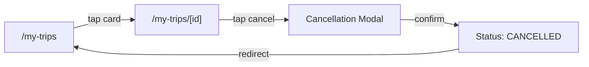

# Frontend design: My Trip (Booking Management)

> **Forward-looking design doc.** What the frontend for this feature **will** look like. Replaces nothing in the codebase yet.
> Once the feature ships, the equivalent reference doc at [`reference/features/my-trip.md`](./reference/features/) takes over as the source of truth and this design doc is archived.

| Field | Value |
|---|---|
| **Status** | Drafting |
| **Owner** | TBD |
| **Last reviewed** | 2026-05-22 |
| **Phase** | Phase 7 |
| **Product PRD** | [`docs/product/prd.md#booking-management`](../../../product/prd.md) |
| **Feature registry** | [`docs/product/feature-decisions.md#my-trip`](../../../product/feature-decisions.md) |
| **Backend module** | [`docs/modules/my-trip/`](../../../modules/my-trip/) |
| **Related ADRs** | — |
| **Dependencies** | Auth module, Bookings module |

---

## 1. Goal

Let a traveler view, manage, and cancel their bookings from a single "My Trips" hub — with status tracking, QR check-in tickets, and transparent refund previews.

---

## 2. User flow

1. User taps "My Trips" in bottom nav → `/[locale]/my-trips` (booking list).
2. User selects a tab: Upcoming, Past, or Cancelled.
3. User taps a booking card → `/[locale]/my-trips/[id]` (booking detail).
4. User views status, itinerary, QR ticket.
5. (Optional) User taps "Cancel Booking" → cancellation modal with refund preview.
6. User confirms cancellation → booking moves to Cancelled tab.

---

## 3. Pages

| # | Path | Auth | Layout shell | Purpose |
|---|---|---|---|---|
| 1 | `/[locale]/my-trips` | Yes | `(app)` | Booking list with tabs |
| 2 | `/[locale]/my-trips/[id]` | Yes | `(app)` | Booking detail, QR, cancel |

---

## 4. Per-page detail

### 4.1 `/[locale]/my-trips` (Booking List)

**Purpose:** View all bookings organized by status.

**Data shown:**
- Tab bar: Upcoming, Past, Cancelled (with count badges).
- Per booking card: trip/activity name, dates, status badge, total price (USD), thumbnail image.
- Empty state per tab when no bookings exist.

**User actions:**
- Switch tabs → filters list by status group.
- Tap booking card → navigate to `/[locale]/my-trips/[id]`.
- Pull-to-refresh → refetch bookings.

**Components used:**
- Existing in `shared/`: `<Tabs>`, `<Card>`, `<Badge>`, `<EmptyState>`, `<Skeleton>`.
- New in `features/my-trip/components/`: `<BookingList>`, `<BookingCard>`, `<BookingTabs>`.

**States:**

| State | UI | Source |
|---|---|---|
| Loading | Skeleton cards (3 placeholders) | `loading.tsx` |
| Empty (Upcoming) | `<EmptyState>` — "No upcoming trips. Start exploring!" with CTA to `/trips` | `t('myTrip.empty.upcoming')` |
| Empty (Past) | `<EmptyState>` — "No past trips yet." | `t('myTrip.empty.past')` |
| Empty (Cancelled) | `<EmptyState>` — "No cancelled bookings." | `t('myTrip.empty.cancelled')` |
| Error | Inline error + retry button | React Query `error` |

**Backend calls:** `GET /v1/bookings?status=upcoming|past|cancelled`

**i18n keys:** `myTrip.list.*`, `myTrip.empty.*`, `myTrip.tabs.*`

---

### 4.2 `/[locale]/my-trips/[id]` (Booking Detail)

**Purpose:** View full booking details, QR check-in ticket, itinerary, and access cancellation.

**Data shown:**
- Booking reference (`DLG-YYYY-NNNN`).
- Status badge (CONFIRMED, COMPLETED, CANCELLED, HOLD, EXPIRED).
- Trip/activity name, dates, number of travelers.
- Itinerary timeline (ordered list of booking items with times, locations).
- QR code (SVG) for check-in — only shown for CONFIRMED bookings.
- Price breakdown: items, add-ons, taxes, total.
- Driver/guide contact info (revealed 24h before start date).
- Cancellation policy summary.
- "Cancel Booking" button (only for CONFIRMED bookings ≥ 24h before start).

**User actions:**
- View QR code (tap to enlarge full-screen).
- Tap "Cancel Booking" → opens cancellation confirmation modal.
- Share booking → native share sheet with shareable link.
- Add to Calendar → downloads .ics file (v1.1).

**Components used:**
- Existing in `shared/`: `<Badge>`, `<Button>`, `<Modal>`, `<Separator>`.
- New in `features/my-trip/components/`: `<BookingDetail>`, `<BookingItinerary>`, `<BookingQRCode>`, `<BookingPriceBreakdown>`, `<CancellationModal>`, `<RefundPreview>`.

**States:**

| State | UI | Source |
|---|---|---|
| Loading | Skeleton layout (header + content blocks) | `loading.tsx` |
| Not found | 404 page | Backend returns `BOOKING_001` |
| Permission denied | Redirect to `/my-trips` + toast | Backend returns `BOOKING_002` |
| Expired hold | Banner: "This booking has expired" | Status = `EXPIRED` |
| Cancelled | Grey-out card, show refund info | Status = `CANCELLED` |
| Confirmed | Full detail with QR + cancel option | Status = `CONFIRMED` |
| Completed | Full detail, no cancel, show review CTA | Status = `COMPLETED` |
| Error | Inline error + retry | React Query `error` |

**Backend calls:** `GET /v1/bookings/:id`

**i18n keys:** `myTrip.detail.*`, `myTrip.status.*`, `myTrip.cancellation.*`

---

### 4.3 Cancellation Flow (Modal)

**Purpose:** Let the user cancel a booking with full transparency on refund amount.

**Data shown:**
- Refund preview: tier applied (100% / 50% / 0%), calculated refund amount in USD.
- Days until trip start date.
- Policy reminder text.
- Original payment method (card ending in XXXX / QR payment note).
- For QR payments: note that refund is processed manually (3–5 business days).

**User actions:**
- View refund preview → auto-calculated on modal open.
- Confirm cancellation → triggers `POST /v1/bookings/:id/cancel`.
- Dismiss modal → no action taken.

**States:**

| State | UI | Source |
|---|---|---|
| Preview | Refund amount + policy + confirm button | Calculated client-side from booking dates |
| Submitting | Button disabled + spinner | Mutation loading |
| Success | Toast "Booking cancelled" + redirect to list | Mutation success |
| Error | Toast with error message, modal stays open | Mutation error |
| Non-refundable | Warning banner: "No refund available (<24h)" | Tier calculation |

**Backend calls:** `POST /v1/bookings/:id/cancel`

**i18n keys:** `myTrip.cancellation.*`, `myTrip.refund.*`

---

## 5. Data model

| Schema | Shape (high-level) | Source |
|---|---|---|
| `BookingSummarySchema` | `id`, `reference`, `type`, `status`, `totalPriceUsd`, `startDate`, `endDate`, `itemName`, `thumbnailUrl` | `features/my-trip/schemas/booking.ts` |
| `BookingDetailSchema` | extends above + `items[]`, `qrCodeUrl`, `paymentStatus`, `currency`, `cancelledAt`, `refundAmountUsd`, `holdExpiresAt`, `guestEmail`, `metadata` | same file |
| `BookingItemSchema` | `id`, `itemType`, `name`, `quantity`, `unitPriceUsd`, `totalPriceUsd`, `metadata` (dates, location, meeting point) | same file |
| `RefundPreviewSchema` | `refundTier`, `refundPercentage`, `refundAmountUsd`, `daysUntilStart`, `policyText` | `features/my-trip/schemas/refund.ts` |

**Backend endpoints called:**

| Method | Path | Use |
|---|---|---|
| GET | `/v1/bookings` | List bookings with status filter |
| GET | `/v1/bookings/:id` | Booking detail with items |
| POST | `/v1/bookings/:id/cancel` | Cancel booking and initiate refund |

---

## 6. Client state

**React Query hooks** (server state):

| Hook | Query key | `staleTime` | Invalidates |
|---|---|---|---|
| `useBookingList(status)` | `['bookings', 'list', status]` | 30s | — |
| `useBooking(id)` | `['bookings', id]` | 60s | — |
| `useCancelBooking()` | — | — | `['bookings']` (all lists + detail) |

**Zustand stores** (client UI state):

| Store | What it holds | Persisted |
|---|---|---|
| `useMyTripUiStore` | active tab (upcoming/past/cancelled) | No |

**Forms:** None — cancellation uses a confirmation modal, not a form.

---

## 7. External integrations

- **WebSocket:** N/A
- **Stripe:** N/A (refunds processed server-side)
- **Maps:** N/A (v1.1 may add meeting point map)
- **Push (FCM):** Receives push for booking status changes (confirmed, cancelled, reminder)
- **Storage (uploads):** QR code SVGs served from Supabase Storage via `qrCodeUrl`
- **Calendar:** `.ics` file download (v1.1, generated client-side or via backend endpoint)

---

## 8. Edge cases & error states

| Case | UI behavior | Notes |
|---|---|---|
| Offline | Show cached booking list + offline banner; detail page shows cached data if previously viewed | PWA cache strategy |
| 401 (session expired) | Auto-refresh token once, then redirect to `/login` | Shared API client handles |
| Booking not found (404) | Redirect to `/my-trips` + toast "Booking not found" | `BOOKING_001` |
| Permission denied (403) | Redirect to `/my-trips` + toast "Access denied" | `BOOKING_002` |
| Cancel within 24h (400) | Modal shows "Cannot cancel — less than 24 hours before start" with disabled confirm button | `BOOKING_003` |
| Hold expired during viewing (409) | Banner replaces QR section: "This hold has expired" + CTA to rebook | `BOOKING_004` |
| Concurrent cancellation (409) | Toast "Booking already cancelled" + refetch detail | Race condition |
| Network failure on cancel | Toast "Failed to cancel. Please try again." + modal stays open for retry | |
| QR code fails to load | Fallback: show booking reference as text + "Show QR" retry button | Image load error |
| Guest user (no account) | Not accessible — My Trips requires auth; guest bookings accessed via shareable link | |
| Very long itinerary (10+ items) | Scrollable itinerary section with "Show all" expand | |
| Refund for QR payment | Banner: "Refund will be processed manually within 3–5 business days" | No Stripe auto-refund |
| Multiple currencies | Display in booking's original currency + USD equivalent | |

---

## 9. Acceptance criteria (frontend)

The feature is "done" when:

- [ ] `/[locale]/my-trips` renders with real booking data from `GET /v1/bookings`.
- [ ] Tabs (Upcoming, Past, Cancelled) correctly filter bookings by status group.
- [ ] Each tab shows correct empty state when no bookings exist.
- [ ] `/[locale]/my-trips/[id]` renders full booking detail with itinerary and price breakdown.
- [ ] QR code displays for CONFIRMED bookings and is enlargeable.
- [ ] "Cancel Booking" button only appears for cancellable bookings (CONFIRMED, ≥24h before start).
- [ ] Cancellation modal shows correct refund preview based on tiered policy (100%/50%/0%).
- [ ] Cancellation confirmation triggers `POST /v1/bookings/:id/cancel` and updates UI.
- [ ] All loading, empty, and error states render correctly per §4.
- [ ] All copy uses i18n keys across `en`, `zh`, `km`.
- [ ] At least one E2E test covers: list → detail → cancel happy path.
- [ ] Keyboard navigation works on all interactive elements (tabs, buttons, modal).
- [ ] WCAG AA contrast met on all text and status badges.
- [ ] Mobile (375px) and tablet (768px) layouts render correctly.
- [ ] Driver/guide contact info hidden until 24h before start date.
- [ ] Shareable booking link works without login (read-only view).

---

## 10. Open questions

None — all design decisions resolved.

---

## 11. Out of scope

- Admin-side booking management dashboard (separate feature, post-MVP).
- iCal export / "Add to Calendar" (v1.1, F38).
- Booking modification (change dates/travelers) — not in MVP.
- Review/rating after trip completion.
- Offline maps integration on booking detail.
- Push notification preferences UI.
- Loyalty points display on booking (v1.1).

---

## 12. Related

- Product PRD section: [`docs/product/prd.md#booking-management`](../../../product/prd.md)
- Feature registry entry: [`docs/product/feature-decisions.md#my-trip`](../../../product/feature-decisions.md)
- Backend module: [`docs/modules/my-trip/`](../../../modules/my-trip/)
- Future reference doc: [`../reference/features/my-trip.md`](../reference/features/) *(authored once shipped)*
- Roadmap phase: [`docs/platform/roadmaps/frontend-roadmap.md`](../../roadmaps/frontend-roadmap.md)
- Requirements: [`docs/modules/my-trip/requirements.md`](../../../modules/my-trip/requirements.md)
- Architecture: [`docs/modules/my-trip/architecture.md`](../../../modules/my-trip/architecture.md)
