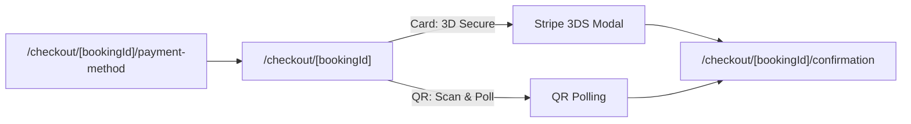

# Frontend design: Payments & Checkout

> **Forward-looking design doc.** What the frontend for this feature **will** look like. Replaces nothing in the codebase yet.

| Field | Value |
|---|---|
| **Status** | Drafting |
| **Owner** | TBD |
| **Last reviewed** | 2026-05-22 |
| **Phase** | Phase 5 — Feature Modules |
| **Product PRD** | [`docs/product/prd.md#payments`](../../../product/prd.md) |
| **Feature registry** | [`docs/product/feature-decisions.md#payments`](../../../product/feature-decisions.md) |
| **Backend module** | [`docs/modules/payments/`](../../../modules/payments/) |
| **Related ADRs** | — |

---

## 1. Goal

Let a traveler select a payment method, complete checkout with a live 15-minute hold timer, and receive instant confirmation — supporting Stripe card (3D Secure) and Bakong/ABA QR code payments.

---

## 2. User flow

1. User completes a booking selection (trip, hotel, transport, or guide) → booking hold created (15 min TTL).
2. User lands on **Payment Method Selection** at `/[locale]/checkout/[bookingId]/payment-method`.
3. User selects Stripe card or QR code payment.
4. User proceeds to **Checkout** at `/[locale]/checkout/[bookingId]` with price breakdown, hold timer, and payment form.
5. User submits payment (card via Stripe Elements or scans QR code).
6. On success, user lands on **Payment Confirmation** at `/[locale]/checkout/[bookingId]/confirmation`.
7. User can view refund status from **Booking Detail** at `/[locale]/bookings/[bookingId]` (refund display section).

---

## 3. Pages

| # | Path | Auth | Layout shell | Purpose |
|---|---|---|---|---|
| 1 | `/[locale]/checkout/[bookingId]/payment-method` | Yes | `(main)` | Select payment method |
| 2 | `/[locale]/checkout/[bookingId]` | Yes | `(main)` | Checkout with price breakdown, timer, payment form |
| 3 | `/[locale]/checkout/[bookingId]/confirmation` | Yes | `(main)` | Payment success confirmation |
| 4 | `/[locale]/bookings/[bookingId]` (refund section) | Yes | `(main)` | Refund status display (embedded in booking detail) |

---

## 4. Per-page detail

### 4.1 `/[locale]/checkout/[bookingId]/payment-method` (Payment Method Selection)

**Purpose:** Let the user choose between Stripe card payment and Bakong/ABA QR code payment.

**Data shown:**
- Booking summary (item name, date, participants, total in USD).
- Available payment methods with icons (Visa/Mastercard/Amex, Bakong, ABA).
- 15-minute hold countdown timer.
- Currency display (selected currency with USD equivalent in small text).

**User actions:**
- Select "Credit/Debit Card" → navigates to checkout with `method=stripe_card`.
- Select "Bakong QR" → navigates to checkout with `method=bakong_qr`.
- Select "ABA QR" → navigates to checkout with `method=aba_qr`.
- Back → returns to booking detail.

**Components used:**
- Existing in `shared/`: `<Button>`, `<Card>`, `<CountdownTimer>`.
- New in `features/payments/components/`: `<PaymentMethodCard>`, `<PaymentMethodSelector>`, `<BookingSummaryCard>`, `<HoldTimer>`.

**States:**

| State | UI | Source |
|---|---|---|
| Loading | Skeleton cards | `loading.tsx` |
| Hold expired | Redirect to booking page with toast "Hold expired" | Timer reaches 0 |
| Error (booking not found) | Error page with "Booking not found" | 404 from backend |

**Backend calls:** `GET /v1/bookings/:bookingId` (to fetch booking summary and hold expiry).

**i18n keys:** `payments.method.*`

---

### 4.2 `/[locale]/checkout/[bookingId]` (Checkout)

**Purpose:** Display price breakdown, countdown timer, and payment form (Stripe Elements or QR code) for the user to complete payment.

**Data shown:**
- Itemized price breakdown: subtotal, taxes/fees, total.
- Currency conversion (display currency + original USD).
- 15-minute hold countdown timer (synced with server expiry).
- Payment form (Stripe Elements card input OR generated QR code image).
- QR code: merchant ID, amount, reference, expiry timestamp.
- QR polling status indicator ("Waiting for payment...").

**User actions:**
- (Card) Fill card details → tap "Pay Now" → Stripe Elements `confirmPayment()`.
- (Card) Complete 3D Secure challenge if prompted.
- (QR) View QR code → scan with Bakong/ABA app.
- (QR) Tap "I've paid" → triggers manual verification check.
- (QR) Download QR image.
- (QR) Tap "Switch to card" → fallback to Stripe if QR not completed.
- Cancel → releases hold, returns to booking.

**Components used:**
- Existing in `shared/`: `<Button>`, `<Card>`, `<Spinner>`.
- New in `features/payments/components/`: `<PriceBreakdown>`, `<HoldTimer>`, `<StripeCardForm>`, `<QrCodeDisplay>`, `<QrPollingStatus>`, `<PaymentActions>`.

**States:**

| State | UI | Source |
|---|---|---|
| Loading | Skeleton form | `loading.tsx` |
| Card input | Stripe Elements embedded form | Stripe.js |
| QR display | QR code SVG + polling indicator | Backend QR payload |
| Processing | Disabled form + spinner + "Processing payment..." | After submit |
| 3D Secure | Stripe modal overlay | Stripe.js |
| QR polling | "Waiting for payment..." with animated dots, polls every 10s | `useQrPolling` hook |
| Hold expired | Modal: "Your hold has expired. Please start over." + redirect | Timer reaches 0 |
| Payment failed | Inline error message + retry button | Stripe error / backend error |
| Error (network) | Toast + retry CTA | Network failure |

**Backend calls:**
- `POST /v1/payments/intent` — create Stripe PaymentIntent, returns `client_secret`.
- `POST /v1/payments/qr` — generate QR payment payload.
- `GET /v1/payments/:paymentId/status` — poll QR payment status (every 10s).
- `POST /v1/payments/:paymentId/verify` — manual "I've paid" verification.

**i18n keys:** `payments.checkout.*`

---

### 4.3 `/[locale]/checkout/[bookingId]/confirmation` (Payment Confirmation)

**Purpose:** Confirm successful payment, show booking reference, and provide next steps.

**Data shown:**
- Success icon/animation.
- Booking reference number.
- Payment summary (amount, method, transaction ID, date).
- Booking details (item, date, participants).
- Refund policy summary (tiered: 100% ≥7 days, 50% 1–7 days, 0% <24h).
- Download receipt (PDF) button.
- Next steps (e.g., "Check your email for confirmation").

**User actions:**
- Tap "Download Receipt" → triggers PDF download.
- Tap "View Booking" → navigates to `/[locale]/bookings/[bookingId]`.
- Tap "Book Another" → navigates to home.

**Components used:**
- Existing in `shared/`: `<Button>`, `<Card>`, `<SuccessAnimation>`.
- New in `features/payments/components/`: `<PaymentConfirmationCard>`, `<RefundPolicySummary>`, `<ReceiptDownloadButton>`.

**States:**

| State | UI | Source |
|---|---|---|
| Loading | Skeleton confirmation | `loading.tsx` |
| Success | Full confirmation card | Backend payment data |
| Error (payment not found) | Error state with support contact | 404 from backend |

**Backend calls:**
- `GET /v1/payments/:paymentId` — fetch payment confirmation details.
- `GET /v1/payments/:paymentId/receipt` — download PDF receipt.

**i18n keys:** `payments.confirmation.*`

---

### 4.4 Refund Display (embedded in `/[locale]/bookings/[bookingId]`)

**Purpose:** Show refund status and tiered refund policy when a booking is cancelled.

**Data shown:**
- Refund status badge: `PENDING`, `SUCCEEDED`, `FAILED`.
- Refund amount (with breakdown: original amount, refund tier applied, refund amount).
- Tiered refund policy explanation:
  - ≥7 days before: 100% refund.
  - 1–7 days before: 50% refund.
  - <24 hours before: 0% refund (no refund).
- Refund timeline (estimated processing time: 5–10 business days for card, instant for QR).
- Refund reason (if provided).

**User actions:**
- View refund status (read-only).
- Tap "Contact Support" if refund failed.

**Components used:**
- New in `features/payments/components/`: `<RefundStatusCard>`, `<RefundTierExplanation>`, `<RefundTimeline>`.

**States:**

| State | UI | Source |
|---|---|---|
| No refund | Section hidden | Booking not cancelled |
| Refund pending | Yellow badge + "Processing..." | `refund.status === 'PENDING'` |
| Refund succeeded | Green badge + amount | `refund.status === 'SUCCEEDED'` |
| Refund failed | Red badge + "Contact support" CTA | `refund.status === 'FAILED'` |

**Backend calls:** `GET /v1/bookings/:bookingId` (includes refund data in response).

**i18n keys:** `payments.refund.*`

---

## 5. Data model

| Schema | Shape (high-level) | Source |
|---|---|---|
| `PaymentIntentSchema` | `clientSecret`, `paymentId`, `amount`, `currency` | `features/payments/schemas/payment.ts` |
| `QrPaymentSchema` | `qrData`, `reference`, `expiry`, `amount`, `merchantId` | `features/payments/schemas/payment.ts` |
| `PaymentStatusSchema` | `id`, `status`, `method`, `amountUsd`, `currency`, `providerTransactionId`, `createdAt` | `features/payments/schemas/payment.ts` |
| `RefundSchema` | `status`, `amountUsd`, `reason`, `refundTier`, `createdAt` | `features/payments/schemas/payment.ts` |
| `PriceBreakdownSchema` | `subtotal`, `taxes`, `fees`, `discount`, `loyaltyPointsRedeemed`, `total`, `currency`, `exchangeRate` | `features/payments/schemas/payment.ts` |

**Backend endpoints called:**

| Method | Path | Use |
|---|---|---|
| GET | `/v1/bookings/:bookingId` | Booking summary + hold expiry + refund data |
| POST | `/v1/payments/intent` | Create Stripe PaymentIntent |
| POST | `/v1/payments/qr` | Generate QR payment payload |
| GET | `/v1/payments/:paymentId/status` | Poll QR payment status |
| POST | `/v1/payments/:paymentId/verify` | Manual QR verification |
| GET | `/v1/payments/:paymentId` | Payment confirmation details |
| GET | `/v1/payments/:paymentId/receipt` | Download PDF receipt |

---

## 6. Client state

**React Query hooks** (server state):

| Hook | Query key | `staleTime` | Invalidates |
|---|---|---|---|
| `useBookingSummary(bookingId)` | `['bookings', bookingId]` | 30s | — |
| `usePaymentStatus(paymentId)` | `['payments', paymentId, 'status']` | 0 (polling) | — |
| `useCreatePaymentIntent()` | — | — | `['payments']` |
| `useCreateQrPayment()` | — | — | `['payments']` |
| `useVerifyQrPayment()` | — | — | `['payments', paymentId, 'status']` |
| `usePaymentConfirmation(paymentId)` | `['payments', paymentId]` | 60s | — |

**Zustand stores** (client UI state):

| Store | What it holds | Persisted |
|---|---|---|
| `usePaymentStore` | selectedMethod, holdExpiresAt, isProcessing, qrPollingActive | No |

**Forms** (RHF + Zod):

| Form | Schema | Where |
|---|---|---|
| — | — | Stripe Elements handles card input (no RHF needed for card fields) |

---

## 7. External integrations

- **WebSocket:** N/A
- **Stripe:** Stripe Elements (`@stripe/react-stripe-js`) for secure card input on checkout page. `loadStripe()` initialized with publishable key from env. `confirmPayment()` handles 3D Secure automatically.
- **QR Code Generation:** `qrcode.react` library to render QR code SVG from backend-provided payload (merchant ID, amount, reference, expiry, checksum).
- **Maps:** N/A
- **Push (FCM):** Payment confirmation triggers FCM push (handled by backend).
- **Storage (uploads):** N/A (PDF receipt served from backend/Supabase Storage).

---

## 8. Edge cases & error states

| Case | UI behavior | Notes |
|---|---|---|
| Hold expires during checkout | Modal overlay: "Your booking hold has expired." + "Start Over" button redirects to booking page | Timer synced with server `holdExpiresAt` |
| Hold expires during 3D Secure | Same as above; Stripe payment cancelled | Backend rejects payment if hold expired |
| Card declined | Inline error below card form: "Payment declined. Please try another card." + retry | Error from Stripe Elements |
| 3D Secure fails | Inline error: "Authentication failed. Please try again." | Stripe returns `requires_action` failure |
| QR payment timeout (15 min) | QR code grayed out + "Payment window expired. Switch to card?" | Polling stops, fallback offered |
| QR "I've paid" but not received | Toast: "Payment not yet received. We'll keep checking." + continue polling | Backend returns `PENDING` |
| Network loss during payment | Toast: "Connection lost. Your payment may still be processing." + auto-retry on reconnect | Idempotency key prevents double charge |
| Double-submit prevention | "Pay Now" button disabled immediately on click; spinner shown | Prevents duplicate PaymentIntents |
| Booking already paid | Redirect to confirmation page | Backend returns 409 `PAYMENT_003` |
| Invalid booking ID | 404 error page | Backend returns 404 |
| Stripe.js fails to load | Error state: "Payment system unavailable. Please try again later." | CDN failure edge case |
| Currency conversion stale | Show "Rates updated X min ago" disclaimer | Rates cached 1h in Redis |
| Refund failed | Red badge + "Contact support" link in refund section | Admin alerted on backend |
| PDF receipt unavailable | Toast: "Receipt not ready yet. Try again in a moment." | PDF generation async |
| Offline | Prevent checkout (payment requires network); show offline banner | Cannot process payments offline |
| 401 (session expired) | Auto-refresh once, then redirect to `/login` | Shared API client handles |

---

## 9. Acceptance criteria (frontend)

The feature is "done" when:

- [ ] Payment method selection page renders with all available methods (Stripe card, Bakong QR, ABA QR).
- [ ] Checkout page displays correct price breakdown (subtotal, taxes, fees, total) with currency conversion.
- [ ] 15-minute hold countdown timer is visible and synced with server expiry on both method selection and checkout pages.
- [ ] Stripe Elements card form renders, accepts input, and submits payment via `confirmPayment()`.
- [ ] 3D Secure challenge modal appears when required and completes successfully.
- [ ] QR code displays correctly with amount, reference, and expiry; downloadable as image.
- [ ] QR payment polling fires every 10 seconds and stops on success or expiry.
- [ ] "I've paid" button triggers manual verification and shows appropriate feedback.
- [ ] Fallback from QR to Stripe card is available when QR payment times out.
- [ ] Payment confirmation page shows booking reference, amount, method, and transaction ID.
- [ ] PDF receipt download works from confirmation page.
- [ ] Refund display shows correct tier (100%/50%/0%) with status badge (PENDING/SUCCEEDED/FAILED).
- [ ] Hold expiry triggers modal and prevents further payment submission.
- [ ] Card decline and 3D Secure failure show clear, actionable error messages with retry.
- [ ] Double-submit is prevented (button disabled + spinner on click).
- [ ] All copy is i18n-keyed across `en`, `zh`, `km`.
- [ ] At least one E2E test covers the happy path (card payment flow).
- [ ] At least one E2E test covers QR payment polling flow.
- [ ] All pages pass keyboard navigation and meet WCAG AA contrast.
- [ ] Mobile (375 px) and tablet (768 px) layouts render correctly.
- [ ] All pages meet Core Web Vitals budget.

---

## 10. Open questions

None — all decisions resolved.

---

## 11. Out of scope

- Admin-side payment management dashboard (separate admin feature, post-MVP).
- Discount code input and loyalty points redemption at checkout (v1.1, separate design doc).
- Stripe Connect for provider payouts.
- Recurring/subscription payments.
- Cryptocurrency payments.
- Payment method saved/remembered for returning users.
- Partial payments or installment plans.

---

## 12. Related

- Product PRD section: [`docs/product/prd.md#payments`](../../../product/prd.md)
- Feature registry entry: [`docs/product/feature-decisions.md#payments`](../../../product/feature-decisions.md)
- Backend module: [`docs/modules/payments/`](../../../modules/payments/)
- Backend requirements: [`docs/modules/payments/requirements.md`](../../../modules/payments/requirements.md)
- Backend architecture: [`docs/modules/payments/architecture.md`](../../../modules/payments/architecture.md)
- Future reference doc: [`../reference/features/payments.md`](../reference/features/) *(authored once shipped)*
- Roadmap phase: [`docs/platform/roadmaps/frontend-roadmap.md`](../../roadmaps/frontend-roadmap.md)
- Dependencies: Auth module (Phase 2), at least one booking flow (trips/hotels/transport/guides)
