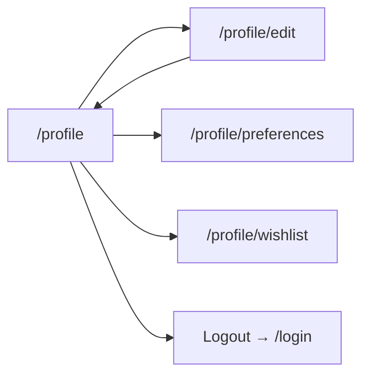

# Frontend design: User Profile & Settings

> **Forward-looking design doc.** What the frontend for this feature **will** look like. Replaces nothing in the codebase yet.
> Once the feature ships, the equivalent reference doc at [`reference/features/profile.md`](./reference/features/) takes over as the source of truth and this design doc is archived.

| Field | Value |
|---|---|
| **Status** | Drafting |
| **Owner** | TBD |
| **Last reviewed** | 2026-05-22 |
| **Phase** | Phase 7 — User Profile & Settings |
| **Product PRD** | [`docs/product/prd.md#user-profile`](../../../product/prd.md) |
| **Feature registry** | [`docs/product/feature-decisions.md#profile`](../../../product/feature-decisions.md) |
| **Backend module** | [`docs/modules/profile/`](../../../modules/profile/) |
| **Related ADRs** | — |
| **Depends on** | Auth (Phase 6) |

---

## 1. Goal

Let an authenticated traveler view and edit their personal profile, manage preferences (language, currency, notifications), view their wishlist, and securely log out — all from a single settings hub.

---

## 2. User flow

1. User taps avatar/profile icon in bottom nav → navigates to `/[locale]/profile`.
2. User views their profile summary (name, email, avatar, loyalty points).
3. User taps "Edit Profile" → navigates to `/[locale]/profile/edit`.
4. User modifies fields (name, phone, avatar) → submits form → success toast → redirected to `/[locale]/profile`.
5. User taps "Preferences" → navigates to `/[locale]/profile/preferences`.
6. User updates language, currency, or notification toggles → auto-saves on change.
7. User taps "Wishlist" → navigates to `/[locale]/profile/wishlist`.
8. User views saved trips/hotels → taps item to navigate to detail.
9. User taps "Logout" → confirmation dialog → session cleared → redirected to `/[locale]/login`.



---

## 3. Pages

| # | Path | Auth | Layout shell | Purpose |
|---|---|---|---|---|
| 1 | `/[locale]/profile` | Yes | `(main)` | Profile summary & settings hub |
| 2 | `/[locale]/profile/edit` | Yes | `(main)` | Edit name, phone, avatar |
| 3 | `/[locale]/profile/preferences` | Yes | `(main)` | Language, currency, notifications |
| 4 | `/[locale]/profile/wishlist` | Yes | `(main)` | Saved trips/hotels list |

---

## 4. Per-page detail

### 4.1 `/[locale]/profile` (Profile Summary)

**Purpose:** Display user profile at a glance and provide navigation to sub-pages.

**Data shown:**
- Avatar image (or initials fallback)
- Display name
- Email (read-only)
- Phone number
- Preferred language badge
- Loyalty points balance
- Student verification status badge

**User actions:**
- Tap "Edit Profile" → navigate to `/profile/edit`.
- Tap "Preferences" → navigate to `/profile/preferences`.
- Tap "Wishlist" → navigate to `/profile/wishlist`.
- Tap "Logout" → show confirmation dialog → call logout mutation.

**Components used:**
- Existing in `shared/`: `<Button>`, `<Avatar>`, `<Badge>`, `<Card>`.
- New in `features/profile/components/`: `<ProfileHeader>`, `<ProfileMenuList>`, `<LogoutDialog>`.

**States:**

| State | UI | Source |
|---|---|---|
| Loading | Skeleton card + skeleton menu items | `loading.tsx` |
| Error | Inline error + retry button | React Query `error` |

**Backend calls:** `GET /v1/users/me`

**i18n keys:** `profile.summary.*`

---

### 4.2 `/[locale]/profile/edit` (Edit Profile)

**Purpose:** Allow user to update name, phone, and avatar.

**Data shown:**
- Current avatar with upload overlay
- Name input (pre-filled)
- Phone input (pre-filled)
- Email (displayed read-only, not editable)

**User actions:**
- Tap avatar → open file picker (JPEG/PNG/WebP, max 5MB).
- Edit name field.
- Edit phone field (E.164 validation).
- Tap "Save" → submit form → success toast → navigate back.
- Tap "Cancel" → navigate back without saving.

**Components used:**
- Existing in `shared/`: `<Button>`, `<Input>`, `<Avatar>`, `<FormField>`.
- New in `features/profile/components/`: `<EditProfileForm>`, `<AvatarUpload>`.

**States:**

| State | UI | Source |
|---|---|---|
| Loading | Skeleton form | `loading.tsx` |
| Submitting | Disabled form + spinner on button | RHF `isSubmitting` |
| Validation error | Inline field errors | Zod resolver |
| Upload error | Toast "File too large" or "Invalid format" | Mutation `onError` |
| Success | Toast "Profile updated" + redirect | Mutation `onSuccess` |

**Backend calls:**
- `GET /v1/users/me` (pre-fill)
- `PATCH /v1/users/me` (submit)
- Avatar upload to Supabase Storage (presigned URL or direct upload)

**i18n keys:** `profile.edit.*`

---

### 4.3 `/[locale]/profile/preferences` (Preferences)

**Purpose:** Manage language, currency, and notification settings.

**Data shown:**
- Language selector (EN, ZH, KM) — current selection highlighted
- Currency selector (USD, KHR, CNY) — current selection highlighted
- Notification toggles: push notifications, email notifications, booking reminders

**User actions:**
- Select language → auto-saves via mutation → app locale updates.
- Select currency → auto-saves via mutation → currency context updates.
- Toggle notification switches → auto-saves per toggle.

**Components used:**
- Existing in `shared/`: `<Select>`, `<Switch>`, `<Card>`.
- New in `features/profile/components/`: `<LanguageSelector>`, `<CurrencySelector>`, `<NotificationSettings>`.

**States:**

| State | UI | Source |
|---|---|---|
| Loading | Skeleton selectors + toggles | `loading.tsx` |
| Saving | Subtle spinner on changed field | Mutation `isPending` |
| Error | Toast with retry | Mutation `onError` |
| Success | Checkmark flash on saved field | Mutation `onSuccess` |

**Backend calls:**
- `GET /v1/users/me` (current preferences)
- `PATCH /v1/users/me` (language update: `{ preferred_language }`)
- `PATCH /v1/users/me/preferences` (currency, notifications — if separate endpoint; otherwise same PATCH)

**i18n keys:** `profile.preferences.*`

---

### 4.4 `/[locale]/profile/wishlist` (Wishlist / Favorites)

**Purpose:** View and manage saved/favorited trips and hotels.

**Data shown:**
- List of wishlist items (trip cards or hotel cards)
- Each item: thumbnail, name, price, location, "Remove" action

**User actions:**
- Tap item → navigate to trip/hotel detail page.
- Tap "Remove" → optimistic removal + mutation.
- Pull-to-refresh on mobile.

**Components used:**
- Existing in `shared/`: `<Card>`, `<Button>`, `<EmptyState>`.
- New in `features/profile/components/`: `<WishlistItem>`, `<WishlistList>`.

**States:**

| State | UI | Source |
|---|---|---|
| Loading | Skeleton card list | `loading.tsx` |
| Empty | `<EmptyState>` with "Explore trips" CTA | `t('profile.wishlist.empty.*')` |
| Error | Inline error + retry | React Query `error` |
| Removing | Item fades out (optimistic) | Mutation with `onMutate` |

**Backend calls:**
- `GET /v1/users/me/wishlist`
- `DELETE /v1/users/me/wishlist/:itemId`

**i18n keys:** `profile.wishlist.*`

---

## 5. Data model

| Schema | Shape (high-level) | Source |
|---|---|---|
| `UserProfileSchema` | `id`, `email`, `name`, `phone`, `avatar_url`, `preferred_language`, `loyalty_balance`, `student_status`, `role` | `features/profile/schemas/profile.ts` |
| `UpdateProfileSchema` | `name?`, `phone?`, `avatar_url?` | same file |
| `UserPreferencesSchema` | `preferred_language`, `preferred_currency`, `notifications_push`, `notifications_email`, `notifications_reminders` | same file |
| `WishlistItemSchema` | `id`, `type` (trip\|hotel), `item_id`, `name`, `image_url`, `price_usd`, `location` | `features/profile/schemas/wishlist.ts` |

**Backend endpoints called:**

| Method | Path | Use |
|---|---|---|
| GET | `/v1/users/me` | Fetch profile |
| PATCH | `/v1/users/me` | Update profile fields |
| GET | `/v1/users/me/wishlist` | List wishlist |
| DELETE | `/v1/users/me/wishlist/:id` | Remove wishlist item |
| POST | `/v1/auth/logout` | Logout (clear session) |

---

## 6. Client state

**React Query hooks** (server state):

| Hook | Query key | `staleTime` | Invalidates |
|---|---|---|---|
| `useProfile()` | `['profile', 'me']` | 60s | — |
| `useUpdateProfile()` | — | — | `['profile', 'me']` |
| `useWishlist()` | `['profile', 'wishlist']` | 30s | — |
| `useRemoveWishlistItem()` | — | — | `['profile', 'wishlist']` |
| `useLogout()` | — | — | Clears all queries |

**Zustand stores** (client UI state):

| Store | What it holds | Persisted |
|---|---|---|
| `usePreferencesStore` | `currency` (USD/KHR/CNY), used app-wide for display | Yes (localStorage) |

**Forms** (RHF + Zod):

| Form | Schema | Where |
|---|---|---|
| EditProfileForm | `UpdateProfileSchema` | `features/profile/components/EditProfileForm.tsx` |

Zod schema:

```typescript
const UpdateProfileSchema = z.object({
  name: z.string().min(1).max(255),
  phone: z.string().regex(/^\+[1-9]\d{1,14}$/).optional().or(z.literal('')),
})
```

---

## 7. External integrations

- **WebSocket:** N/A
- **Stripe:** N/A
- **Maps:** N/A
- **Push (FCM):** Notification permission request triggered from preferences page when user enables push notifications.
- **Storage (uploads):** Avatar upload to Supabase Storage. Max 5MB, JPEG/PNG/WebP. Upload via presigned URL or direct client upload with auth token.

---

## 8. Edge cases & error states

| Case | UI behavior | Notes |
|---|---|---|
| Offline | Show cached profile from React Query cache + offline banner | Edits queued until online |
| 401 (session expired) | Auto-refresh once, then redirect to `/login` | Shared API client interceptor |
| Avatar upload > 5MB | Toast "File too large (max 5MB)" + file picker reset | Client-side validation before upload |
| Avatar invalid format | Toast "Only JPEG, PNG, or WebP allowed" | Client-side MIME check |
| Avatar upload network failure | Toast "Upload failed, try again" + retry button | Mutation `onError` |
| Phone invalid format | Inline field error "Enter valid phone (e.g. +855...)" | Zod regex validation |
| PATCH 400 (validation) | Inline field errors from server response | Map `error.details` to fields |
| 5xx / network error | Toast "Something went wrong" + manual retry CTA | |
| Wishlist empty | `<EmptyState>` with illustration + "Explore trips" button | |
| Logout with pending booking hold | Confirmation dialog warns "You have an active hold" | Check local state before logout |
| Language change | App locale switches immediately; page re-renders in new language | `next-intl` locale routing |
| Currency change | All displayed prices re-convert using cached rates | Zustand store triggers re-render |

---

## 9. Acceptance criteria (frontend)

The feature is "done" when:

- [ ] `/profile` renders authenticated user's name, email, avatar, loyalty balance, and student status from `GET /v1/users/me`.
- [ ] `/profile/edit` form pre-fills current values and successfully submits via `PATCH /v1/users/me`.
- [ ] Avatar upload accepts JPEG/PNG/WebP ≤5MB, rejects others with clear error message.
- [ ] Phone field validates E.164 format with inline error on invalid input.
- [ ] `/profile/preferences` language selector updates app locale and persists via backend.
- [ ] `/profile/preferences` currency selector updates Zustand store and re-renders prices app-wide.
- [ ] `/profile/preferences` notification toggles save state to backend.
- [ ] `/profile/wishlist` displays saved items and supports removal with optimistic UI.
- [ ] Wishlist empty state shows CTA to explore trips.
- [ ] Logout clears access token from memory, clears refresh cookie via `POST /v1/auth/logout`, and redirects to `/login`.
- [ ] Logout confirmation dialog appears before executing logout.
- [ ] All pages show loading skeletons, error states, and empty states correctly.
- [ ] All copy uses i18n keys across `en`, `zh`, `km` — no hardcoded strings.
- [ ] Mobile (375px) and tablet (768px) layouts render correctly.
- [ ] All pages pass keyboard navigation and meet WCAG AA contrast.
- [ ] At least one E2E test covers: view profile → edit → save → verify update.

---

## 10. Open questions

None — all design decisions resolved.

---

## 11. Out of scope

- Admin-side user management (separate admin dashboard, post-MVP).
- Student verification upload flow (separate feature, Phase 8+).
- Emergency contact editing (deferred to SOS feature implementation).
- Password change UI (handled by auth/security settings, separate design).
- Account deletion / data export (GDPR compliance, post-MVP).
- Loyalty points history and redemption UI (separate loyalty feature).

---

## 12. Related

- Product PRD section: [`docs/product/prd.md#user-profile`](../../../product/prd.md)
- Feature registry entry: [`docs/product/feature-decisions.md#profile`](../../../product/feature-decisions.md)
- Backend module: [`docs/modules/profile/`](../../../modules/profile/)
- Future reference doc: [`../reference/features/profile.md`](../reference/features/) *(authored once shipped)*
- Roadmap phase: [`docs/platform/roadmaps/frontend-roadmap.md`](../../roadmaps/frontend-roadmap.md)
