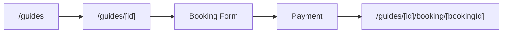

# Frontend design: Tour Guide Booking

> **Forward-looking design doc.** What the frontend for this feature **will** look like. Replaces nothing in the codebase yet.
> Once the feature ships, the equivalent reference doc at [`reference/features/tour-guide.md`](./reference/features/) takes over as the source of truth and this design doc is archived.

| Field | Value |
|---|---|
| **Status** | Drafting |
| **Owner** | TBD |
| **Last reviewed** | 2026-05-22 |
| **Phase** | Phase 5 — Feature Modules |
| **Product PRD** | [`docs/product/prd.md#7.4`](../../../product/prd.md) |
| **Feature registry** | [`docs/product/feature-decisions.md#tour-guide`](../../../product/feature-decisions.md) |
| **Backend module** | [`docs/modules/tour-guide/`](../../../modules/tour-guide/) |
| **Related ADRs** | — |
| **Depends on** | `auth`, `trip-discovery` |

---

## 1. Goal

Let a traveler discover, compare, and book a verified local tour guide for specific dates in Cambodia — filtered by language, specialty, location, and availability — entirely on mobile.

---

## 2. User flow

1. User lands on `/[locale]/guides` (guide list page).
2. User applies filters (language, specialty, location, availability, gender).
3. User taps a guide card → navigates to `/[locale]/guides/[id]` (guide detail).
4. User reviews bio, gallery, reviews, calendar, and price.
5. User taps "Book This Guide" CTA → booking form appears.
6. User selects dates, optional trip link, special requests → submits.
7. System creates 15-min hold → user redirected to payment.
8. Payment completes → confirmation at `/[locale]/guides/[id]/booking/[bookingId]`.

---

## 3. Pages

| # | Path | Auth | Layout shell | Purpose |
|---|---|---|---|---|
| 1 | `/[locale]/guides` | No | `(main)` | Browse & filter guides |
| 2 | `/[locale]/guides/[id]` | No | `(main)` | Guide profile & reviews |
| 3 | `/[locale]/guides/[id]/book` | Yes | `(main)` | Booking form |
| 4 | `/[locale]/guides/[id]/booking/[bookingId]` | Yes | `(main)` | Booking confirmation |

---

## 4. Per-page detail

### 4.1 `/[locale]/guides` (Guide List)

**Purpose:** Browse and filter verified tour guides.

**Data shown:**
- Guide card: photo, name, languages (badges), specialties (tags), rating (stars + count), price per day (USD), verified badge, female-friendly badge.
- Active filter chips.
- Result count and sort indicator.

**User actions:**
- Filter by: language (EN/ZH/KM), specialty (Temples/Nature/Food/History/Adventure), location (province dropdown), gender (Male/Female/Other), availability (date range picker).
- Sort by: recommended, rating, price (asc/desc).
- Tap card → navigate to `/[locale]/guides/[id]`.
- Pagination: load more (infinite scroll or numbered pages, 20 per page).

**Components used:**
- Existing in `shared/`: `<Button>`, `<Card>`, `<Badge>`, `<EmptyState>`, `<Skeleton>`, `<Select>`.
- New in `features/guides/components/`: `<GuideList>`, `<GuideCard>`, `<GuideFilterBar>`, `<GuideFilterSheet>` (mobile bottom sheet).

**States:**

| State | UI | Source |
|---|---|---|
| Loading | Skeleton grid (6 cards) | `loading.tsx` |
| Empty | `<EmptyState>` — "No guides match your filters" with reset CTA | `t('guides.empty.*')` |
| Error | Inline error banner + retry button | React Query `error` |
| Loaded | Guide card grid | API response |

**Backend calls:** `GET /v1/guides?language=&specialty=&location=&gender=&start_date=&end_date=&sort=&page=&limit=20`

**i18n keys:** `guides.list.*`

---

### 4.2 `/[locale]/guides/[id]` (Guide Detail)

**Purpose:** View full guide profile, reviews, availability, and initiate booking.

**Data shown:**
- Hero: primary photo + gallery (up to 10 images, swipeable).
- Name, verified badge, female-friendly badge.
- Bio (translated per locale).
- Languages spoken (badges).
- Specialties (tags).
- Experience (years).
- Rating: average stars + total review count.
- Price per day (with currency selector: USD/KHR/CNY).
- Availability calendar (month view, unavailable dates greyed out).
- Reviews list: reviewer name, rating, date, text, verified-booking badge.
- "Book This Guide" sticky bottom CTA.

**User actions:**
- Swipe gallery images.
- Toggle currency selector.
- Navigate calendar months.
- Read reviews (paginated, 10 per load).
- Tap "Book This Guide" → navigate to `/[locale]/guides/[id]/book`.

**Components used:**
- Existing in `shared/`: `<Button>`, `<Badge>`, `<Skeleton>`, `<Avatar>`, `<Calendar>`.
- New in `features/guides/components/`: `<GuideProfile>`, `<GuideGallery>`, `<GuideReviewList>`, `<GuideReviewCard>`, `<GuideAvailabilityCalendar>`, `<GuidePriceDisplay>`.

**States:**

| State | UI | Source |
|---|---|---|
| Loading | Skeleton layout (photo + text blocks) | `loading.tsx` |
| Not found | 404 page | `GUIDE_001` error |
| Suspended | "This guide is currently unavailable" message | `GUIDE_004` error |
| Error | Inline error + retry | React Query `error` |
| Loaded | Full profile | API response |

**Backend calls:**
- `GET /v1/guides/:id` — profile data.
- `GET /v1/guides/:id/reviews?page=&limit=10` — paginated reviews.
- `GET /v1/guides/:id/availability?month=YYYY-MM` — calendar availability.

**i18n keys:** `guides.detail.*`

---

### 4.3 `/[locale]/guides/[id]/book` (Booking Form)

**Purpose:** Select dates, link trip, add requests, and create a booking hold.

**Data shown:**
- Guide summary card (photo, name, price per day).
- Date range picker (start/end).
- Calculated total: daily rate × days.
- Optional: link to existing trip booking (dropdown of user's upcoming trips).
- Special requests textarea (dietary, accessibility, interests).
- 15-minute hold notice.

**User actions:**
- Select start and end dates (blocked dates disabled).
- Optionally link a trip booking.
- Enter special requests (max 500 chars).
- Submit → creates hold → redirects to payment.

**Components used:**
- Existing in `shared/`: `<Button>`, `<DateRangePicker>`, `<Textarea>`, `<Select>`, `<Card>`.
- New in `features/guides/components/`: `<GuideBookingForm>`, `<GuideBookingSummary>`, `<GuideDatePicker>`.

**States:**

| State | UI | Source |
|---|---|---|
| Loading | Skeleton form | `loading.tsx` |
| Idle | Form ready | Default |
| Submitting | Button disabled + spinner | Mutation `isPending` |
| Unavailable dates selected | Inline error: "Guide not available for these dates" | `GUIDE_002` |
| Invalid date range | Inline error: "End date must be after start date" | `GUIDE_003` / Zod |
| Hold created | Redirect to payment with 15-min countdown | Mutation `onSuccess` |
| Error | Toast + form re-enabled | Mutation `onError` |

**Backend calls:**
- `GET /v1/guides/:id/availability?start_date=&end_date=` — real-time check.
- `POST /v1/guides/:id/bookings` — create hold (requires `Idempotency-Key`).

**i18n keys:** `guides.booking.*`

---

### 4.4 `/[locale]/guides/[id]/booking/[bookingId]` (Booking Confirmation)

**Purpose:** Show booking confirmation details after payment.

**Data shown:**
- Booking status (CONFIRMED / PENDING_PAYMENT).
- Guide name, photo, dates, total price.
- Guide contact info (revealed 24h before start_date, otherwise "Contact revealed 24h before trip").
- Special requests summary.
- Cancellation policy reminder.
- Cancel booking button.

**User actions:**
- View confirmation details.
- Cancel booking (with confirmation modal).

**Backend calls:** `GET /v1/guides/:id/bookings/:bookingId`

**i18n keys:** `guides.confirmation.*`

---

## 5. Data model

| Schema | Shape (high-level) | Source |
|---|---|---|
| `GuideSchema` | `id`, `name`, `photoUrl`, `languages[]`, `specialties[]`, `location`, `gender`, `pricePerDayUsd`, `isVerified`, `ratingAverage`, `ratingCount` | `features/guides/schemas/guide.ts` |
| `GuideDetailSchema` | extends above + `bio`, `galleryImageUrls[]`, `experienceYears`, `status` | same file |
| `GuideReviewSchema` | `id`, `reviewerName`, `rating`, `text`, `date`, `isVerifiedBooking` | same file |
| `GuideAvailabilitySchema` | `date`, `isAvailable` | same file |
| `CreateGuideBookingSchema` | `startDate`, `endDate`, `linkedTripBookingId?`, `specialRequests?` | `features/guides/schemas/create-guide-booking.ts` |

**Backend endpoints called:**

| Method | Path | Use |
|---|---|---|
| GET | `/v1/guides` | List with filters & pagination |
| GET | `/v1/guides/:id` | Guide detail |
| GET | `/v1/guides/:id/reviews` | Paginated reviews |
| GET | `/v1/guides/:id/availability` | Calendar availability |
| POST | `/v1/guides/:id/bookings` | Create booking hold |
| GET | `/v1/guides/:id/bookings/:bookingId` | Booking confirmation |
| POST | `/v1/guides/:id/bookings/:bookingId/cancel` | Cancel booking |

---

## 6. Client state

**React Query hooks** (server state):

| Hook | Query key | `staleTime` | Invalidates |
|---|---|---|---|
| `useGuideList(filters)` | `['guides', 'list', filters]` | 30s | — |
| `useGuide(id)` | `['guides', id]` | 60s | — |
| `useGuideReviews(id, page)` | `['guides', id, 'reviews', page]` | 60s | — |
| `useGuideAvailability(id, month)` | `['guides', id, 'availability', month]` | 30s | — |
| `useCreateGuideBooking()` | — | — | `['guides', id, 'availability']` |
| `useGuideBooking(guideId, bookingId)` | `['guides', guideId, 'bookings', bookingId]` | 30s | — |
| `useCancelGuideBooking()` | — | — | `['guides', guideId, 'bookings']` |

**Zustand stores** (client UI state):

| Store | What it holds | Persisted |
|---|---|---|
| `useGuideFilterStore` | language[], specialty[], location, gender, dateRange, sortBy | No |

**Forms** (RHF + Zod):

| Form | Schema | Where |
|---|---|---|
| GuideBookingForm | `CreateGuideBookingSchema` | `features/guides/components/GuideBookingForm.tsx` |

---

## 7. External integrations

- **WebSocket:** N/A
- **Stripe:** Payment flow triggered after booking hold creation (handled by shared payment module).
- **Maps:** N/A (guide location is province-level, no map needed).
- **Push (FCM):** Booking confirmation push notification (handled by shared notification module).
- **Storage (uploads):** N/A (guide images served from backend/CDN).

---

## 8. Edge cases & error states

| Case | UI behavior | Notes |
|---|---|---|
| Offline | Show cached guide list + offline banner | PWA strategy |
| 401 (session expired) | Auto-refresh once, then redirect to `/login` | Shared API client |
| Guide not found (GUIDE_001) | 404 page with "Guide not found" message | |
| Guide unavailable for dates (GUIDE_002) | Inline error on date picker: "Guide is booked for these dates" | |
| Invalid date range (GUIDE_003) | Zod validation error: "End date must be after start date" | Client-side + server |
| Guide suspended (GUIDE_004) | Detail page shows "This guide is currently unavailable" with back CTA | |
| Hold expired (15 min) | Toast: "Your hold has expired" + redirect back to booking form | |
| Concurrent booking conflict | Toast: "Someone just booked this guide for those dates" + refresh availability | |
| No reviews yet | "No reviews yet" empty state on detail page | |
| Gallery has 0 images | Show placeholder image | |
| Network error on booking submit | Toast + form re-enabled, no duplicate submission (idempotency key) | |
| User has no upcoming trips | "Link to trip" dropdown shows "No trips available" disabled option | |
| Filter returns 0 results | Empty state with "Clear filters" CTA | |
| Price display in non-USD currency | Convert using cached exchange rate, show "≈" prefix | |

---

## 9. Acceptance criteria (frontend)

The feature is "done" when:

- [ ] Guide list page renders with real data, supports all filters (language, specialty, location, gender, availability), and paginates at 20 per page.
- [ ] Guide detail page displays bio, gallery, languages, specialties, experience, rating, price, availability calendar, and reviews.
- [ ] Booking form validates dates (Zod), checks real-time availability, creates a 15-min hold, and redirects to payment.
- [ ] Booking confirmation page shows status, guide info, dates, price, and cancellation option.
- [ ] Every state (loading/empty/error/not-found/suspended) renders correctly per §4.
- [ ] All user flows in §2 complete end-to-end without console errors.
- [ ] All copy uses i18n keys across `en`, `zh`, `km` — no hardcoded strings.
- [ ] Verified badge and female-friendly badge display correctly.
- [ ] Currency selector on detail page works for USD/KHR/CNY.
- [ ] At least one E2E test covers: list → detail → book → confirm.
- [ ] All pages pass keyboard navigation and meet WCAG AA contrast.
- [ ] Mobile (375px) and tablet (768px) layouts render correctly.
- [ ] All pages meet Core Web Vitals budget (LCP < 2.5s, CLS < 0.1).
- [ ] Idempotency key sent on booking creation to prevent duplicate holds.

---

## 10. Open questions

None.

---

## 11. Out of scope

- Admin-side guide management (approval, suspension, verification workflow) — separate dashboard, post-MVP.
- Guide-side app (accepting bookings, managing calendar) — future phase.
- In-app messaging between traveler and guide — not in v1.
- Calendar sync with Google Calendar / Outlook — planned for v1.2.
- Guide application and onboarding flow.
- Review submission UI (handled in a separate post-trip review feature).

---

## 12. Related

- Product PRD section: [`docs/product/prd.md#7.4`](../../../product/prd.md)
- Feature registry entry: [`docs/product/feature-decisions.md#tour-guide`](../../../product/feature-decisions.md)
- Backend module: [`docs/modules/tour-guide/`](../../../modules/tour-guide/)
- Future reference doc: [`../reference/features/tour-guide.md`](../reference/features/) *(authored once shipped)*
- Roadmap phase: [`docs/platform/roadmaps/frontend-roadmap.md`](../../roadmaps/frontend-roadmap.md)
