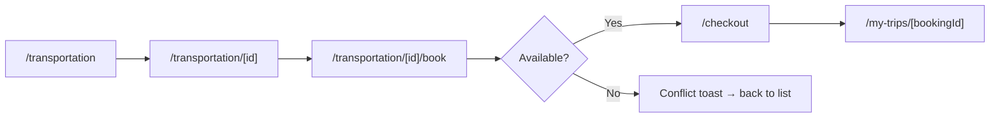

# Frontend design: Transportation Booking

> **Forward-looking design doc.** What the frontend for this feature **will** look like. Replaces nothing in the codebase yet.
> Once the feature ships, the equivalent reference doc at [`reference/features/transportation.md`](./reference/features/) takes over as the source of truth and this design doc is archived.

| Field | Value |
|---|---|
| **Status** | Drafting |
| **Owner** | TBD |
| **Last reviewed** | 2026-05-22 |
| **Phase** | Phase 5 — Feature Modules |
| **Product PRD** | [`docs/product/prd.md#transportation`](../../../product/prd.md) |
| **Feature registry** | [`docs/product/feature-decisions.md#F32`](../../../product/feature-decisions.md) |
| **Backend module** | [`docs/modules/transportation/`](../../../modules/transportation/) |
| **Related ADRs** | — |
| **Depends on** | `auth`, `trip-discovery` |

---

## 1. Goal

Let a traveler browse, compare, and book ground transportation (van, bus, tuk-tuk, private car) for specific routes and dates in Cambodia, with real-time availability and route visualization.

---

## 2. User flow

1. User navigates to `/[locale]/transportation` from the main nav or trip detail page.
2. User applies filters (vehicle type, route, dates, amenities) and browses the vehicle list.
3. User taps a vehicle card → navigates to `/[locale]/transportation/[id]`.
4. User views vehicle details, route map, schedule, and pricing.
5. User taps "Book Now" → booking form slides in or navigates to `/[locale]/transportation/[id]/book`.
6. User fills pickup/dropoff, dates, optional stops → submits.
7. System checks availability → creates 15-min booking hold.
8. User proceeds to payment (handoff to payments module).
9. Success state at `/[locale]/my-trips/[bookingId]`.

---

## 3. Pages

| # | Path | Auth | Layout shell | Purpose |
|---|---|---|---|---|
| 1 | `/[locale]/transportation` | No | `(main)` | Browse & filter vehicles |
| 2 | `/[locale]/transportation/[id]` | No | `(main)` | Vehicle detail + route map |
| 3 | `/[locale]/transportation/[id]/book` | Yes | `(main)` | Booking form (dates, route) |

---

## 4. Per-page detail

### 4.1 `/[locale]/transportation` (List)

**Purpose:** Browse available transportation options with filters.

**Data shown:**
- Vehicle card: type badge, name, photo, capacity, amenities (AC/WiFi/luggage), price, rating.
- Active filter chips.
- Result count.

**User actions:**
- Filter by vehicle type (Van, Bus, Tuk-Tuk, Private Car).
- Filter by route (pickup city → destination city).
- Filter by date range (availability).
- Filter by amenities (AC, WiFi).
- Sort by price (low→high) or rating (high→low).
- Tap card → navigate to detail.
- Infinite scroll / "Load more" pagination.

**Components used:**
- Existing in `shared/`: `<Button>`, `<Card>`, `<Badge>`, `<EmptyState>`, `<Skeleton>`.
- New in `features/transportation/components/`: `<TransportList>`, `<TransportCard>`, `<TransportFilterBar>`, `<TransportSortSelect>`.

**States:**

| State | UI | Source |
|---|---|---|
| Loading | Skeleton grid (6 cards) | `loading.tsx` |
| Empty | `<EmptyState>` — "No vehicles match your filters" with reset CTA | `t('transportation.empty.*')` |
| Error | Inline error banner + retry button | React Query `error` |
| Partial (filtered, no results) | Empty state with "Clear filters" CTA | Filter state check |

**Backend calls:** `GET /v1/transportation/vehicles?type=&route=&startDate=&endDate=&hasAc=&sort=&page=&limit=`

**i18n keys:** `transportation.list.*`

---

### 4.2 `/[locale]/transportation/[id]` (Detail)

**Purpose:** View full vehicle info, route map, schedule, pricing, and initiate booking.

**Data shown:**
- Photo gallery (swipeable carousel).
- Vehicle name, type badge, capacity.
- Amenities list (AC, WiFi, luggage capacity).
- Rating (stars + count).
- Description (translated).
- Route map (Leaflet) showing common routes served.
- Pricing table (per-day or per-km rates).
- Availability calendar (next 30 days).

**User actions:**
- Swipe through photos.
- View route on interactive Leaflet map.
- Tap "Book Now" → navigate to booking form (requires auth).
- Share vehicle link.

**Components used:**
- Existing in `shared/`: `<Button>`, `<Badge>`, `<Carousel>`, `<Skeleton>`.
- New in `features/transportation/components/`: `<TransportDetail>`, `<TransportGallery>`, `<TransportRouteMap>`, `<TransportPricingTable>`, `<TransportAvailabilityCalendar>`.

**States:**

| State | UI | Source |
|---|---|---|
| Loading | Skeleton layout (image placeholder + text lines) | `loading.tsx` |
| Not found | 404 page | Backend returns 404 (`TRANS_001`) |
| Error | Error banner + retry | React Query `error` |
| Loaded | Full detail view | React Query `data` |

**Backend calls:**
- `GET /v1/transportation/vehicles/:id`
- `GET /v1/transportation/vehicles/:id/availability?month=YYYY-MM`

**i18n keys:** `transportation.detail.*`

---

### 4.3 `/[locale]/transportation/[id]/book` (Booking Form)

**Purpose:** Collect booking details (dates, route) and create a 15-min hold.

**Data shown:**
- Vehicle summary card (name, type, price).
- Date picker (start + end).
- Pickup location input (autocomplete).
- Dropoff location input (autocomplete).
- Optional stops (add/remove).
- Estimated price (live calculation).
- Route preview on mini Leaflet map.
- 15-min hold countdown (after submission).

**User actions:**
- Select start/end dates.
- Enter pickup and dropoff locations.
- Add/remove intermediate stops.
- View estimated price update in real-time.
- Submit → availability check → hold creation.
- Proceed to payment (on success).

**Components used:**
- Existing in `shared/`: `<Button>`, `<Input>`, `<DatePicker>`, `<Card>`.
- New in `features/transportation/components/`: `<TransportBookingForm>`, `<TransportRoutePlanner>`, `<TransportPriceEstimate>`, `<TransportHoldCountdown>`.

**States:**

| State | UI | Source |
|---|---|---|
| Idle | Form ready for input | Default |
| Submitting | Button loading + form disabled | Mutation `isPending` |
| Conflict (409) | Toast "Vehicle unavailable for these dates" + suggest alternatives | Backend `TRANS_002` |
| Validation error | Inline field errors | Zod + backend `TRANS_003`, `TRANS_004` |
| Hold created | Success card with countdown timer + "Proceed to Payment" CTA | Mutation `onSuccess` |

**Backend calls:**
- `GET /v1/transportation/vehicles/:id/availability?startDate=&endDate=`
- `POST /v1/transportation/bookings` (creates hold)

**i18n keys:** `transportation.booking.*`

---

## 5. Data model

| Schema | Shape (high-level) | Source |
|---|---|---|
| `TransportVehicleSchema` | `id`, `type`, `name`, `capacity`, `pricePerDayUsd`, `pricePerKmUsd`, `hasAc`, `hasWifi`, `luggageCapacity`, `imageUrls[]`, `ratingAverage`, `ratingCount`, `status` | `features/transportation/schemas/transport.ts` |
| `TransportVehicleDetailSchema` | extends above + `description`, `availableDates[]` | same file |
| `TransportBookingCreateSchema` | `vehicleId`, `startDate`, `endDate`, `pickupLocation`, `dropoffLocation`, `stops[]` | same file |
| `TransportBookingResponseSchema` | `bookingId`, `vehicleId`, `status`, `holdExpiresAt`, `estimatedPriceUsd` | same file |

**Backend endpoints called:**

| Method | Path | Use |
|---|---|---|
| GET | `/v1/transportation/vehicles` | List with filters + pagination |
| GET | `/v1/transportation/vehicles/:id` | Vehicle detail |
| GET | `/v1/transportation/vehicles/:id/availability` | Date availability check |
| POST | `/v1/transportation/bookings` | Create booking hold |

---

## 6. Client state

**React Query hooks** (server state):

| Hook | Query key | `staleTime` | Invalidates |
|---|---|---|---|
| `useTransportList(filters)` | `['transportation', 'list', filters]` | 30s | — |
| `useTransportDetail(id)` | `['transportation', id]` | 60s | — |
| `useTransportAvailability(id, month)` | `['transportation', id, 'availability', month]` | 30s | — |
| `useCreateTransportBooking()` | — | — | `['transportation']` |

**Zustand stores** (client UI state):

| Store | What it holds | Persisted |
|---|---|---|
| `useTransportFilterStore` | `vehicleType`, `route` (pickup/dropoff cities), `dateRange`, `hasAc`, `hasWifi`, `sortBy` | No |

**Forms** (RHF + Zod):

| Form | Schema | Where |
|---|---|---|
| TransportBookingForm | `TransportBookingCreateSchema` | `features/transportation/components/TransportBookingForm.tsx` |

---

## 7. External integrations

- **WebSocket:** N/A
- **Stripe:** N/A (handoff to payments module at checkout)
- **Maps:** Leaflet.js + OpenStreetMap on detail page (route visualization) and booking form (route preview with pickup/dropoff markers and intermediate stops).
- **Push (FCM):** N/A
- **Storage (uploads):** N/A

---

## 8. Edge cases & error states

| Case | UI behavior | Notes |
|---|---|---|
| Offline | Show cached vehicle list + offline banner; booking form disabled | PWA cache strategy |
| 401 (session expired) | Auto-refresh once, then redirect to `/login` | Shared API client handles |
| Vehicle not found (404 / `TRANS_001`) | 404 page with "Browse other vehicles" CTA | |
| Vehicle unavailable for dates (409 / `TRANS_002`) | Toast error + highlight date fields + suggest nearby dates | |
| Invalid date range (`TRANS_003`) | Inline validation "End date must be after start date" | Client-side Zod catches first |
| Missing pickup/dropoff (`TRANS_004`) | Inline field error on required location inputs | Client-side Zod catches first |
| Hold expires (15 min) | Countdown reaches 0 → toast "Hold expired" + reset form | Poll or timer-based |
| Concurrent booking conflict | Toast "Someone just booked this vehicle" + refresh availability | Optimistic UI rollback |
| No vehicles match filters | Empty state with "Clear all filters" CTA | |
| Slow network (>3s) | Skeleton persists; no timeout error until 15s | |
| Map tiles fail to load | Fallback to static route text description | Leaflet error handler |
| 5xx / network error | Toast + manual retry CTA | |
| Feature flag off | Route returns 404 | |

---

## 9. Acceptance criteria (frontend)

The feature is "done" when:

- [ ] Every page in §3 renders with real data from the backend.
- [ ] Vehicle list displays correct type, capacity, price, amenities, and rating.
- [ ] Filters (type, route, date, amenities) correctly narrow results via query params.
- [ ] Sort by price and rating works correctly.
- [ ] Pagination loads additional results without duplicates.
- [ ] Detail page shows photo gallery, amenities, pricing table, and Leaflet route map.
- [ ] Availability calendar accurately reflects backend availability data.
- [ ] Booking form validates all fields (dates, locations) client-side before submission.
- [ ] Successful booking creates a 15-min hold and displays countdown.
- [ ] Hold expiry is handled gracefully (toast + form reset).
- [ ] 409 conflict shows user-friendly message and suggests alternatives.
- [ ] Every state in §4 (loading / empty / error / conflict) is reachable and renders correctly.
- [ ] Every flow in §2 completes end-to-end without console errors.
- [ ] All copy is i18n-keyed across `en`, `zh`, `km`.
- [ ] At least one E2E test covers the happy path (list → detail → book → hold created).
- [ ] All §3 routes pass keyboard navigation and meet WCAG AA contrast.
- [ ] Mobile (375 px) and tablet (768 px) layouts render correctly.
- [ ] Leaflet map is responsive and touch-friendly on mobile.
- [ ] All §3 routes meet the Core Web Vitals budget.

---

## 10. Open questions

None.

---

## 11. Out of scope

- Admin-side vehicle management (separate dashboard, post-MVP).
- Driver assignment UI (driver info revealed automatically 24h before via backend).
- Transportation upgrade flow from trip detail page (handled by trip-discovery module).
- Cancellation/refund UI (handled by my-trips module).
- Real-time driver tracking / live GPS.
- Review/rating submission for completed transport bookings.

---

## 12. Related

- Product PRD section: [`docs/product/prd.md#transportation`](../../../product/prd.md)
- Feature registry entry: [`docs/product/feature-decisions.md#F32`](../../../product/feature-decisions.md)
- Backend module: [`docs/modules/transportation/`](../../../modules/transportation/)
- Future reference doc: [`../reference/features/transportation.md`](../reference/features/) *(authored once shipped)*
- Roadmap phase: [`docs/platform/roadmaps/frontend-roadmap.md`](../../roadmaps/frontend-roadmap.md)
