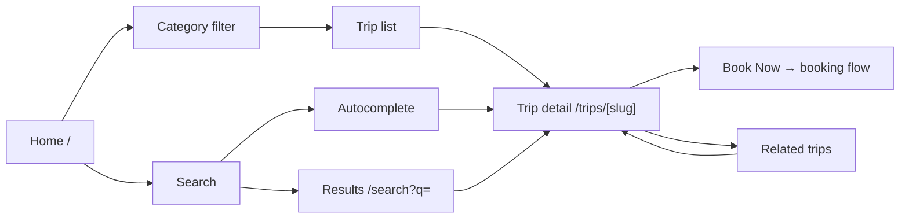

# Frontend design: Trip Discovery

> **Forward-looking design doc.** What the frontend for trip discovery **will** look like — the primary conversion surface where travelers browse, filter, search, and select trips.
> Once the feature ships, the equivalent reference doc at [`reference/features/trip-discovery.md`](../../reference/features/trip-discovery.md) takes over.

| Field | Value |
|---|---|
| **Status** | Drafting |
| **Owner** | You |
| **Last reviewed** | 2026-05-22 |
| **Phase** | Phase 5 — Feature Modules |
| **Product PRD** | [`docs/product/prd.md`](../../../../product/prd.md) |
| **Feature registry** | [`docs/product/feature-decisions.md`](../../../../product/feature-decisions.md) |
| **Backend module** | [`docs/modules/trip-discovery/`](../../../../modules/trip-discovery/) |
| **Related ADRs** | [ADR-0001](../../adr/0001-app-router-server-components-default.md), [ADR-0002](../../adr/0002-state-management-split.md), [ADR-0007](../../adr/0007-feature-sliced-architecture-with-strict-boundaries.md) |

---

## 1. Goal

Let a traveler discover, compare, and select Cambodia trip packages — via featured content on the home screen, category filtering, search with autocomplete, and rich detail pages — setting the list-detail-book pattern reused by hotel-booking, transportation, and tour-guide.

---

## 2. User flow

### Browse (home → detail)

1. User lands on `/[locale]/` (Home tab)
2. Sees hero featured trips + category row
3. Taps a category → filters trip list below
4. Taps a trip card → navigates to `/[locale]/trips/[slug]`
5. Views detail (gallery, itinerary, reviews, map)
6. Taps "Book Now" → navigates to booking flow

### Search

1. User taps search icon in TopBar → search overlay/page
2. Types query → debounced autocomplete dropdown (300ms)
3. Taps a result → navigates to that entity's detail
4. Or presses Enter → full results page `/[locale]/search?q=...`

### Favorites

1. User taps heart icon on trip card or detail page
2. Trip added/removed from wishlist (server-synced if authenticated, localStorage if guest)

---

## 3. Pages

| # | Path | Auth | Layout shell | Rendering | Purpose |
|---|---|---|---|---|---|
| 1 | `/[locale]/` | No (public home) | `(app)` | ISR 60s | Featured trips + categories |
| 2 | `/[locale]/trips` | No | `(app)` | ISR 300s | Trip list with filters/sort |
| 3 | `/[locale]/trips/[slug]` | No | `(app)` | SSR | Trip detail |
| 4 | `/[locale]/search` | No | `(app)` | Client-side | Search results |

---

## 4. Per-page detail

### 4.1 `/[locale]/` (Home)

**Purpose:** Primary landing for authenticated users — discover featured trips and browse by category.

**Data shown:**
- Hero section: 3–5 featured trip cards (cover image, name, duration, price, rating)
- Category row: horizontal scroll — Temples, Nature, Culture, Adventure, Food (icon + label + count)
- Trip grid below categories (filtered by selected category or "All")

**User actions:**
- Tap featured trip card → navigate to detail
- Tap category → filter trip grid
- Tap heart on card → toggle favorite
- Pull to refresh → revalidate data
- Scroll down → load more trips (pagination)

**Components used:**
- New in `features/trip-discovery/components/`: `<FeaturedHero>`, `<CategoryRow>`, `<TripCard>`, `<TripGrid>`, `<FavoriteButton>`
- From `shared/components/layout/`: `<Skeleton>`

**States:**

| State | UI | Source |
|---|---|---|
| Loading | Skeleton grid (3 cards) | `loading.tsx` |
| Loaded | Featured + categories + grid | Server data |
| Empty (no trips) | `<EmptyState>` "No trips available" | Empty response |
| Error | Inline error + retry | React Query `error` |
| Category selected | Grid filtered, category highlighted | URL `?category=X` |

**Backend calls:** `GET /v1/trips?featured=true&limit=5`, `GET /v1/trips?category=X&sort=featured&page=1&limit=20`

**i18n keys:** `trips.home.*`

---

### 4.2 `/[locale]/trips` (Trip List)

**Purpose:** Full trip catalog with filtering and sorting.

**Data shown:**
- Filter bar: categories (multi-select chips), sort dropdown
- Trip grid: cards with cover image, name, duration, price, rating, heart icon
- Pagination (infinite scroll or "Load more" button)
- Result count

**User actions:**
- Select/deselect category chips → update `?category=` params
- Change sort → update `?sort=` param
- Tap card → navigate to detail
- Tap heart → toggle favorite
- Scroll to bottom → load next page

**Components used:**
- New in `features/trip-discovery/components/`: `<TripFilterBar>`, `<TripSortSelect>`, `<TripGrid>`, `<TripCard>`
- From `shared/`: `<Skeleton>`, `<EmptyState>`

**States:**

| State | UI | Source |
|---|---|---|
| Loading | Skeleton grid | `loading.tsx` |
| Loaded | Filter bar + grid | Server data |
| Empty (no results) | "No trips found" + clear filters CTA | Empty response |
| Loading more | Spinner at bottom of grid | Pagination fetch |
| Error | Toast + retry | Network error |

**Backend calls:** `GET /v1/trips?category=X&sort=Y&page=N&limit=20`

**i18n keys:** `trips.list.*`

---

### 4.3 `/[locale]/trips/[slug]` (Trip Detail)

**Purpose:** Full trip information to support a booking decision.

**Data shown:**
- Photo gallery (swipeable, lightbox on tap, up to 20 images)
- Trip name, duration, location, price per person (with currency selector USD/KHR/CNY)
- Day-by-day itinerary (accordion or timeline)
- Included / excluded items lists
- Cancellation policy
- Meeting point with map embed (Leaflet)
- Reviews section: average rating, count, paginated review list
- "You might also like" — 4 related trip cards
- Sticky "Book Now" CTA button (bottom)
- Heart (favorite) button in header

**User actions:**
- Swipe gallery → view photos
- Tap photo → lightbox
- Tap currency selector → switch price display
- Expand itinerary day → see details
- Scroll to reviews → paginate reviews
- Tap "Book Now" → navigate to booking flow
- Tap heart → toggle favorite
- Tap share → native share sheet or copy link
- Tap related trip → navigate to that detail

**Components used:**
- New in `features/trip-discovery/components/`: `<TripGallery>`, `<TripItinerary>`, `<TripInclusions>`, `<TripReviews>`, `<TripReviewCard>`, `<TripMap>`, `<RelatedTrips>`, `<BookNowCTA>`, `<CurrencySelector>`, `<ShareButton>`
- From `shared/`: `<FavoriteButton>` (promoted from feature if reused by hotels), `<Skeleton>`

**States:**

| State | UI | Source |
|---|---|---|
| Loading | Full-page skeleton | `loading.tsx` |
| Loaded | Complete detail page | SSR data |
| Trip not found | 404 page | `notFound()` |
| Reviews loading | Skeleton in reviews section | Client fetch |
| Reviews empty | "No reviews yet" | Empty response |
| Gallery lightbox open | Full-screen overlay | User tap |

**Backend calls:** `GET /v1/trips/:slug`, `GET /v1/trips/:id/reviews?page=1&limit=10`, `GET /v1/trips/:id/related`

**i18n keys:** `trips.detail.*`

---

### 4.4 `/[locale]/search` (Search Results)

**Purpose:** Full search results page with type tabs.

**Data shown:**
- Search input (pre-filled with `q` param)
- Tabs: All, Trips, Places, Hotels, Guides
- Result cards grouped by type (in "All" tab) or filtered by tab
- Pagination: 20 per page

**User actions:**
- Edit search query → re-fetch
- Switch tab → filter results by type
- Tap result → navigate to entity detail
- Paginate → load next page

**Components used:**
- New in `features/trip-discovery/components/`: `<SearchInput>`, `<SearchTabs>`, `<SearchResultCard>`, `<SearchAutocomplete>`
- From `shared/`: `<Skeleton>`, `<EmptyState>`

**States:**

| State | UI | Source |
|---|---|---|
| Loading | Skeleton list | Fetch in progress |
| Loaded | Tabs + results | Server data |
| Empty | "No results for [query]" + suggestions | Empty response |
| Error | Toast + retry | Network error |
| Autocomplete open | Dropdown with 8 results | Debounced input |

**Backend calls:** `GET /v1/search?q=X&type=trips&page=1&limit=20`

**i18n keys:** `trips.search.*`

---

## 5. Data model

| Schema | Shape (high-level) | Source |
|---|---|---|
| `TripCardSchema` | `id`, `slug`, `name`, `coverImageUrl`, `durationDays`, `priceUsd`, `ratingAverage`, `ratingCount`, `category`, `isFavorited` | `features/trip-discovery/schemas/trip.ts` |
| `TripDetailSchema` | extends above + `galleryImageUrls[]`, `translations`, `itineraryDays[]`, `includedItems[]`, `excludedItems[]`, `meetingPoint`, `cancellationPolicy`, `location`, `maxGuests` | same file |
| `TripReviewSchema` | `id`, `rating`, `text`, `photoUrls[]`, `isVerified`, `reviewerName`, `createdAt` | same file |
| `SearchResultSchema` | `id`, `type`, `name`, `imageUrl`, `subtitle` | same file |

**Backend endpoints called:**

| Method | Path | Use |
|---|---|---|
| GET | `/v1/trips?featured=true&limit=5` | Home featured |
| GET | `/v1/trips?category=X&sort=Y&page=N&limit=20` | List with filters |
| GET | `/v1/trips/:slug` | Detail |
| GET | `/v1/trips/:id/reviews?page=N&limit=10` | Reviews |
| GET | `/v1/trips/:id/related` | Related trips |
| GET | `/v1/search?q=X&type=Y&page=N&limit=20` | Search |
| GET | `/v1/search/autocomplete?q=X` | Autocomplete |
| POST | `/v1/users/me/favorites/:tripId` | Add favorite |
| DELETE | `/v1/users/me/favorites/:tripId` | Remove favorite |

---

## 6. Client state

Per [ADR-0002](../../adr/0002-state-management-split.md):

**React Query hooks** (server state):

| Hook | Query key | `staleTime` | Notes |
|---|---|---|---|
| `useFeaturedTrips()` | `['trips', 'featured']` | 60s | Home hero |
| `useTripList(filters)` | `['trips', 'list', filters]` | 30s | Paginated |
| `useTrip(slug)` | `['trips', slug]` | 60s | Detail |
| `useTripReviews(id, page)` | `['trips', id, 'reviews', page]` | 30s | Paginated |
| `useRelatedTrips(id)` | `['trips', id, 'related']` | 120s | |
| `useSearch(query, type, page)` | `['search', query, type, page]` | 30s | |
| `useAutocomplete(query)` | `['search', 'autocomplete', query]` | 60s | Debounced |
| `useToggleFavorite()` | — | — | Optimistic update |

**Zustand stores** (client UI state):

| Store | What it holds | Persisted |
|---|---|---|
| `useTripUiStore` | `selectedCategories[]`, `sortBy`, `searchQuery`, `activeSearchTab` | No |

**Forms:** None (no user-submitted forms in this feature; review form is post-MVP).

---

## 7. External integrations

- **Maps:** Leaflet.js on trip detail page for meeting point display. Loaded dynamically (`next/dynamic`) to avoid SSR issues.
- **WebSocket:** N/A
- **Stripe:** N/A
- **Push (FCM):** N/A
- **Storage:** Trip images served from CDN (`cdn.derlg.com`) via `next/image` with responsive sizes.

---

## 8. Edge cases & error states

| Case | UI behavior | Notes |
|---|---|---|
| Offline | Show cached trip list + offline banner | React Query cache + PWA |
| 401 (session expired) | Auto-refresh per ADR-0003 | Trip list/detail are public; favorites require auth |
| Trip not found (404) | `notFound()` → 404 page inside shell | |
| Empty category | "No trips in this category" + clear filter CTA | |
| Search no results | "No results for [query]" + try different keywords | |
| Favorite limit (100) | Toast "Wishlist full. Remove some to add more." | |
| Favorite as guest | Store in localStorage; migrate on login | |
| Slow image load | Blur placeholder via `next/image` `placeholder="blur"` | |
| Gallery with 0 images | Show placeholder image | Shouldn't happen; defensive |
| Rate limited (429) | Toast "Too many requests. Try again shortly." | Search: 30/min |

---

## 9. Acceptance criteria (frontend)

The feature is "done" when:

- [ ] Home page renders featured trips and category row with real data.
- [ ] Category filtering updates the trip grid without full page reload.
- [ ] Sort changes reflect in URL and grid order.
- [ ] Trip detail page renders all sections (gallery, itinerary, inclusions, reviews, map, related, CTA).
- [ ] Photo gallery supports swipe and lightbox.
- [ ] Reviews paginate correctly.
- [ ] Search autocomplete shows results within 500ms of typing.
- [ ] Search results page shows tabs and paginated results.
- [ ] Favorite toggle works (optimistic UI, server sync for authenticated users).
- [ ] Guest favorites persist in localStorage and migrate on login.
- [ ] All pages have proper loading skeletons.
- [ ] All copy is i18n-keyed across `en`, `zh`, `km`.
- [ ] Trip detail has proper SEO metadata (title, description, OG image).
- [ ] Images use `next/image` with responsive sizes and blur placeholder.
- [ ] At least one E2E test covers home → detail → back flow.
- [ ] Mobile (375 px) and tablet (768 px) layouts render correctly.
- [ ] Meets Core Web Vitals budget (LCP < 2.5s on 4G).

---

## 10. Open questions

*None — SSR strategy, endpoints, and component homes are defined by the architecture doc and ADR-0007.*

---

## 11. Out of scope

- Review submission form (post-MVP, F24 user story US-F24-02).
- Social sharing with QR code (v1.1, F26).
- Admin trip management (separate dashboard).
- Booking flow (owned by a separate `payments` / booking feature).
- Map-based trip browsing (owned by `explore-places`).

---

## 12. Related

- Product PRD: [`docs/product/prd.md`](../../../../product/prd.md)
- Feature registry: [`docs/product/feature-decisions.md`](../../../../product/feature-decisions.md)
- Backend module: [`docs/modules/trip-discovery/`](../../../../modules/trip-discovery/)
- Auth design (dependency): [`./auth.md`](./auth.md)
- App-shell design (dependency): [`./app-shell.md`](./app-shell.md)
- Future reference doc: [`../../reference/features/trip-discovery.md`](../../reference/features/trip-discovery.md)
- Roadmap phase: [`docs/platform/roadmaps/frontend-roadmap.md`](../../../roadmaps/frontend-roadmap.md)
