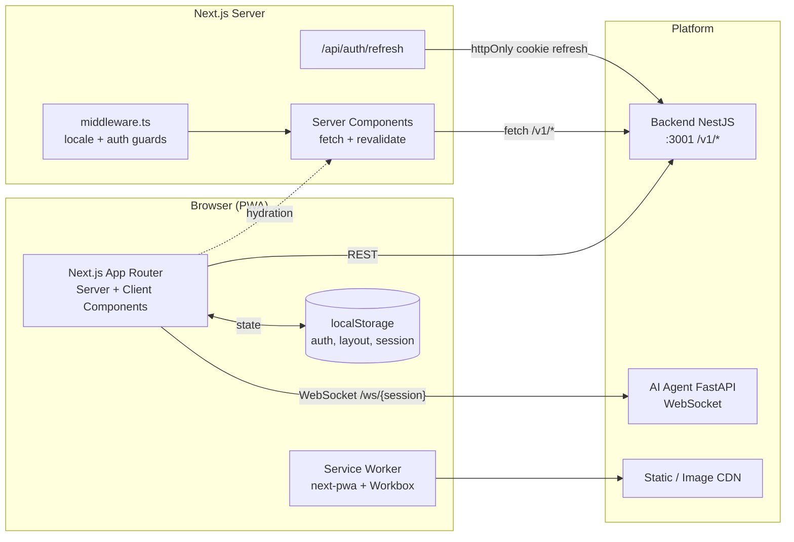

# DerLg Frontend — Platform Documentation

> **What this is.** The official, living documentation for the DerLg Next.js 16 frontend. This is the *system as it is*, not as it is planned. Roadmaps live in [`docs/platform/roadmaps/frontend-roadmap.md`](../roadmaps/frontend-roadmap.md); this folder describes the current architecture, conventions, and operational contract.

| Field | Value |
|-------|-------|
| **Owner** | Frontend platform team |
| **Status** | Active |
| **Last reviewed** | 2026-05-22 |
| **Source of truth code** | [`frontend/`](../../../frontend/) |
| **Source of truth conventions** | [`.kiro/steering/conventions.md`](../../../.kiro/steering/conventions.md), [`.kiro/steering/tech.md`](../../../.kiro/steering/tech.md) |
| **Agent guide** | [`frontend/AGENTS.md`](../../../frontend/AGENTS.md) |

---

## Who this is for

| Audience | Where to start |
|----------|----------------|
| **New engineer joining the team** | `index.md` (this file) → `foundation.md` → `architecture.md` |
| **Feature implementer** | `architecture.md` → `reference/state-and-data.md` → `reference/design-system.md` → relevant feature doc |
| **Operator / SRE** | `reference/deployment.md` → `reference/observability.md` → `reference/performance.md` |
| **AI agent / automation** | [`frontend/AGENTS.md`](../../../frontend/AGENTS.md) (this folder is human-readable narrative; AGENTS.md is the operational contract) |
| **Reviewer / architect** | `governance.md` → `adr/README.md` |

---

## How these docs are organized

This folder follows the [**Diátaxis**](https://diataxis.fr/) taxonomy. Every doc has exactly one home — the question to answer when filing a new doc is: *what does the reader need from it?*

| Category | Reader's need | Folder | Index |
|----------|---------------|--------|-------|
| **Reference** | "Look up a fact." Contracts, schemas, configuration, conventions. | [`./reference/`](./reference/) | [`reference/README.md`](./reference/README.md) |
| **How-to guides** | "Accomplish a task." Numbered steps for a specific goal. | [`./guides/`](./guides/) | [`guides/README.md`](./guides/README.md) |
| **Tutorials** | "Learn by building." End-to-end narrative for newcomers. | [`./tutorials/`](./tutorials/) | [`tutorials/README.md`](./tutorials/README.md) |
| **Explanation** | "Understand why." Concepts, mental models, trade-offs. | [`./explanation/`](./explanation/) | [`explanation/README.md`](./explanation/README.md) |
| **ADRs** | "Trace a historical decision." Immutable, dated records. | [`./adr/`](./adr/) | [`adr/README.md`](./adr/README.md) |

Three docs sit at the **top level** and are not part of any Diátaxis category — they're the front door:

- [`foundation.md`](./foundation.md) — runtime contract (read first)
- [`architecture.md`](./architecture.md) — high-level system shape
- [`governance.md`](./governance.md) — the rules of the road

The choice of category is enforced in code review per [`governance.md`](./governance.md#documentation-taxonomy-diátaxis). If a doc could plausibly live in two categories, write the reference doc and link to it from a guide or explanation — never duplicate.

---

## Document map

### 0. Entry docs
| Doc | Purpose |
|-----|---------|
| [`foundation.md`](./foundation.md) | Runtime contract, Node/Next/React versions, package manager, env vars, common scripts |
| [`architecture.md`](./architecture.md) | App Router structure, rendering strategy (RSC vs Client), route groups, folder layout |
| [`governance.md`](./governance.md) | Doc lifecycle, PR rules, definition of done, how to add an ADR, taxonomy |

### 1. Reference — [`./reference/`](./reference/)

Factual lookup docs. See [`reference/README.md`](./reference/README.md) for the full conventions.

| Doc | Purpose |
|-----|---------|
| [`reference/state-and-data.md`](./reference/state-and-data.md) | Zustand client stores, React Query server state, hydration rules, persistence |
| [`reference/auth-and-session.md`](./reference/auth-and-session.md) | JWT access token storage, refresh-token cookie flow, middleware-based route guards |
| [`reference/realtime-and-vibe-booking.md`](./reference/realtime-and-vibe-booking.md) | WebSocket lifecycle, AI message contracts, auto-render system, Zod validation |
| [`reference/design-system.md`](./reference/design-system.md) | Tailwind v4 tokens, shadcn/ui usage, motion policy, accessibility baseline |
| [`reference/i18n-and-locale.md`](./reference/i18n-and-locale.md) | next-intl setup, EN/ZH/KM resources, font stacks, currency/date/number formatting |
| [`reference/pwa-and-offline.md`](./reference/pwa-and-offline.md) | Service worker scope, cache strategies, offline indicators, install prompt |
| [`reference/performance.md`](./reference/performance.md) | Core Web Vitals targets, code splitting policy, image rules, prefetch strategy |
| [`reference/security.md`](./reference/security.md) | CSP, XSS prevention, input validation, secrets policy, sandboxing AI content |
| [`reference/testing.md`](./reference/testing.md) | Vitest + React Testing Library, Playwright E2E, MSW mocking, coverage targets |
| [`reference/observability.md`](./reference/observability.md) | Sentry integration, analytics events, structured client logs, error budgets |
| [`reference/deployment.md`](./reference/deployment.md) | Docker image, CI/CD pipeline, environments, rollback procedure |

### 2. How-to guides — [`./guides/`](./guides/)

Task-oriented recipes. See [`guides/README.md`](./guides/README.md) for the list of suggested first guides and the authoring conventions.

### 3. Tutorials — [`./tutorials/`](./tutorials/)

End-to-end learning narratives for new contributors. See [`tutorials/README.md`](./tutorials/README.md).

### 4. Explanation — [`./explanation/`](./explanation/)

Concepts, mental models, and trade-offs that don't fit a single ADR. See [`explanation/README.md`](./explanation/README.md).

### 5. Decision records — [`./adr/`](./adr/)
| Doc | Purpose |
|-----|---------|
| [`adr/README.md`](./adr/README.md) | Index of all Architecture Decision Records |
| [`adr/0000-template.md`](./adr/0000-template.md) | Template for new ADRs |

### 6. Templates
| Doc | Purpose |
|-----|---------|
| [`_template.md`](./_template.md) | Copy this when creating a new frontend platform doc (works for all four Diátaxis categories) |

---

## System at a glance

The frontend has three responsibilities and nothing else:

1. **Render** — UI for travelers (Next.js App Router, Server Components by default).
2. **Bridge** — Auth + API calls to the NestJS backend; WebSocket session to the AI agent.
3. **Cache locally** — PWA offline shell, message queue for spotty networks, persisted UI state.

It does **not** own business logic, payment processing, or data persistence beyond UX state.

---

## Non-negotiable principles

These are the rules every frontend PR is reviewed against. They map 1:1 to the steering files and to the ADRs in `adr/`.

| # | Principle | Enforcement |
|---|-----------|-------------|
| 1 | **Mobile-first.** Designs target 375px–428px; tablet/desktop are progressive enhancement. | Visual review, Playwright viewports |
| 2 | **Server Components by default.** `'use client'` is a deliberate decision, not a default. | ESLint rule + PR review |
| 3 | **No raw `fetch` in components.** Server Components use `fetch` with cache hints; Client Components use React Query hooks. | ESLint rule, code review |
| 4 | **No hardcoded user-facing strings.** All text goes through `next-intl` keys (EN/ZH/KM). | Lint rule for string literals in JSX |
| 5 | **No raw images.** Use `next/image` with explicit width/height or `fill` + `sizes`. | ESLint, Lighthouse CI |
| 6 | **Forms = React Hook Form + Zod.** Always. No exceptions for "small" forms. | Code review |
| 7 | **AI content is untrusted.** Every `content_payload` is Zod-validated and rendered inside an Error Boundary; user-visible AI text is sanitized with DOMPurify. | Schema tests, error boundary tests |
| 8 | **No secrets in `NEXT_PUBLIC_*`** unless deliberately public (Stripe publishable, GA ID). | CI secret scan |
| 9 | **Refresh token never touches JS.** httpOnly Secure SameSite=Strict cookie only. | Code review, auth integration tests |
| 10 | **Every Client Component declares why it's a Client Component** at the top of the file. | Comment convention checked in review |

---

## How to use these docs

### When you start a feature
1. Read `architecture.md` and the relevant cross-cutting docs.
2. Look at `adr/` for any decisions that constrain your work.
3. If your feature requires a new architectural pattern, draft an ADR **before** writing code.

### When you change a pattern
1. Update the relevant doc in the **same PR** as the code change.
2. If the change supersedes an existing decision, update the corresponding ADR's status to `Superseded by ADR-XXXX` and create a new ADR.
3. Update `Last reviewed` date in the doc header.

### When you add a new doc
1. Copy [`_template.md`](./_template.md).
2. Add a row to the **Document map** above.
3. Link it from the relevant section.

### When something is unclear
- A doc contradicts the code → the **code** is the source of truth; open a PR to fix the doc.
- A doc contradicts the steering files → the **steering file** wins for cross-cutting rules; for frontend-specific patterns the platform doc wins. If still unclear, escalate via ADR.
- An ADR contradicts a doc → the **ADR** wins (it's the historical decision). Update the doc.

---

## Cross-references

- **Root orchestrator** — [`AGENTS.md`](../../../AGENTS.md)
- **Frontend agent guide** — [`frontend/AGENTS.md`](../../../frontend/AGENTS.md)
- **Steering** — [`.kiro/steering/product.md`](../../../.kiro/steering/product.md), [`structure.md`](../../../.kiro/steering/structure.md), [`tech.md`](../../../.kiro/steering/tech.md), [`conventions.md`](../../../.kiro/steering/conventions.md)
- **Frontend roadmap (progress tracker)** — [`docs/platform/roadmaps/frontend-roadmap.md`](../roadmaps/frontend-roadmap.md)
- **System architecture** — [`docs/platform/architecture/index.md`](../architecture/index.md)
- **Backend platform docs** — [`docs/platform/backend/index.md`](../backend/index.md)
- **Per-feature module specs** — [`docs/modules/`](../../modules/)
- **Implementation specs** — [`.kiro/specs/frontend-nextjs-implementation/`](../../../.kiro/specs/frontend-nextjs-implementation/), [`.kiro/specs/vibe-booking-frontend/`](../../../.kiro/specs/vibe-booking-frontend/)
