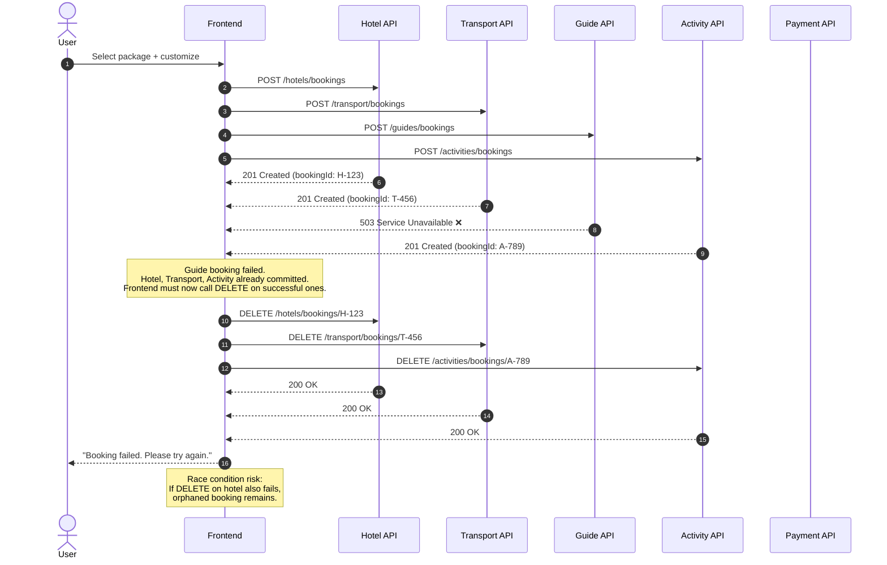
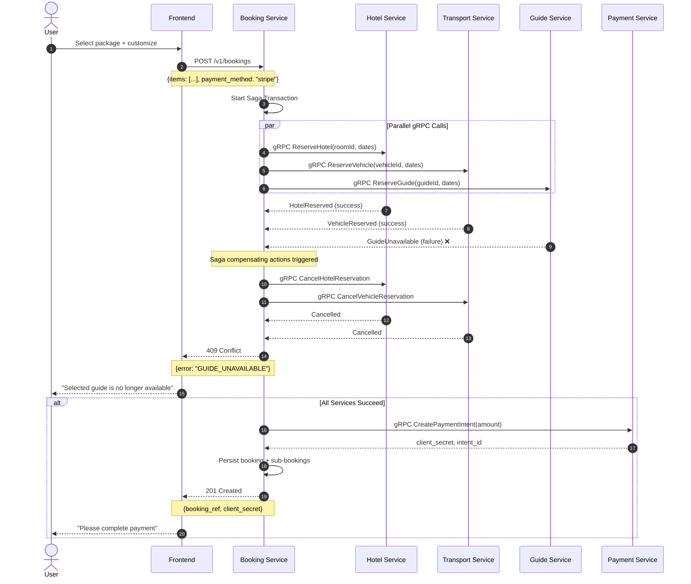
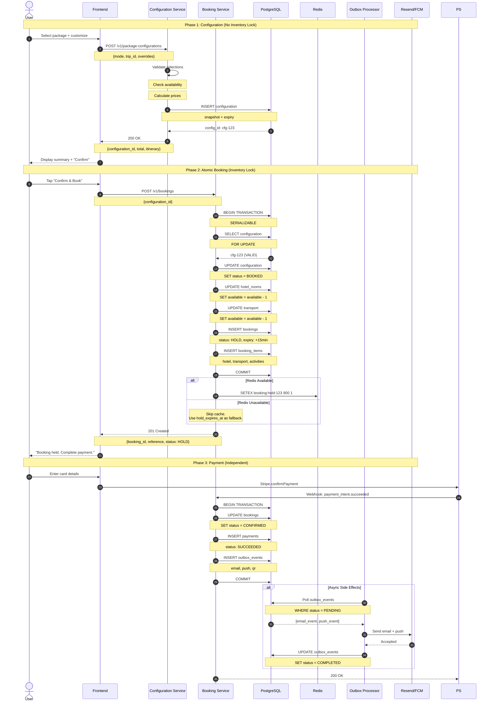

# Booking Transaction Methods Comparison

> Comparison of three architectural approaches for handling package bookings across the three user paths (public prebuilt, private prebuilt, build-from-scratch).

---

## Method 1: Frontend Parallel Requests

In this approach, the frontend acts as the orchestrator. It calls multiple booking APIs in parallel (one per component type) and aggregates the results.

### Operational Characteristics

| Concern | Behavior |
|---------|----------|
| Transaction boundary | No boundary — each API call is independent |
| Rollback mechanism | Frontend-initiated DELETE calls (compensating actions) |
| Failure mode | Partial commits possible; orphaned bookings on rollback failure |
| Consistency | Eventual at best; requires manual reconciliation |
| Retry semantics | Complex — frontend must track which calls succeeded/failed |

---

## Method 2: gRPC Inter-Service Communication

In this approach, the frontend makes a single request to a Booking Service. The Booking Service acts as a saga coordinator, calling internal services via gRPC and executing compensating actions on failure.

### Operational Characteristics

| Concern | Behavior |
|---------|----------|
| Transaction boundary | Saga across multiple services |
| Rollback mechanism | Explicit compensating gRPC calls on failure |
| Failure mode | Clean rollback if compensating actions succeed |
| Consistency | Strong (assuming compensating actions are reliable) |
| Retry semantics | Per-service retry with circuit breaker pattern |

---

## Method 3: Backend Orchestrated with Configuration

In this approach, the booking is split into two phases: a lightweight configuration step (no inventory lock) and an atomic database transaction (inventory lock). All external side effects happen asynchronously via an outbox.

### Operational Characteristics

| Concern | Behavior |
|---------|----------|
| Transaction boundary | Single database transaction with serializable isolation |
| Rollback mechanism | Automatic — database transaction rollback on any failure |
| Failure mode | All-or-nothing; no partial state possible |
| Consistency | Immediate (ACID) |
| Retry semantics | Configuration step is idempotent; booking step retries with fresh configuration |

---

## Comparative Analysis

| Aspect | Method 1: Frontend Parallel | Method 2: gRPC Saga | Method 3: Backend Orchestrated |
|--------|----------------------------|---------------------|-------------------------------|
| **Frontend complexity** | High — manages retries, rollbacks, partial states | Low — single API call | Low — single API call |
| **Backend complexity** | Low — simple CRUD APIs | High — saga coordinator, compensating actions | Medium — configuration service + transaction |
| **Failure recovery** | Manual, fragile | Automatic via compensating transactions | Automatic via database rollback |
| **Consistency** | Eventual, prone to orphans | Strong (with reliable compensations) | Strong (ACID) |
| **Latency** | Multiple round-trips | Multiple internal hops | Single fast transaction |
| **Network resilience** | Poor — frontend must handle all failures | Good — service-level retries | Excellent — single request/response |
| **Operational burden** | High — debug frontend state, reconcile orphans | High — distributed tracing, saga monitoring | Low — single transaction log |
| **Infrastructure needs** | Simple HTTP | gRPC, service mesh, circuit breakers | Standard HTTP + PostgreSQL |
| **Team scaling** | Poor — frontend team owns transaction logic | Good — service teams own boundaries | Good — single backend team owns flow |

---

## Recommendation for DerLg

**Method 3 (Backend Orchestrated with Configuration)** is the recommended approach for the current architecture because:

1. **DerLg is a monolithic NestJS application** with a single PostgreSQL database. The gRPC overhead in Method 2 adds complexity without benefit since all data lives in one database.

2. **All three booking paths** (public prebuilt, private prebuilt, build-from-scratch) resolve to the same operational pattern: user selections → validated configuration → atomic booking. Method 3 unifies them naturally.

3. **The configuration phase separates heavy validation from the inventory lock.** This keeps the booking transaction fast and simple, reducing lock contention under load.

4. **External API failures** (email, push notifications) are isolated from the critical path via the outbox pattern. The booking succeeds even if Resend or FCM is temporarily unavailable.

5. **No partial booking state** is possible. If anything fails during the booking transaction, PostgreSQL rolls back automatically. There are no orphaned reservations requiring manual cleanup.

---

## Decision Record

| Question | Decision |
|----------|----------|
| Who orchestrates the booking? | Backend (Booking Service) |
| How many API calls does the frontend make? | Two: one to configure, one to book |
| Where does validation happen? | Configuration phase (before inventory lock) |
| Where does pricing happen? | Server-side during configuration |
| How is inventory locked? | Atomic database transaction with serializable isolation |
| What happens if payment fails? | Booking remains in HOLD status; user retries payment |
| What happens if email/push fails? | Async outbox retry; booking is still confirmed |
| What happens if Redis fails? | Database timestamp fallback; cron handles expiry |
