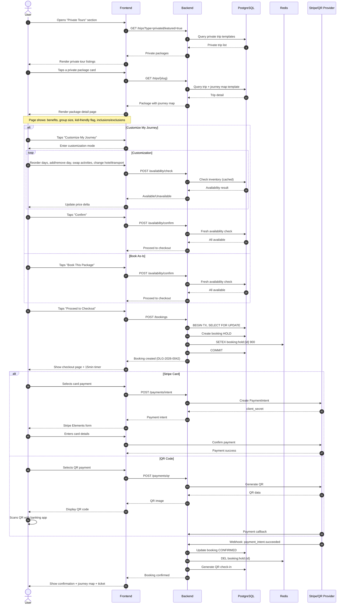
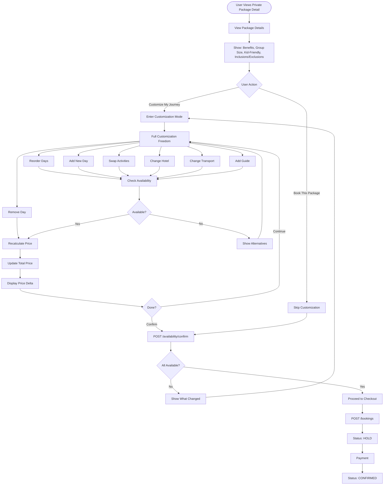
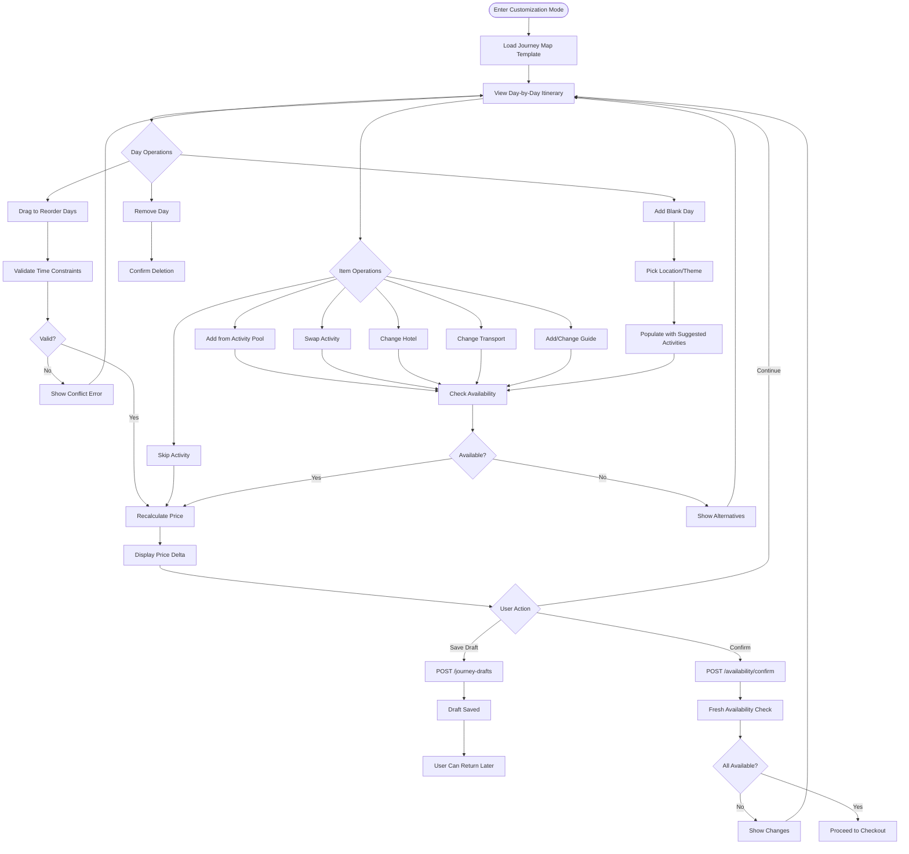

# Customize Package Flow Diagrams

> Visual flow reference for private tour booking journeys.

---

## Table of Contents

1. [Prebuilt Private Package — High-Level Flow](#1-prebuilt-private-package--high-level-flow)
2. [Customize vs Book As-Is Branch](#2-customize-vs-book-as-is-branch)
3. [Customization Mode Detail](#3-customization-mode-detail)

---

## 1. Prebuilt Private Package — High-Level Flow

---

## 2. Customize vs Book As-Is Branch

---

## 3. Customization Mode Detail

