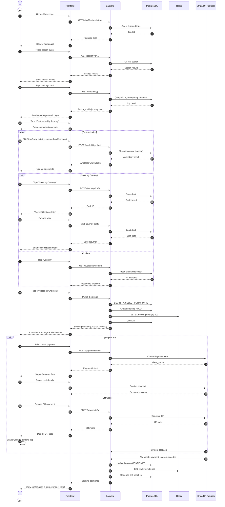
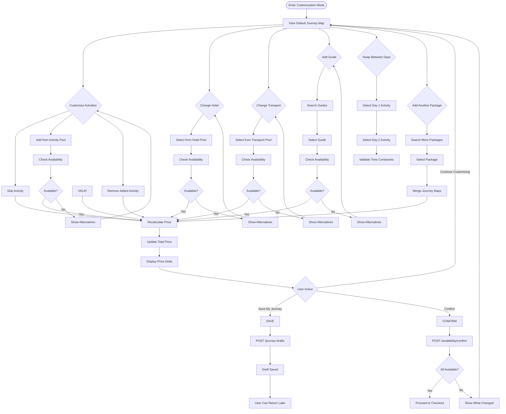
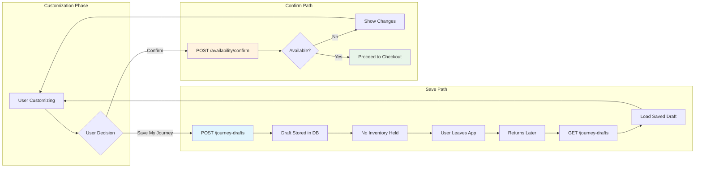
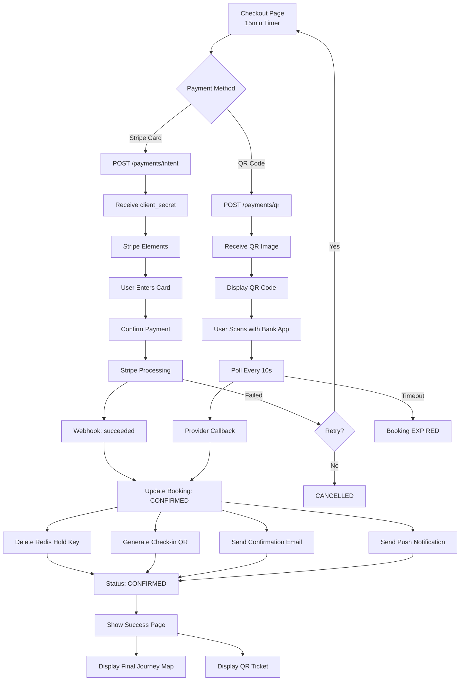
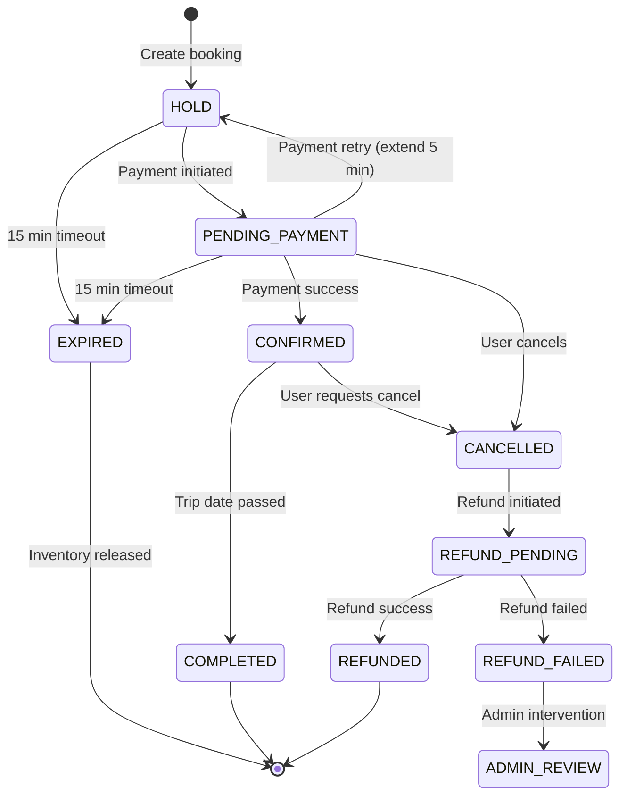
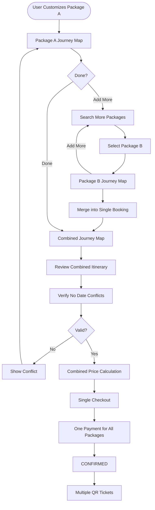

# Package Booking Flow Diagrams

> Visual flow reference for the homepage search package booking journey.

---

## Table of Contents

1. [High-Level Sequence Flow](#1-high-level-sequence-flow)
2. [Journey Map Customization Detail](#2-journey-map-customization-detail)
3. [Save vs Confirm Branch](#3-save-vs-confirm-branch)
4. [Payment Flow](#4-payment-flow)
5. [Booking State Machine](#5-booking-state-machine)
6. [Error Recovery Paths](#6-error-recovery-paths)
7. [Multi-Package Booking Flow](#7-multi-package-booking-flow)

---

## 1. High-Level Sequence Flow

---

## 2. Journey Map Customization Detail

---

## 3. Save vs Confirm Branch

---

## 4. Payment Flow

---

## 5. Booking State Machine

---

## 6. Error Recovery Paths

```mermaid
flowchart TD
    subgraph "During Customization"
        C1[User Changes Hotel] --> C2[Check Availability]
        C2 --> C3{Available?}
        C3 -->|No| C4[Show Sold Out Badge]
        C4 --> C5[Show Similar Options]
        C5 --> C1
        C3 -->|Yes| C6[Apply Change]
    end
    
    subgraph "At Confirm"
        CF1[User Clicks Confirm] --> CF2[Fresh Availability Check]
        CF2 --> CF3{All Available?}
        CF3 -->|No| CF4[Show What's Changed]
        CF4 --> CF5[Highlight Changed Items]
        CF5 --> CF6[User Re-customizes]
        CF6 --> CF1
        CF3 -->|Yes| CF7[Proceed to Checkout]
    end
    
    subgraph "During Payment"
        P1[Payment Processing] --> P2{Success?}
        P2 -->|Declined| P3[Show Error Message]
        P3 --> P4{Retry?}
        P4 -->|Yes| P5[Extend Hold +5 min]
        P5 --> P1
        P4 -->|No| P6[CANCELLED]
        P2 -->|Timeout| P7[EXPIRED]
        P7 --> P8[Notify User]
        P8 --> P9[Return to Search]
    end
    
    subgraph "Post-Booking"
        PB1[CONFIRMED] --> PB2{User Cancels?}
        PB2 -->|>=7 days| PB3[100% Refund]
        PB2 -->|1-7 days| PB4[50% Refund]
        PB2 -->|<24h| PB5[0% Refund]
        PB3 --> PB6[REFUNDED]
        PB4 --> PB6
        PB5 --> PB7[CANCELLED No Refund]
    end
```

---

## 7. Multi-Package Booking Flow

---

## Legend

| Color | Meaning |
|-------|---------|
| Light Blue | Save/Storage operation |
| Light Orange | Validation/Check operation |
| Light Green | Success/Proceed state |
| Red | Error/Failure state |
